# Multi-Country Brand Setup: Product Hierarchy Architecture

## Overview

This project sets up a **multi-country pharmaceutical brand hierarchy** in Life Sciences Cloud (LSC) using the standard `Product2` object with parent-child relationships. Two brands — **Immunexis** and **Cordim** — are deployed across six countries: US, GB, FR, IT, ES, and DE.

## Product2 Hierarchy (3 Levels)

```mermaid
graph TD
    subgraph "Level 1: BRAND"
        IMM["<b>Immunexis</b><br/>Family = Brand"]
        COR["<b>Cordim</b><br/>Family = Brand"]
    end

    subgraph "Level 2: SUB-BRAND (Immunexis)"
        IMM_US["Immunexis US<br/>Country = US"]
        IMM_GB["Immunexis GB<br/>Country = GB"]
        IMM_FR["Immunexis FR<br/>Country = FR"]
        IMM_IT["Immunexis IT<br/>Country = IT"]
        IMM_ES["Immunexis ES<br/>Country = ES"]
        IMM_DE["Immunexis DE<br/>Country = DE"]
    end

    subgraph "Level 2: SUB-BRAND (Cordim)"
        COR_US["Cordim US<br/>Country = US"]
        COR_GB["Cordim GB<br/>Country = GB"]
        COR_FR["Cordim FR<br/>Country = FR"]
        COR_IT["Cordim IT<br/>Country = IT"]
        COR_ES["Cordim ES<br/>Country = ES"]
        COR_DE["Cordim DE<br/>Country = DE"]
    end

    subgraph "Level 3: SAMPLES (examples)"
        IMM_DE_10["Immunexis DE 10mg Sample"]
        IMM_DE_25["Immunexis DE 25mg Sample"]
        COR_DE_5["Cordim DE 5mg Sample"]
        COR_DE_20["Cordim DE 20mg Sample"]
    end

    IMM -->|ParentId| IMM_US
    IMM -->|ParentId| IMM_GB
    IMM -->|ParentId| IMM_FR
    IMM -->|ParentId| IMM_IT
    IMM -->|ParentId| IMM_ES
    IMM -->|ParentId| IMM_DE

    COR -->|ParentId| COR_US
    COR -->|ParentId| COR_GB
    COR -->|ParentId| COR_FR
    COR -->|ParentId| COR_IT
    COR -->|ParentId| COR_ES
    COR -->|ParentId| COR_DE

    IMM_DE -->|ParentId| IMM_DE_10
    IMM_DE -->|ParentId| IMM_DE_25
    COR_DE -->|ParentId| COR_DE_5
    COR_DE -->|ParentId| COR_DE_20

    style IMM fill:#4a90d9,color:#fff
    style COR fill:#4a90d9,color:#fff
    style IMM_US fill:#f5a623,color:#fff
    style IMM_GB fill:#f5a623,color:#fff
    style IMM_FR fill:#f5a623,color:#fff
    style IMM_IT fill:#f5a623,color:#fff
    style IMM_ES fill:#f5a623,color:#fff
    style IMM_DE fill:#f5a623,color:#fff
    style COR_US fill:#f5a623,color:#fff
    style COR_GB fill:#f5a623,color:#fff
    style COR_FR fill:#f5a623,color:#fff
    style COR_IT fill:#f5a623,color:#fff
    style COR_ES fill:#f5a623,color:#fff
    style COR_DE fill:#f5a623,color:#fff
    style IMM_DE_10 fill:#7ed321,color:#fff
    style IMM_DE_25 fill:#7ed321,color:#fff
    style COR_DE_5 fill:#7ed321,color:#fff
    style COR_DE_20 fill:#7ed321,color:#fff
```

## Key Design Decisions

### Why Use Product2.ParentId?
- **Standard field** — no custom development needed
- LSC natively supports product hierarchy via `ParentId`
- Mobile app and Admin Console respect the parent-child relationship
- Enables roll-up reporting from sample → sub-brand → brand

### Why a Separate Sub-Brand Per Country?
- **Product messages** (ProductGuidance) differ by country due to regulatory/compliance
- **CLM content** (presentations, PDFs) must be country-specific
- **Sample regulations** vary by country (e.g., US has PDMA, EU has different rules)
- **Territory alignment** is country-specific — reps only see their country's products
- **Product priorities** differ by market
- **Account restrictions** may vary by country

### Country__c Custom Field on Product2
A custom picklist `Country__c` is added to Product2 to:
- Enable list views and reports filtered by country
- Drive assignment rules and sharing
- Allow Admin Console / DB Schema filtering
- Support data loader operations filtered by country

| Field API Name | Type | Values |
|---|---|---|
| `Country__c` | Picklist | US, GB, FR, IT, ES, DE |

### Product Family Picklist Values
The standard `Family` field on Product2 is used to distinguish hierarchy levels:

| Family Value | Level | Purpose |
|---|---|---|
| Brand | 1 | Top-level brand (Immunexis, Cordim) |
| Sub-Brand | 2 | Country variant of the brand |
| Sample | 3 | Physical sample SKU under a sub-brand |

## Record Counts

| Entity | Count |
|---|---|
| Brands | 2 (Immunexis, Cordim) |
| Sub-Brands | 12 (2 brands × 6 countries) |
| Samples per Sub-Brand | 2 |
| Total Samples | 24 (12 sub-brands × 2 samples) |
| **Total Product2 Records** | **38** |

## Related READMEs

- [README-02: LSC Areas Where Products Appear](README-02-LSC-Product-Areas.md)
- [README-03: Country Field Requirements Per Object](README-03-Country-Field-Requirements.md)
- [README-04: Data Loading Scripts](README-04-Data-Loading-Scripts.md)
