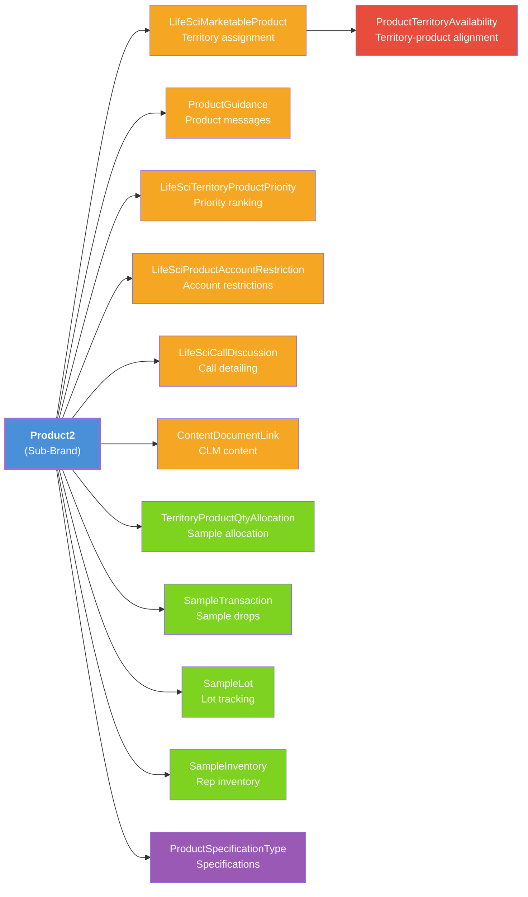
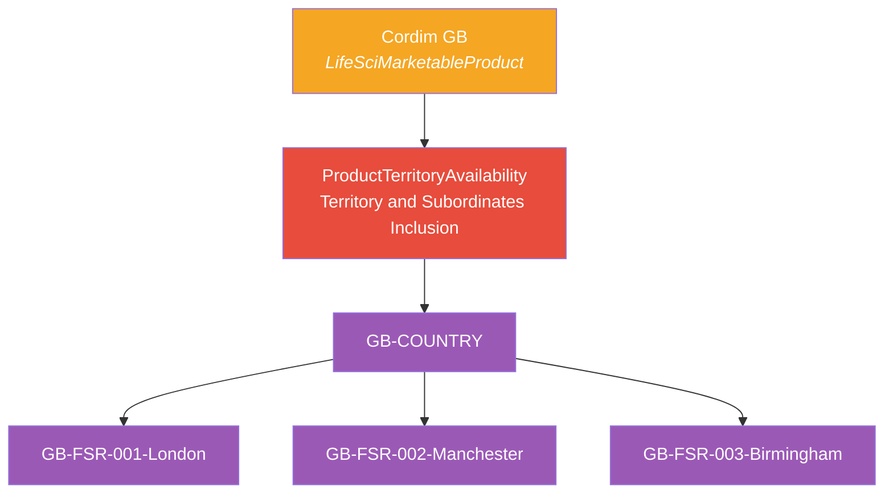
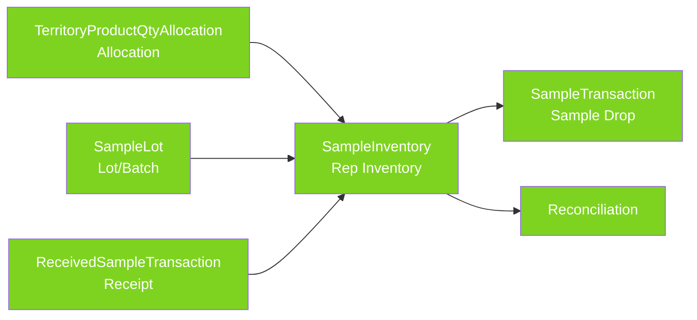

# LSC Areas Where Products Appear

## Complete List of Product Touchpoints in Life Sciences Cloud

Every LSC module below references products. In a multi-country setup, the **sub-brand** (country variant) is the primary product record used — NOT the top-level brand. This is critical: content, messages, priorities, restrictions, and samples all attach to the **sub-brand level**.

> **Orange** = Detailing & Territory objects | **Red** = Territory-Product alignment | **Green** = Sample Management objects | **Purple** = Specifications

---

### 1. Product Catalog (Product2)

| Object | Relationship to Product | Notes |
|---|---|---|
| `Product2` | IS the product | Brand → Sub-brand → Sample hierarchy via `ParentId` |

**Multi-country impact:** Sub-brands carry `Country__c` to identify which market they belong to.

---

### 2. Marketable Products (LifeSciMarketableProduct)

| Object | Relationship to Product | Notes |
|---|---|---|
| `LifeSciMarketableProduct` | Links Product2 to a Territory or User | Controls which products a rep can detail/promote |

**What it does:** Determines which products appear in the rep's product list on mobile and web. Each marketable product record ties a specific Product2 to a territory.

**Multi-country impact:** Each country's territory gets marketable product records for that country's brands. A US rep sees Immunexis US; a DE rep sees Immunexis DE. Country__c on this object enables filtering and validation.

> **Important:** For products to appear in the **Product Details** section during Visit Engagement, the marketable product must have `Type = 'Brand'` (not `'Product'`). Setting `Type = 'Brand'` requires `ProductId` to be null. See [How Product Details Are Resolved](#how-product-details-are-resolved-during-a-visit) for the full query chain.

---

### 2b. Territory-Product Alignment (ProductTerritoryAvailability)

| Object | Relationship to Product | Notes |
|---|---|---|
| `ProductTerritoryAvailability` | Junction between LifeSciMarketableProduct and Territory2 | Controls which products are available in which territories |

**What it does:** Links a marketable product to a territory. Uses `AlignmentType` to control scope:
- **Territory and Subordinates Inclusion** — product available in this territory and all children (most common)
- **Territory Inclusion** — product available in this territory only
- **Territory Exclusion** — product explicitly excluded from a territory (overrides parent inclusion)

**Multi-country impact:** Each country marketable product is aligned to its matching country territory with "Territory and Subordinates Inclusion". This cascades the product down to all city FSR territories in that country. A rep in `GB-FSR-001-London` automatically sees Cordim GB and Immunexis GB because they're aligned at `GB-COUNTRY`.

---

### 3. Product Guidance / Product Messages (ProductGuidance)

| Object | Relationship to Product | Notes |
|---|---|---|
| `ProductGuidance` | Lookup to Product2 | Talking points, key messages, objectives shown during calls |

**What it does:** Provides reps with approved messaging during a detail/call. Messages appear in the call discussion screen on mobile.

**Multi-country impact:** Each country has its own approved messages due to regulatory differences. Immunexis US messages differ from Immunexis FR messages. Messages attach to the sub-brand. Country__c enables admin filtering.

---

### 4. Territory Product Priorities (LifeSciTerritoryProductPriority)

| Object | Relationship to Product | Notes |
|---|---|---|
| `LifeSciTerritoryProductPriority` | Lookup to Product2 + Territory2 | Rank/priority of products within a territory |

**What it does:** Controls the order in which products appear for reps. Higher priority = appears first in detailing screens.

**Multi-country impact:** Priority rankings differ by country/market. A new launch in DE may be #1 priority there but #3 in the US. Country__c enables priority management by market.

---

### 5. Product Account Restrictions (LifeSciProductAccountRestriction)

| Object | Relationship to Product | Notes |
|---|---|---|
| `LifeSciProductAccountRestriction` | Lookup to Product2 + Account | Restricts detailing of a product at specific accounts |

**What it does:** Prevents reps from promoting certain products at certain accounts (e.g., formulary restrictions, compliance holds).

**Multi-country impact:** Restrictions are inherently country-specific (different formularies, regulations). The sub-brand already carries country context via its parent. Country__c on this object aids reporting.

---

### 6. Sample Management Objects

| Object | Relationship to Product | Notes |
|---|---|---|
| `TerritoryProductQtyAllocation` | Lookup to Product2 + Territory2 | Sample quantity allocation per territory |
| `SampleTransaction` | Lookup to Product2 | Individual sample drop/transfer/receipt/adjustment |
| `SampleLot` | Lookup to Product2 | Lot/batch tracking with expiry dates |
| `SampleInventory` | Lookup to Product2 | Rep's current inventory count |
| `ReceivedSampleTransaction` | Lookup to Product2 | Inbound sample receipts |

**What it does:** Tracks the full sample lifecycle:

**Multi-country impact:** Sample regulations differ dramatically by country:
- **US:** PDMA compliance, state license verification, DEA requirements
- **EU countries:** Each has its own pharmaceutical distribution rules
- Lot numbers, expiry tracking, and allocation quantities are country-specific

Country__c on sample-level Product2 records and on `TerritoryProductQtyAllocation` enables compliance reporting.

---

### 7. CLM Content (ContentDocumentLink / ContentVersion)

| Object | Relationship to Product | Notes |
|---|---|---|
| `ContentDocumentLink` | Links ContentDocument to Product2 | Attaches presentations/PDFs to products |
| `ContentVersion` | The actual file/version | Stores the binary content |

**What it does:** Associates approved marketing materials (CLM presentations, PDFs, videos) with products for use during calls.

**Multi-country impact:** Content is language-specific AND regulatory-specific. A French presentation for Immunexis FR differs from the English one for Immunexis US. Content attaches to the **sub-brand** record. No Country__c needed on ContentVersion — the relationship to the sub-brand provides country context.

---

### 8. Call Discussion / Detailing (LifeSciCallDiscussion)

| Object | Relationship to Product | Notes |
|---|---|---|
| `LifeSciCallDiscussion` | Lookup to Product2 | Records which products were discussed during a visit/call |

**What it does:** Tracks what the rep discussed during a visit — which products, which messages, which content was shown.

**Multi-country impact:** Call discussions reference the sub-brand. Country__c on this object helps with multi-country reporting and analytics dashboards.

---

### 9. Next Best Customer / Next Best Action (NBC/NBA)

| Object/Feature | Relationship to Product | Notes |
|---|---|---|
| NBC Configuration | Uses Product Priorities | Recommends which customers to visit based on product priorities |
| NBA Suggestions | References Product2 | Suggests which product to detail at an account |

**Multi-country impact:** Recommendations are driven by territory product priorities, which are already country-specific through the sub-brand structure.

---

### 10. Activity Plans

| Object | Relationship to Product | Notes |
|---|---|---|
| `ActionPlanTemplate` / Activity Plan Config | Can be filtered by Product | Activity plan templates can target specific products |

**Multi-country impact:** Activity plan templates may be country-specific (different call frequencies, different target lists). Country__c on the template or a filter criterion enables country-specific activity plans.

---

### 11. Surveys

| Object | Relationship to Product | Notes |
|---|---|---|
| Survey configuration | Can be associated with products | Surveys shown during/after calls can be product-specific |

**Multi-country impact:** Survey questions differ by country (language, regulatory questions). Surveys attach to the sub-brand.

---

### 12. Product Specification Types (ProductSpecificationType)

| Object | Relationship to Product | Notes |
|---|---|---|
| `ProductSpecificationType` | Defines product attributes | Stores dosage forms, strengths, indications, etc. |

**Multi-country impact:** Approved indications may differ by country. Country__c on specifications enables tracking of country-specific approvals.

---

## How Product Details Are Resolved During a Visit

When a rep opens the **Product Details** section during Visit Engagement, the platform executes a series of SOQL queries to determine which products to display. Understanding this chain is critical for troubleshooting "No items found" issues.

The following table shows each query in execution order, based on actual debug logs captured from the Visit Engagement component:

| # | Object Queried | SOQL | Rows | Purpose |
|---|---|---|---|---|
| 1 | `UserAdditionalInfo` | `SELECT Preference, UserId FROM UserAdditionalInfo WHERE UserId IN (:currentUserId)` | 1 | Loads the current user's preferences (e.g., language, display settings) to personalize the visit experience. |
| 2 | `ProductTerrDtlAvailability` | `SELECT ProductId, SortOrder FROM ProductTerrDtlAvailability WHERE (SortOrder != null AND RelatedTerritory.Name = '{territory}')` | 0+ | **Key query.** Checks for pre-configured product sort orders for this territory. `ProductTerrDtlAvailability` is a read-only view that combines `ProductTerritoryAvailability` records with territory hierarchy resolution. The `ProductId` values returned here become the candidate product list for the final query. If this returns 0 rows, no products will display. |
| 3 | `ApexClass` | `SELECT Id, Name, NamespacePrefix, ApiVersion FROM ApexClass WHERE (Name = 'ClassUtilities' AND NamespacePrefix = 'lsc4ce')` | 1 | Internal framework lookup — loads the LSC managed package utility class used by subsequent processing logic. |
| 4 | `LifeSciProductAcctRstrc` | `SELECT AccountId, ProductId, Product.Name FROM LifeSciProductAcctRstrc WHERE TerritoryId = null` | 0+ | Loads **global** product-account restrictions (restrictions that apply regardless of territory). If the current account+product combination has a restriction here, the product is excluded from the list. |
| 5 | `LifeSciProductAcctRstrc` | `SELECT AccountId, ProductId, Product.Name, TerritoryId, Territory.Name FROM LifeSciProductAcctRstrc WHERE Territory.Name = '{territory}'` | 0+ | Loads **territory-specific** product-account restrictions. Same as above but scoped to the rep's territory. Products matching a restriction for this account are removed from the candidate list. |
| 6 | `LifeSciMarketableProduct` | `SELECT Id, Name, Type, SortOrder, ProductMetadata, IsActive, StartDate, EndDate, ParentTherapeuticAreaId, ParentTherapeuticArea.Name, ParentBrandProductId, ParentProductId, ParentIndicationId, IsCompetitorProduct, SignatureRequirementLevel, DefaultDistributionQuantity FROM LifeSciMarketableProduct WHERE (IsActive = true AND (EndDate = null OR EndDate >= :today) AND (StartDate = null OR StartDate <= :today) AND Id IN (:productIdsFromQuery2) AND Type IN ('Brand','Indication','TherapeuticArea','BrandIndication') AND IsCompetitorProduct = false) ORDER BY SortOrder, Name` | 0+ | **Final filter.** Takes the product IDs from query #2 and applies all display conditions. This is where most "No items found" issues originate. |

### Query #6 Filter Conditions (All Must Pass)

| Condition | What It Checks | Common Failure |
|---|---|---|
| `IsActive = true` | Product must be active | Deactivated product |
| `EndDate = null OR EndDate >= today` | Product must not be expired | Past end date |
| `StartDate = null OR StartDate <= today` | Product must have started | Future start date |
| `Id IN (:productIdsFromQuery2)` | Product must be territory-aligned | Missing `ProductTerritoryAvailability` record for the rep's territory |
| **`Type IN ('Brand','Indication','TherapeuticArea','BrandIndication')`** | **Product must be a Brand-level type** | **Product has `Type = 'Product'` — this is the most common mistake in multi-country setups** |
| `IsCompetitorProduct = false` | Must not be a competitor product | Flagged as competitor |

### Prerequisites Checklist

For a product to appear in **Product Details** during a visit, ALL of these must be true:

- [ ] **User → Territory**: Rep is assigned to a territory via `UserTerritory2Association`
- [ ] **Account → Territory**: The visit's account is assigned to the same territory via `ObjectTerritory2Association`
- [ ] **Product → Territory**: A `ProductTerritoryAvailability` record exists linking the marketable product to the rep's territory (either directly or via "Territory and Subordinates Inclusion" from a parent territory, expanded by the batch job)
- [ ] **Marketable Product Type = 'Brand'**: The `LifeSciMarketableProduct` record must have `Type = 'Brand'` (not `'Product'`). Product Details shows brand-level groupings, not individual product SKUs
- [ ] **Marketable Product IsActive = true**: The record must be active
- [ ] **Marketable Product date range**: `StartDate` ≤ today ≤ `EndDate` (or null)
- [ ] **Not a competitor**: `IsCompetitorProduct = false`
- [ ] **No account restriction**: No `LifeSciProductAcctRstrc` record blocking this product for this account/territory

> **Multi-country gotcha:** In a multi-country setup, country sub-brand marketable products (e.g., "Immunexis GB") are typically created with `Type = 'Product'`. For these to appear in Product Details, they must be set to `Type = 'Brand'` — which also requires clearing the `ProductId` field (the platform enforces that `ProductId` can only be set when `Type = 'Product'`). Alternatively, align the parent Brand marketable products (e.g., "Immunexis", "Cordim") to the country territories instead.

---

## Summary: Where Products Appear

| # | LSC Area | Object(s) | Sub-Brand Used? | Country-Specific? |
|---|---|---|---|---|
| 1 | Product Catalog | `Product2` | YES — is the sub-brand | YES |
| 2 | Marketable Products | `LifeSciMarketableProduct` | YES | YES |
| 2b | Territory-Product Alignment | `ProductTerritoryAvailability` | YES (via marketable product) | YES |
| 3 | Product Messages | `ProductGuidance` | YES | YES |
| 4 | Territory Priorities | `LifeSciTerritoryProductPriority` | YES | YES |
| 5 | Account Restrictions | `LifeSciProductAccountRestriction` | YES | YES |
| 6 | Sample Allocation | `TerritoryProductQtyAllocation` | YES (sample-level) | YES |
| 7 | Sample Transactions | `SampleTransaction` | YES (sample-level) | YES |
| 8 | Sample Lots | `SampleLot` | YES (sample-level) | YES |
| 9 | Sample Inventory | `SampleInventory` | YES (sample-level) | YES |
| 10 | CLM Content | `ContentDocumentLink` | YES | YES |
| 11 | Call Discussions | `LifeSciCallDiscussion` | YES | YES |
| 12 | NBC/NBA | Config-driven | YES (via priorities) | YES |
| 13 | Activity Plans | `ActionPlanTemplate` | Optional | YES |
| 14 | Surveys | Survey config | Optional | YES |
| 15 | Product Specifications | `ProductSpecificationType` | YES | YES |

---

## Related READMEs

- [README-01: Product Hierarchy Architecture](README-01-Product-Hierarchy.md)
- [README-03: Country Field Requirements Per Object](README-03-Country-Field-Requirements.md)
- [README-04: Data Loading Scripts](README-04-Data-Loading-Scripts.md)
- [README-05: Country Global Value Set](README-05-Country-Global-Value-Set.md)
- [README-06: Parent-Child Approaches](README-06-Parent-Child-Approaches.md)
- [README-07: Provider Account Territory Info](README-07-Provider-Account-Territory-Info.md)
- [README-08: Sample Management Setup](README-08-Sample-Management-Setup.md)
