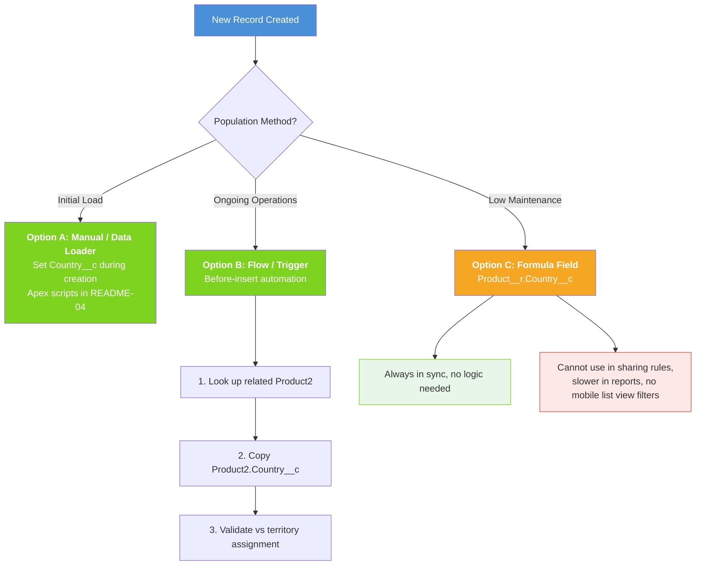
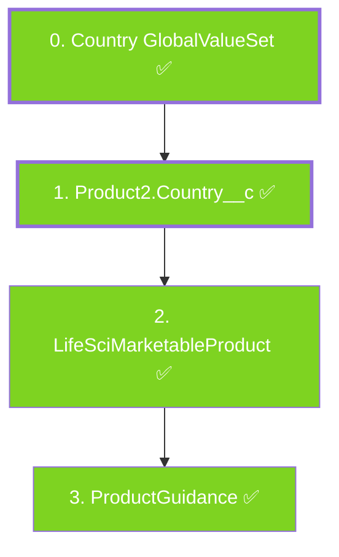

# Country Field Requirements Per Object

## Do We Need Country__c on Every Product-Related Object?

**Short answer: No — only on the master/configuration objects.** The sub-brand Product2 record is the source of truth for country context. Downstream transactional objects (sample transactions, call discussions, inventory) inherit country context through their relationship to Product2 or LifeSciMarketableProduct. Adding `Country__c` to those objects is unnecessary overhead.

Adding `Country__c` to the **core product objects** provides:

1. **Direct filtering** — List views, reports, and dashboards can filter by country without joining to Product2
2. **Admin Console management** — Admins managing multi-country orgs can quickly scope their work
3. **Data validation** — Ensures records are created against the correct country's sub-brand
4. **Sharing rules** — Country-based sharing rules can be applied directly

---

## Country__c Field Specification

All `Country__c` fields use the same definition for consistency, backed by a **Global Value Set** (`Country`):

| Property | Value |
|---|---|
| **API Name** | `Country__c` |
| **Type** | Picklist (Global Value Set) |
| **Global Value Set** | `Country` |
| **Values** | `US`, `GB`, `FR`, `IT`, `ES`, `DE` |
| **Required** | No (blank for global/brand-level records) |
| **Description** | Identifies the country/market this record belongs to |
| **Default** | None |

> To add a new country, edit only `force-app/main/default/globalValueSets/Country.globalValueSet-meta.xml` — all fields inherit the change.

---

## Objects Requiring Country__c

These objects are core to the multi-country product setup and MUST have Country__c.

| # | Object API Name | Why Country__c Is Needed | Populating Strategy | Deployed |
|---|---|---|---|---|
| 1 | `Product2` | Identifies which country a sub-brand or sample belongs to | Set during record creation; inherited from hierarchy | YES |
| 2 | `LifeSciMarketableProduct` | Filter marketable products by country; validate territory alignment | Copy from related Product2.Country__c | YES |
| 3 | `ProductGuidance` | Country-specific product messages; admin filtering | Copy from related Product2.Country__c | YES |

### Objects That Do NOT Need Country__c

Transactional and downstream objects inherit country context through their relationships to Product2 or LifeSciMarketableProduct. Adding `Country__c` directly is redundant.

| Object | Reason Country__c Is Not Needed |
|---|---|
| `LifeSciTerritoryProductPriority` | References Product2 which carries Country__c; territory itself implies country |
| `LifeSciProductAccountRestriction` | References Product2 which carries Country__c |
| `TerritoryProdtQtyAllocation` | References Product2 (sample-level) which carries Country__c; territory implies country |
| `SampleTransaction` / `SampleLot` / `SampleInventory` | References Product2 which carries Country__c; use Product2.Country__c in reports |
| `LifeSciCallDiscussion` | References Product2 which carries Country__c |
| `ContentVersion` / `ContentDocumentLink` | Country context inherited through the Product2 relationship |
| `ActionPlanTemplate` | Use filter criteria or record types for country scoping instead |
| `Territory2` | Territories already have geography built into their hierarchy |
| `ProductSpecificationType` | References Product2 which carries Country__c |
| NBC/NBA Configuration | Driven by territory product priorities which reference Product2 |

> **Design principle:** Country belongs on the **master data** (Product2, LifeSciMarketableProduct, ProductGuidance) — not on every transactional record. For reporting, join to Product2.Country__c.

---

## Population Strategy



**Recommendation:** Use a stored picklist (Option A/B) for flexibility and performance.

---

## Deployment Order



---

## SFDX Metadata Location

All custom field metadata is in:
```
force-app/main/default/objects/<ObjectName>/fields/Country__c.field-meta.xml
```

---

## Related READMEs

- [README-01: Product Hierarchy Architecture](README-01-Product-Hierarchy.md)
- [README-02: LSC Areas Where Products Appear](README-02-LSC-Product-Areas.md)
- [README-04: Data Loading Scripts](README-04-Data-Loading-Scripts.md)
- [README-05: Country Global Value Set](README-05-Country-Global-Value-Set.md)
- [README-06: Parent-Child Approaches](README-06-Parent-Child-Approaches.md)
- [README-07: Provider Account Territory Info](README-07-Provider-Account-Territory-Info.md)
- [README-08: Sample Management Setup](README-08-Sample-Management-Setup.md)
