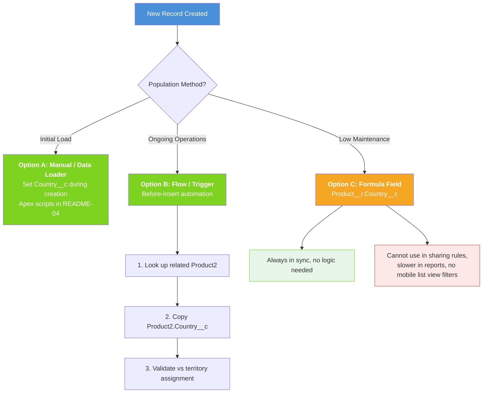
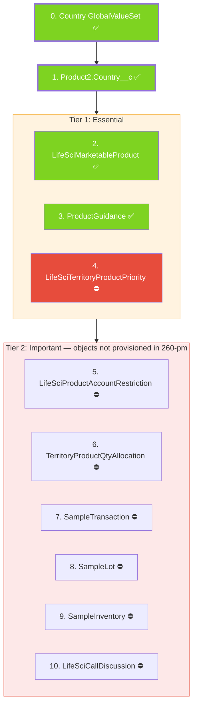

# Country Field Requirements Per Object

## Do We Need Country__c on Every Product-Related Object?

**Short answer: Yes, on most of them.** While the sub-brand Product2 record carries country context through its `Country__c` field, adding `Country__c` to downstream objects provides:

1. **Direct filtering** — List views, reports, and dashboards can filter by country without joining to Product2
2. **Admin Console management** — Admins managing multi-country orgs can quickly scope their work
3. **Data validation** — Ensures records are created against the correct country's sub-brand
4. **Mobile performance** — Reduces query complexity on the mobile app (no extra join needed)
5. **Sharing rules** — Country-based sharing rules can be applied directly

---

## Country__c Field Specification

All `Country__c` fields use the same definition for consistency, backed by a **Global Value Set** (`Country`):

| Property | Value |
|---|---|
| **API Name** | `Country__c` |
| **Type** | Picklist (Global Value Set) |
| **Global Value Set** | `Country` |
| **Values** | `US`, `GB`, `FR`, `IT`, `ES`, `DE` |
| **Required** | No (blank for global/brand-level records) |
| **Description** | Identifies the country/market this record belongs to |
| **Default** | None |

> To add a new country, edit only `force-app/main/default/globalValueSets/Country.globalValueSet-meta.xml` — all 10 fields inherit the change.

---

## Objects Requiring Country__c

### Tier 1: Essential (Deploy First)

These objects are core to the multi-country product setup and MUST have Country__c.

| # | Object API Name | Why Country__c Is Needed | Populating Strategy | Deployed to 260-pm |
|---|---|---|---|---|
| 1 | `Product2` | Identifies which country a sub-brand or sample belongs to | Set during record creation; inherited from hierarchy | YES |
| 2 | `LifeSciMarketableProduct` | Filter marketable products by country; validate territory alignment | Copy from related Product2.Country__c | YES |
| 3 | `ProductGuidance` | Country-specific product messages; admin filtering | Copy from related Product2.Country__c | YES |
| 4 | `LifeSciTerritoryProductPriority` | Manage priorities by country; prevent cross-country misalignment | Copy from related Product2.Country__c | NO — object not provisioned |

### Tier 2: Important (Deploy Second)

These objects benefit significantly from direct country filtering.

| # | Object API Name | Why Country__c Is Needed | Populating Strategy | Deployed to 260-pm |
|---|---|---|---|---|
| 5 | `LifeSciProductAccountRestriction` | Country-specific formulary/compliance restrictions | Copy from related Product2.Country__c | NO — object not provisioned |
| 6 | `TerritoryProductQtyAllocation` | Country-specific sample allocation quantities | Copy from related Product2.Country__c | NO — object not provisioned |
| 7 | `SampleTransaction` | Compliance reporting by country (PDMA vs EU rules) | Copy from related Product2.Country__c | NO — object not provisioned |
| 8 | `SampleLot` | Country-specific lot tracking and expiry management | Copy from related Product2.Country__c | NO — object not provisioned |
| 9 | `SampleInventory` | Country-level inventory reporting | Copy from related Product2.Country__c | NO — object not provisioned |
| 10 | `LifeSciCallDiscussion` | Multi-country call analytics and reporting | Copy from related Product2.Country__c | NO — object not provisioned |

> **Note (2026-04-15):** 7 of 10 objects are not yet provisioned in the 260-pm org. They require LSC feature licenses for Sample Management, Territory Management, and Call Discussion to be enabled. The Country GVS and 3 fields (Product2, LifeSciMarketableProduct, ProductGuidance) deployed successfully.

### Tier 3: Optional (Deploy If Needed)

These objects may or may not need Country__c depending on your implementation.

| # | Object API Name | Why Country__c Might Be Needed | When to Add |
|---|---|---|---|
| 11 | `ProductSpecificationType` | Country-specific indications/approvals | If indications differ by country |
| 12 | `ReceivedSampleTransaction` | Country-level receipt tracking | If separate receipt compliance by country |

### Objects That Do NOT Need Country__c

| Object | Reason |
|---|---|
| `ContentVersion` / `ContentDocumentLink` | Country context is inherited through the Product2 relationship; content files are linked to sub-brands |
| `ActionPlanTemplate` | Use filter criteria or record types for country scoping instead |
| `Territory2` | Territories already have geography built into their hierarchy |
| NBC/NBA Configuration | Driven by territory product priorities which already carry country context |

---

## Population Strategy



**Recommendation:** Use a stored picklist (Option A/B) for flexibility and performance.

---

## Deployment Order



---

## SFDX Metadata Location

All custom field metadata is in:
```
force-app/main/default/objects/<ObjectName>/fields/Country__c.field-meta.xml
```

---

## Related READMEs

- [README-01: Product Hierarchy Architecture](README-01-Product-Hierarchy.md)
- [README-02: LSC Areas Where Products Appear](README-02-LSC-Product-Areas.md)
- [README-04: Data Loading Scripts](README-04-Data-Loading-Scripts.md)
- [README-05: Country Global Value Set](README-05-Country-Global-Value-Set.md)
- [README-06: Parent-Child Approaches](README-06-Parent-Child-Approaches.md)
- [README-07: Provider Account Territory Info](README-07-Provider-Account-Territory-Info.md)
