# Data Loading Scripts

## Overview

These Anonymous Apex scripts create the full multi-country product hierarchy in your org. Run them in order using Developer Console or VS Code.


**Prerequisites:**
- `Country__c` custom picklist field deployed to `Product2` (see `force-app/` metadata)
- `Family` picklist values `Brand`, `Sub-Brand`, `Sample` added to `Product2.Family`

---

## Script 1: Create Brands (Level 1)

```apex
// ============================================================
// Script 1: Create Top-Level Brand Records
// ============================================================

List<Product2> brands = new List<Product2>();

brands.add(new Product2(
    Name = 'Immunexis',
    ProductCode = 'IMMUNEXIS',
    Family = 'Brand',
    IsActive = true,
    Description = 'Immunexis - Global Brand'
));

brands.add(new Product2(
    Name = 'Cordim',
    ProductCode = 'CORDIM',
    Family = 'Brand',
    IsActive = true,
    Description = 'Cordim - Global Brand'
));

insert brands;
System.debug('Brands created: ' + brands);
```

---

## Script 2: Create Sub-Brands Per Country (Level 2)

```apex
// ============================================================
// Script 2: Create Country Sub-Brand Records
// Run AFTER Script 1
// ============================================================

// Fetch parent brands
Map<String, Id> brandMap = new Map<String, Id>();
for (Product2 p : [SELECT Id, Name FROM Product2 WHERE Family = 'Brand' AND Name IN ('Immunexis', 'Cordim')]) {
    brandMap.put(p.Name, p.Id);
}

List<String> countries = new List<String>{'US', 'GB', 'FR', 'IT', 'ES', 'DE'};
List<String> brandNames = new List<String>{'Immunexis', 'Cordim'};

List<Product2> subBrands = new List<Product2>();

for (String brand : brandNames) {
    for (String country : countries) {
        subBrands.add(new Product2(
            Name = brand + ' ' + country,
            ProductCode = brand.toUpperCase() + '-' + country,
            Family = 'Sub-Brand',
            IsActive = true,
            ParentId = brandMap.get(brand),
            Country__c = country,
            Description = brand + ' - ' + country + ' market variant'
        ));
    }
}

insert subBrands;
System.debug('Sub-brands created: ' + subBrands.size());
for (Product2 sb : subBrands) {
    System.debug(sb.Name + ' (Country: ' + sb.Country__c + ', Parent: ' + sb.ParentId + ')');
}
```

---

## Script 3: Create Samples Per Sub-Brand (Level 3)

```apex
// ============================================================
// Script 3: Create Sample Records Under Each Sub-Brand
// Run AFTER Script 2
// ============================================================

// Fetch sub-brands
List<Product2> subBrands = [
    SELECT Id, Name, Country__c, ParentId
    FROM Product2
    WHERE Family = 'Sub-Brand'
    AND Country__c IN ('US', 'GB', 'FR', 'IT', 'ES', 'DE')
    AND Parent.Name IN ('Immunexis', 'Cordim')
];

// Define sample dosages per brand
Map<String, List<String>> sampleDosages = new Map<String, List<String>>{
    'Immunexis' => new List<String>{'10mg', '25mg'},
    'Cordim' => new List<String>{'5mg', '20mg'}
};

List<Product2> samples = new List<Product2>();

for (Product2 sb : subBrands) {
    // Determine brand name from sub-brand name (e.g., "Immunexis US" → "Immunexis")
    String brandName = sb.Name.substringBefore(' ');
    List<String> dosages = sampleDosages.get(brandName);

    if (dosages != null) {
        for (String dosage : dosages) {
            samples.add(new Product2(
                Name = sb.Name + ' ' + dosage + ' Sample',
                ProductCode = brandName.toUpperCase() + '-' + sb.Country__c + '-' + dosage + '-SMPL',
                Family = 'Sample',
                IsActive = true,
                ParentId = sb.Id,
                Country__c = sb.Country__c,
                Description = brandName + ' ' + dosage + ' sample for ' + sb.Country__c + ' market'
            ));
        }
    }
}

insert samples;
System.debug('Samples created: ' + samples.size());
for (Product2 s : samples) {
    System.debug(s.Name + ' (Code: ' + s.ProductCode + ')');
}
```

---

## Script 4: Verify Hierarchy

```apex
// ============================================================
// Script 4: Verify the complete product hierarchy
// ============================================================

System.debug('=== BRAND LEVEL ===');
for (Product2 brand : [SELECT Id, Name, ProductCode, Family FROM Product2 WHERE Family = 'Brand' ORDER BY Name]) {
    System.debug('BRAND: ' + brand.Name + ' (' + brand.ProductCode + ')');

    System.debug('  === SUB-BRANDS ===');
    for (Product2 sub : [SELECT Id, Name, ProductCode, Country__c FROM Product2 WHERE ParentId = :brand.Id AND Family = 'Sub-Brand' ORDER BY Country__c]) {
        System.debug('  SUB-BRAND: ' + sub.Name + ' [' + sub.Country__c + '] (' + sub.ProductCode + ')');

        for (Product2 sample : [SELECT Id, Name, ProductCode, Country__c FROM Product2 WHERE ParentId = :sub.Id AND Family = 'Sample' ORDER BY Name]) {
            System.debug('    SAMPLE: ' + sample.Name + ' [' + sample.Country__c + '] (' + sample.ProductCode + ')');
        }
    }
}
```

---

## Expected Output After All Scripts

```mermaid
graph TD
    COR["<b>Cordim</b><br/>CORDIM"]
    COR_DE["Cordim DE<br/>CORDIM-DE"]
    COR_ES["Cordim ES<br/>CORDIM-ES"]
    COR_FR["Cordim FR<br/>CORDIM-FR"]
    COR_GB["Cordim GB<br/>CORDIM-GB"]
    COR_IT["Cordim IT<br/>CORDIM-IT"]
    COR_US["Cordim US<br/>CORDIM-US"]

    COR_DE_5["5mg Sample<br/>CORDIM-DE-5mg-SMPL"]
    COR_DE_20["20mg Sample<br/>CORDIM-DE-20mg-SMPL"]

    COR --> COR_DE & COR_ES & COR_FR & COR_GB & COR_IT & COR_US
    COR_DE --> COR_DE_5 & COR_DE_20

    IMM["<b>Immunexis</b><br/>IMMUNEXIS"]
    IMM_DE["Immunexis DE<br/>IMMUNEXIS-DE"]
    IMM_ES["Immunexis ES<br/>IMMUNEXIS-ES"]
    IMM_FR["Immunexis FR<br/>IMMUNEXIS-FR"]
    IMM_GB["Immunexis GB<br/>IMMUNEXIS-GB"]
    IMM_IT["Immunexis IT<br/>IMMUNEXIS-IT"]
    IMM_US["Immunexis US<br/>IMMUNEXIS-US"]

    IMM_DE_10["10mg Sample<br/>IMMUNEXIS-DE-10mg-SMPL"]
    IMM_DE_25["25mg Sample<br/>IMMUNEXIS-DE-25mg-SMPL"]

    IMM --> IMM_DE & IMM_ES & IMM_FR & IMM_GB & IMM_IT & IMM_US
    IMM_DE --> IMM_DE_10 & IMM_DE_25

    style COR fill:#4a90d9,color:#fff
    style IMM fill:#4a90d9,color:#fff
    style COR_DE fill:#f5a623,color:#fff
    style COR_ES fill:#f5a623,color:#fff
    style COR_FR fill:#f5a623,color:#fff
    style COR_GB fill:#f5a623,color:#fff
    style COR_IT fill:#f5a623,color:#fff
    style COR_US fill:#f5a623,color:#fff
    style IMM_DE fill:#f5a623,color:#fff
    style IMM_ES fill:#f5a623,color:#fff
    style IMM_FR fill:#f5a623,color:#fff
    style IMM_GB fill:#f5a623,color:#fff
    style IMM_IT fill:#f5a623,color:#fff
    style IMM_US fill:#f5a623,color:#fff
    style COR_DE_5 fill:#7ed321,color:#fff
    style COR_DE_20 fill:#7ed321,color:#fff
    style IMM_DE_10 fill:#7ed321,color:#fff
    style IMM_DE_25 fill:#7ed321,color:#fff
```



> Samples shown for DE only — each of the 12 sub-brands has 2 samples (24 total).

---

## Cleanup Script (If Needed)

```apex
// WARNING: Deletes ALL product records created by these scripts
// Delete in reverse order: Samples → Sub-Brands → Brands

delete [SELECT Id FROM Product2 WHERE Family = 'Sample' AND (Parent.Parent.Name = 'Immunexis' OR Parent.Parent.Name = 'Cordim')];
delete [SELECT Id FROM Product2 WHERE Family = 'Sub-Brand' AND (Parent.Name = 'Immunexis' OR Parent.Name = 'Cordim')];
delete [SELECT Id FROM Product2 WHERE Family = 'Brand' AND Name IN ('Immunexis', 'Cordim')];
System.debug('All product records deleted.');
```

---

## Related READMEs

- [README-01: Product Hierarchy Architecture](README-01-Product-Hierarchy.md)
- [README-02: LSC Areas Where Products Appear](README-02-LSC-Product-Areas.md)
- [README-03: Country Field Requirements Per Object](README-03-Country-Field-Requirements.md)
