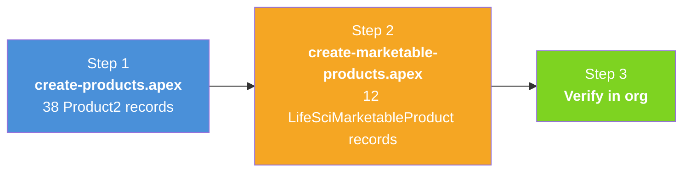
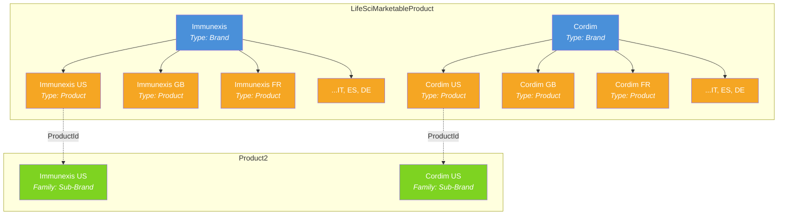
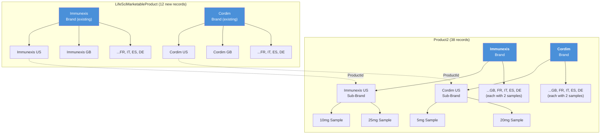

# Data Loading Scripts

## Overview

These Anonymous Apex scripts create the full multi-country product hierarchy and marketable product records in your org. Both scripts are idempotent — safe to re-run without creating duplicates.



**Prerequisites:**
- `Country__c` custom picklist field deployed to `Product2` and `LifeSciMarketableProduct` (see `force-app/` metadata)
- `ParentProduct__c` custom lookup deployed to `Product2` (see [README-06](README-06-Parent-Child-Approaches.md))
- `Family` picklist values `Brand`, `Sub-Brand`, `Sample` available on `Product2.Family`
- `Multi_Country_Brand_Admin` permission set assigned to running user (for FLS on custom fields)
- Existing `Immunexis` and `Cordim` Brand-type LifeSciMarketableProduct records (these exist in the standard LSC demo data)

---

## Step 1: Create Product2 Hierarchy

**Script:** `scripts/create-products.apex`

Creates 38 Product2 records in a three-level hierarchy:

| Level | Family | Records | Parent Field |
|-------|--------|---------|--------------|
| 1 | Brand | 2 | None |
| 2 | Sub-Brand | 12 (2 brands x 6 countries) | `ParentProduct__c` → Brand |
| 3 | Sample | 24 (12 sub-brands x 2 dosages) | `ParentProduct__c` → Sub-Brand |

**Run it:**
```bash
sf apex run --file scripts/create-products.apex --target-org 260-pm
```

**How it works:**
1. Queries all existing Product2 records by ProductCode (idempotency key)
2. Inserts new records or updates existing ones
3. Populates `ParentProduct__c` to link child → parent
4. Sets `Country__c` on Sub-Brands and Samples

> **Note:** The script uses `ParentProduct__c` (custom lookup) by default. If your org has Product Hierarchy enabled, swap to the lines marked `[STANDARD HIERARCHY]` in the script. See [README-06](README-06-Parent-Child-Approaches.md) for details.

---

## Step 2: Create LifeSciMarketableProduct Records

**Script:** `scripts/create-marketable-products.apex`

Creates 12 LifeSciMarketableProduct records — one per brand per country. These make the country-level sub-brands visible across LSC features (territory alignment, call discussions, product priorities, etc.).

| Brand | Records | Parent Brand (via ParentBrandProductId) |
|-------|---------|----------------------------------------|
| Immunexis | 6 (US, GB, FR, IT, ES, DE) | Existing "Immunexis" Brand marketable product |
| Cordim | 6 (US, GB, FR, IT, ES, DE) | Existing "Cordim" Brand marketable product |

Each record is:
- Linked to its **Product2 sub-brand** via `ProductId`
- Parented under the **Brand marketable product** via `ParentBrandProductId`
- Tagged with `Country__c`

**Run it:**
```bash
sf apex run --file scripts/create-marketable-products.apex --target-org 260-pm
```

**How it works:**
1. Looks up existing Brand-type LifeSciMarketableProduct records for Immunexis and Cordim
2. Looks up Product2 sub-brand records (Family = Sub-Brand)
3. Queries existing LifeSciMarketableProduct records by ProductCode (idempotency key)
4. Inserts new records or updates existing ones



---

## Why Both Objects?

| Object | Role | Without It |
|--------|------|------------|
| **Product2** | Master product catalog — defines brands, dosages, hierarchy | No products exist |
| **LifeSciMarketableProduct** | Makes products available in LSC features — territory alignment, call discussions, priorities, sampling | Products exist but are invisible to reps and LSC workflows |

Think of Product2 as the **definition** and LifeSciMarketableProduct as the **activation** for LSC.

---

## Expected Output After Both Scripts



> **Record counts:** 38 Product2 (2 brands + 12 sub-brands + 24 samples) + 12 new LifeSciMarketableProduct = **50 total records created**

---

## Cleanup Scripts

### Delete Product2 Records
```bash
sf apex run --file scripts/delete-products.apex --target-org 260-pm
```

Deletes in reverse hierarchy order: Samples → Sub-Brands → Brands.

### Delete LifeSciMarketableProduct Records
```apex
// Delete country-level marketable products (not the Brand-level parents)
delete [
    SELECT Id FROM LifeSciMarketableProduct
    WHERE ProductCode LIKE 'IMMUNEXIS-%' OR ProductCode LIKE 'CORDIM-%'
];
System.debug('Country marketable products deleted.');
```

---

## Data Source

All brand definitions, countries, and dosages are stored in `data/products.json`. Edit that file to add brands, countries, or dosages, then update the scripts to match.

---

## Related READMEs

- [README-01: Product Hierarchy Architecture](README-01-Product-Hierarchy.md)
- [README-02: LSC Areas Where Products Appear](README-02-LSC-Product-Areas.md)
- [README-03: Country Field Requirements Per Object](README-03-Country-Field-Requirements.md)
- [README-05: Country Global Value Set](README-05-Country-Global-Value-Set.md)
- [README-06: Parent-Child Approaches](README-06-Parent-Child-Approaches.md)
