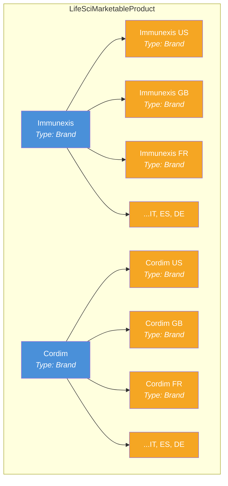
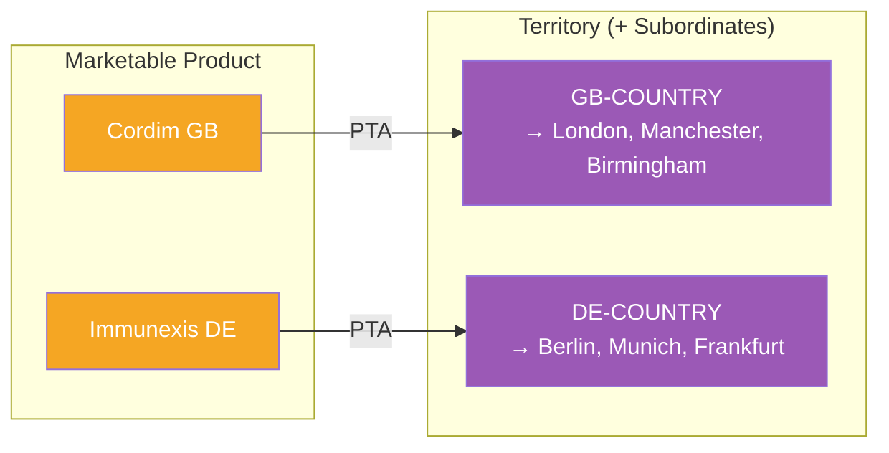
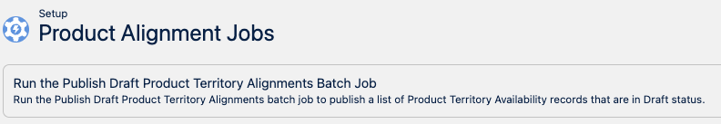
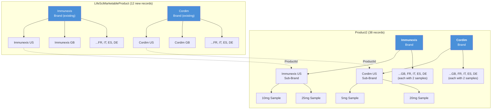

# Data Loading Scripts

## Overview

These Anonymous Apex scripts create the full multi-country product hierarchy and marketable product records in your org. All scripts are idempotent — safe to re-run without creating duplicates.

```mermaid
flowchart LR
    S1["Step 1<br/><b>create-products.apex</b><br/>38 Product2 records"] --> S2["Step 2<br/><b>create-marketable-products.apex</b><br/>12 LifeSciMarketableProduct"]
    S2 --> S3["Step 3<br/><b>create-territories.apex</b><br/>25 Territory2 records"]
    S3 --> S4["Step 4<br/><b>create-territory-product-alignment.apex</b><br/>12 ProductTerritoryAvailability"]
    S4 --> S5["Step 5<br/><b>create-provider-territory-info.apex</b><br/>Account → Territory visibility"]
    S5 --> S6a["Step 6a<br/><b>create-sample-marketable-products.apex</b><br/>4 sample LifeSciMarketableProduct"]
    S6a --> S6b["Step 6b<br/><b>Align sample products to territory</b><br/>+ Run alignment batch job"]
    S6b --> S6c["Step 6c<br/><b>create-sample-inventory.apex</b><br/>4 ProductItem records"]
    S6c --> S6d["Step 6d<br/><b>create-sample-allocations.apex</b><br/>8 TerritoryProdtQtyAllocation"]
    S6d --> S6e["Step 6e<br/><b>create-sample-limits.apex</b><br/>ProviderSampleLimit records"]
    S6e --> S7["Step 7<br/><b>Verify in org</b>"]

    style S1 fill:#4a90d9,color:#fff
    style S2 fill:#f5a623,color:#fff
    style S3 fill:#9b59b6,color:#fff
    style S4 fill:#e74c3c,color:#fff
    style S5 fill:#2ecc71,color:#fff
    style S6a fill:#2ecc71,color:#fff
    style S6b fill:#e74c3c,color:#fff
    style S6c fill:#2ecc71,color:#fff
    style S6d fill:#2ecc71,color:#fff
    style S6e fill:#2ecc71,color:#fff
    style S7 fill:#7ed321,color:#fff
```



**Prerequisites:**
- `Country__c` custom picklist field deployed to `Product2` and `LifeSciMarketableProduct` (see `force-app/` metadata)
- `ParentProduct__c` custom lookup deployed to `Product2` (see [README-06](README-06-Parent-Child-Approaches.md))
- `Family` picklist values `Brand`, `Sub-Brand`, `Sample` available on `Product2.Family`
- `Multi_Country_Brand_Admin` permission set assigned to running user (for FLS on custom fields)
- Existing `Immunexis` and `Cordim` Brand-type LifeSciMarketableProduct records (these exist in the standard LSC demo data)

---

## Step 1: Create Product2 Hierarchy

**Script:** `scripts/create-products.apex`

Creates 38 Product2 records in a three-level hierarchy:

| Level | Family | Records | Parent Field |
|-------|--------|---------|--------------|
| 1 | Brand | 2 | None |
| 2 | Sub-Brand | 12 (2 brands x 6 countries) | `ParentProduct__c` → Brand |
| 3 | Sample | 24 (12 sub-brands x 2 dosages) | `ParentProduct__c` → Sub-Brand |

**Run it:**
```bash
sf apex run --file scripts/create-products.apex --target-org 260-pm
```

**How it works:**
1. Queries all existing Product2 records by ProductCode (idempotency key)
2. Inserts new records or updates existing ones
3. Populates `ParentProduct__c` to link child → parent
4. Sets `Country__c` on Sub-Brands and Samples

> **Note:** The script uses `ParentProduct__c` (custom lookup) by default. If your org has Product Hierarchy enabled, swap to the lines marked `[STANDARD HIERARCHY]` in the script. See [README-06](README-06-Parent-Child-Approaches.md) for details.

---

## Step 2: Create LifeSciMarketableProduct Records

**Script:** `scripts/create-marketable-products.apex`

Creates 12 LifeSciMarketableProduct records — one per brand per country. These make the country-level brands visible in Product Details during Visit Engagement, territory alignment, call discussions, product priorities, etc.

| Brand | Records | Parent Brand (via ParentBrandProductId) |
|-------|---------|----------------------------------------|
| Immunexis | 6 (US, GB, FR, IT, ES, DE) | Existing "Immunexis" Brand marketable product |
| Cordim | 6 (US, GB, FR, IT, ES, DE) | Existing "Cordim" Brand marketable product |

Each record is:
- Created with **`Type = 'Brand'`** so it appears in the Product Details section during visits
- Parented under the **Brand marketable product** via `ParentBrandProductId`
- Tagged with `Country__c`
- **No `ProductId` link** — the platform requires `ProductId = null` when `Type = 'Brand'`

> **Why `Type = 'Brand'`?** The Visit Engagement component filters detailable products with `Type IN ('Brand','Indication','TherapeuticArea','BrandIndication')`. Records with `Type = 'Product'` are excluded from Product Details. See [README-02 — How Product Details Are Resolved](README-02-LSC-Product-Areas.md#how-product-details-are-resolved-during-a-visit) for the full SOQL resolution chain.

**Run it:**
```bash
sf apex run --file scripts/create-marketable-products.apex --target-org 260-pm
```

**How it works:**
1. Looks up existing Brand-type LifeSciMarketableProduct records for Immunexis and Cordim
2. Queries existing LifeSciMarketableProduct records by ProductCode (idempotency key)
3. Inserts new records (or updates existing) with `Type = 'Brand'` and `ProductId = null`



---

## Why Both Objects?

| Object | Role | Without It |
|--------|------|------------|
| **Product2** | Master product catalog — defines brands, dosages, hierarchy | No products exist |
| **LifeSciMarketableProduct** | Makes products available in LSC features — territory alignment, call discussions, priorities, sampling | Products exist but are invisible to reps and LSC workflows |

Think of Product2 as the **definition** and LifeSciMarketableProduct as the **activation** for LSC.

---

## Step 3: Create Territory Hierarchy

**Script:** `scripts/create-territories.apex`

Creates 25 Territory2 records in a three-level hierarchy under the existing active Territory2Model:

| Level | Naming Convention | Records |
|-------|-------------------|---------|
| 1 | GLOBAL | 1 |
| 2 | `{CC}-COUNTRY` | 6 (US, GB, FR, IT, ES, DE) |
| 3 | `{CC}-FSR-{seq}-{City}` | 18 (3 cities per country) |

All territories have `AccountAccessLevel = Edit` (view and edit for accounts).

**Run it:**
```bash
sf apex run --file scripts/create-territories.apex --target-org 260-pm
```

**How it works:**
1. Looks up the active Territory2Model and Territory2Type
2. Queries all existing territories by DeveloperName (idempotency key)
3. Creates GLOBAL top-level, then countries, then cities
4. Sets `AccountAccessLevel = 'Edit'` on all records

```mermaid
graph TD
    G["GLOBAL"]
    G --> US["US-COUNTRY"]
    G --> GB["GB-COUNTRY"]
    G --> FR["FR-COUNTRY"]
    G --> IT["IT-COUNTRY"]
    G --> ES["ES-COUNTRY"]
    G --> DE["DE-COUNTRY"]

    US --> US1["US-FSR-001-New York"]
    US --> US2["US-FSR-002-Los Angeles"]
    US --> US3["US-FSR-003-Chicago"]

    GB --> GB1["GB-FSR-001-London"]
    GB --> GB2["GB-FSR-002-Manchester"]
    GB --> GB3["GB-FSR-003-Birmingham"]

    DE --> DE1["DE-FSR-001-Berlin"]
    DE --> DE2["DE-FSR-002-Munich"]
    DE --> DE3["DE-FSR-003-Frankfurt"]

    FR --> FR1["...Paris, Lyon, Marseille"]
    IT --> IT1["...Rome, Milan, Naples"]
    ES --> ES1["...Madrid, Barcelona, Valencia"]

    style G fill:#9b59b6,color:#fff
    style US fill:#9b59b6,color:#fff
    style GB fill:#9b59b6,color:#fff
    style FR fill:#9b59b6,color:#fff
    style IT fill:#9b59b6,color:#fff
    style ES fill:#9b59b6,color:#fff
    style DE fill:#9b59b6,color:#fff
```



> These territories sit alongside the existing US-only territory hierarchy (RD - Midwest, Northeast, etc.) and do not modify it.

---

## Step 4: Align Marketable Products to Territories

**Script:** `scripts/create-territory-product-alignment.apex`

Creates 12 `ProductTerritoryAvailability` records — one per country marketable product aligned to its matching country territory.

| Field | Value |
|-------|-------|
| `ProductId` | Country-level LifeSciMarketableProduct |
| `TerritoryId` | Matching `{CC}-COUNTRY` Territory2 |
| `AlignmentType` | Territory and Subordinates Inclusion |
| `Purpose` | Visit |
| `Status` | Active |
| `UsageType` | LifeSciences |

**"Territory and Subordinates Inclusion"** means the product is available in the country territory AND all city FSR territories underneath — no need to create separate alignments per city.

**Run it:**
```bash
sf apex run --file scripts/create-territory-product-alignment.apex --target-org 260-pm
```

**How it works:**
1. Looks up country territories and country marketable products
2. Checks for existing alignments (idempotency)
3. Inserts as `Draft` (platform requirement)

> **Do NOT activate PTA records via Apex.** The records must remain in Draft so the batch job can properly process them and expand the alignments into subordinate territories. Activating via Apex bypasses this expansion — products will not appear in child territories like `GB-FSR-001-London`.



> **After running the script**, go to **Setup > Product Alignment Jobs** and run the **"Publish Draft Product Territory Alignments Batch Job"**. This is a standard Salesforce step that finalizes PTA records. While the script updates records to Active programmatically, running this job ensures the alignments are fully published and visible across all LSC features.
>
> 

After the batch job completes, 12 `ProductTerritoryAvailability` records are created — one per country marketable product:

| Product | Territory | Alignment Type | Status |
|---------|-----------|---------------|--------|
| Immunexis US | US-COUNTRY | Territory and Subordinates Inclusion | Active |
| Immunexis GB | GB-COUNTRY | Territory and Subordinates Inclusion | Active |
| Immunexis FR | FR-COUNTRY | Territory and Subordinates Inclusion | Active |
| Immunexis IT | IT-COUNTRY | Territory and Subordinates Inclusion | Active |
| Immunexis ES | ES-COUNTRY | Territory and Subordinates Inclusion | Active |
| Immunexis DE | DE-COUNTRY | Territory and Subordinates Inclusion | Active |
| Cordim US | US-COUNTRY | Territory and Subordinates Inclusion | Active |
| Cordim GB | GB-COUNTRY | Territory and Subordinates Inclusion | Active |
| Cordim FR | FR-COUNTRY | Territory and Subordinates Inclusion | Active |
| Cordim IT | IT-COUNTRY | Territory and Subordinates Inclusion | Active |
| Cordim ES | ES-COUNTRY | Territory and Subordinates Inclusion | Active |
| Cordim DE | DE-COUNTRY | Territory and Subordinates Inclusion | Active |

Because each alignment uses **"Territory and Subordinates Inclusion"**, reps assigned to any city FSR territory (e.g., `GB-FSR-001-London`) automatically see the country's products (Immunexis GB, Cordim GB) without needing separate alignments per city.

> **For Sample Management:** This step only aligns **Brand-level** marketable products. If you're setting up samples (Step 6), the sample-level marketable products also need separate territory alignment — see [Step 6b](#step-6b-align-sample-products-to-territory--run-alignment-batch).

---

## Step 5: Create Provider Account Territory Info

**Script:** `scripts/create-provider-territory-info.apex`

Creates `ProviderAcctTerritoryInfo` (PATI) records so reps can see accounts in their territory. Without these, LSC features (OMCC, My Accounts, visit planning) show **no accounts** — even if accounts are assigned to the territory.

The script is configurable — edit the variables at the top:
```apex
String TERRITORY_DEV_NAME = 'GB_FSR_001_London';  // Target territory
Integer ACCOUNT_LIMIT = 50;                        // Number of accounts
```

**Run it:**
```bash
sf apex run --file scripts/create-provider-territory-info.apex --target-org 260-pm
```

**How it works:**
1. Looks up the target territory
2. Finds person accounts not already in that territory
3. Creates `ObjectTerritory2Association` records (account → territory assignment)
4. Creates `ProviderAcctTerritoryInfo` records with `IsAvailableOffline = true`

> See [README-07: Provider Account Territory Info](README-07-Provider-Account-Territory-Info.md) for full documentation on PATI, how it differs from `ObjectTerritory2Association`, and troubleshooting.

---

## Step 6: Create Sample Management Data

### Step 6a: Sample Marketable Products

**Script:** `scripts/create-sample-marketable-products.apex`

Creates sample-level `LifeSciMarketableProduct` records with `Type = 'Product'`, `DistributionMethod = 'DropAndShip'`, and `ProductSpecificationType = 'LSSampleProduct'` (auto-populated). These are required for the Samples panel during Visit Engagement.

```bash
sf apex run --file scripts/create-sample-marketable-products.apex --target-org 260-pm
```

### Step 6b: Align Sample Products to Territory + Run Alignment Batch

**Manual step (Admin Console UI).** Each sample-level marketable product from Step 6a must be aligned to the rep's territory, then the alignment batch job must run to create `ProductTerrDtlAvailability` (PTDA) records.

1. Go to **Setup > Product Alignment**
2. For each sample product (e.g., `Cordim GB 5mg`, `Immunexis GB 10mg`), check the box next to the rep's territory (e.g., `GB-FSR-001-London`)
3. Run the **alignment batch job** from the Product Alignment page

> **Why is this needed?** The Samples panel uses PTDA records as the master product pool. Step 4 only aligns Brand-level products (e.g., `Immunexis GB`) to the country territory. Sample-level products need their own alignment so the batch job creates sample-level PTDAs. Without PTDAs for sample products, the Samples panel shows "No items found" even if all other data is correct.

### Step 6c: Sample Inventory

**Script:** `scripts/create-sample-inventory.apex`

Creates `ProductItem` records in the rep's inventory location for each sample product.

```bash
sf apex run --file scripts/create-sample-inventory.apex --target-org 260-pm
```

### Step 6d: Sample Allocations

**Script:** `scripts/create-sample-allocations.apex`

Creates `TerritoryProdtQtyAllocation` records — sample quotas for each sample product in the target territory.

```bash
sf apex run --file scripts/create-sample-allocations.apex --target-org 260-pm
```

### Step 6e: Sample Limits

**Script:** `scripts/create-sample-limits.apex`

Creates `ProviderSampleLimit` records linking accounts to marketable products with a sample limit template.

```bash
sf apex run --file scripts/create-sample-limits.apex --target-org 260-pm
```

> See [README-08: Sample Management Setup](README-08-Sample-Management-Setup.md) for full documentation on the sample SOQL resolution chain, object relationships, and troubleshooting.

---

## Expected Output After All Scripts



> **Record counts:** 38 Product2 + 12 LifeSciMarketableProduct + 25 Territory2 + 12 ProductTerritoryAvailability = **87 total records created**

---

## Cleanup Scripts

Run in reverse order — sample data first, then PATI, then alignments, then territories, then marketable products, then products.

### 0a. Delete Sample Data
```bash
sf apex run --file scripts/delete-sample-data.apex --target-org 260-pm
```

### 0b. Delete Provider Account Territory Info
```bash
sf apex run --file scripts/delete-provider-territory-info.apex --target-org 260-pm
```

### 1. Delete Territory-Product Alignments
```apex
// Delete PTA records for our country marketable products
List<Id> mktIds = new List<Id>();
for (LifeSciMarketableProduct m : [SELECT Id FROM LifeSciMarketableProduct WHERE ProductCode LIKE 'IMMUNEXIS-%' OR ProductCode LIKE 'CORDIM-%']) {
    mktIds.add(m.Id);
}
delete [SELECT Id FROM ProductTerritoryAvailability WHERE ProductId IN :mktIds];
System.debug('Territory-product alignments deleted.');
```

### 2. Delete Territories
```bash
sf apex run --file scripts/delete-territories.apex --target-org 260-pm
```

Deletes in reverse order: Cities → Countries → GLOBAL.

### 3. Delete LifeSciMarketableProduct Records
```apex
// Delete country-level marketable products (not the Brand-level parents)
delete [
    SELECT Id FROM LifeSciMarketableProduct
    WHERE ProductCode LIKE 'IMMUNEXIS-%' OR ProductCode LIKE 'CORDIM-%'
];
System.debug('Country marketable products deleted.');
```

### 4. Delete Product2 Records
```bash
sf apex run --file scripts/delete-products.apex --target-org 260-pm
```

Deletes in reverse hierarchy order: Samples → Sub-Brands → Brands.

---

## Data Sources

| File | What It Defines |
|------|-----------------|
| `data/products.json` | Brands, countries, sample dosages |
| `data/territories.json` | Country territories and cities |

Edit these files and update the corresponding scripts to match, then re-run.

---

## Script Summary

| Script | Creates | Records | Object |
|--------|---------|---------|--------|
| `scripts/create-products.apex` | Product hierarchy | 38 | Product2 |
| `scripts/create-marketable-products.apex` | Marketable products | 12 | LifeSciMarketableProduct |
| `scripts/create-territories.apex` | Territory hierarchy | 25 | Territory2 |
| `scripts/create-territory-product-alignment.apex` | Product-territory alignment | 12 | ProductTerritoryAvailability |
| `scripts/create-provider-territory-info.apex` | Account-territory visibility | 50 per territory | ProviderAcctTerritoryInfo + ObjectTerritory2Association |
| `scripts/delete-products.apex` | Cleanup products | — | Product2 |
| `scripts/delete-territories.apex` | Cleanup territories | — | Territory2 |
| `scripts/delete-provider-territory-info.apex` | Cleanup account-territory | — | ProviderAcctTerritoryInfo + ObjectTerritory2Association |
| `scripts/create-sample-marketable-products.apex` | Sample-level marketable products | 4 per country | LifeSciMarketableProduct |
| `scripts/create-sample-inventory.apex` | Rep inventory items | 4 per rep | ProductItem |
| `scripts/create-sample-allocations.apex` | Territory sample quotas | 8 per territory | TerritoryProdtQtyAllocation |
| `scripts/create-sample-limits.apex` | Account sample limits | N accounts x 2 products | ProviderSampleLimit |
| `scripts/delete-sample-data.apex` | Cleanup all sample data | — | All sample objects |

---

## Related READMEs

- [README-01: Product Hierarchy Architecture](README-01-Product-Hierarchy.md)
- [README-02: LSC Areas Where Products Appear](README-02-LSC-Product-Areas.md)
- [README-03: Country Field Requirements Per Object](README-03-Country-Field-Requirements.md)
- [README-05: Country Global Value Set](README-05-Country-Global-Value-Set.md)
- [README-06: Parent-Child Approaches](README-06-Parent-Child-Approaches.md)
- [README-07: Provider Account Territory Info](README-07-Provider-Account-Territory-Info.md)
- [README-08: Sample Management Setup](README-08-Sample-Management-Setup.md)
