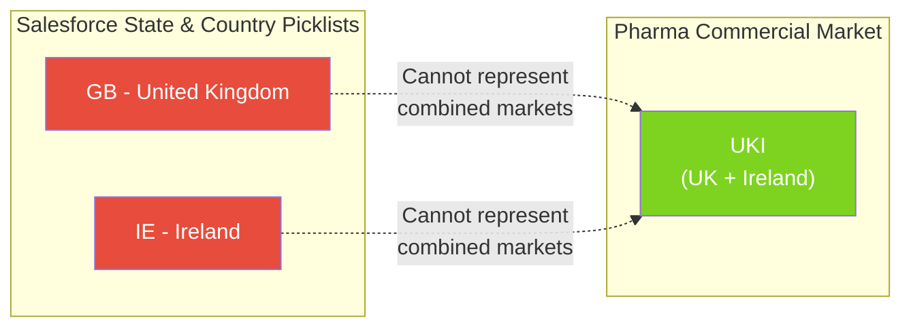
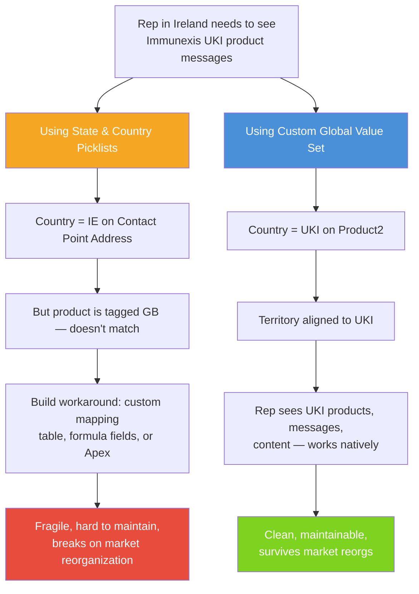
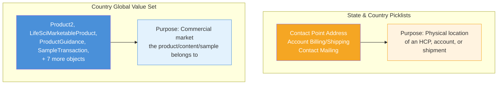

# Country Global Value Set: Design Rationale

## Why a Custom Global Value Set Instead of Salesforce State & Country Picklists?

Salesforce provides a built-in **State & Country Picklists** feature (used in `Contact`, `Account`, `ContactPointAddress`, etc.) that maps to ISO 3166 physical countries. At first glance, this seems like the obvious choice for a multi-country product hierarchy. **It is not.**

Pharmaceutical companies do not organize their business around physical countries — they organize around **commercial markets**, which often differ from political boundaries.



---

## The Problem with State & Country Picklists

### Real-World Pharma Market Examples

| Pharma Market Code | Physical Countries Included | Why It Exists |
|---|---|---|
| **UKI** | United Kingdom + Ireland | Single commercial team covers both markets |
| **DACH** | Germany + Austria + Switzerland | German-speaking markets managed together |
| **Nordics** / **NORD** | Denmark, Sweden, Norway, Finland | Combined Nordic commercial operations |
| **Benelux** / **BNL** | Belgium, Netherlands, Luxembourg | Shared regulatory and distribution |
| **ANZ** | Australia + New Zealand | Combined Asia-Pacific commercial unit |
| **LATAM** | Multiple Latin American countries | Regional commercial team structure |
| **MEA** | Middle East + Africa | Emerging markets managed as a region |
| **CEE** | Central & Eastern Europe | Regional market access team |
| **Greater China** | China + Hong Kong + Taiwan | Single commercial strategy |

Salesforce State & Country Picklists **cannot represent any of these**. They are locked to ISO 3166 physical countries with no ability to add custom values.

### What Happens When You Use State & Country Picklists for Product Hierarchy



---

## Comparison: Custom GVS vs State & Country Picklists

| Criteria | Custom Global Value Set | State & Country Picklists |
|---|---|---|
| **Add custom market codes** (UKI, DACH, Nordics) | YES — add any value | NO — locked to ISO 3166 |
| **Rename markets** during reorgs | YES — update the GVS | NO — cannot modify standard values |
| **Use on any object** | YES — any object can reference it | NO — only address fields on standard objects |
| **Works on LSC objects** (LifeSciMarketableProduct, ProductGuidance, etc.) | YES | NO — not available on these objects |
| **Consistent across objects** | YES — single GVS, all fields inherit | N/A — only works on address fields |
| **Mobile app filtering** | YES — standard picklist behavior | NO — address picklists not usable for product filtering |
| **Sharing rules** | YES — picklist fields support sharing rules | NO — address country not available for sharing |
| **Reports & dashboards** | YES — group/filter by Country__c | Limited — only on address fields |
| **Represents physical countries** | YES — ISO 3166 codes included as baseline | YES — this is its only strength |
| **Future-proof for market changes** | YES — add/rename/deactivate values freely | NO — tied to geopolitical boundaries |

---

## Why Both Can Coexist

This is not an either/or decision:



| Use Case | Use This |
|---|---|
| Where does the HCP physically practice? | State & Country Picklists (ContactPointAddress) |
| Where should we ship samples? | State & Country Picklists (Shipping Address) |
| Which commercial market does this product belong to? | **Country Global Value Set** |
| Which market's regulatory messages should the rep see? | **Country Global Value Set** |
| Which territory/market does this sample allocation serve? | **Country Global Value Set** |

---

## What's in the Global Value Set

The `Country` Global Value Set ships with **196 ISO 3166-1 alpha-2 country codes** as a baseline:

- **Format:** `XX - Country Name` (e.g., `US - United States`, `DE - Germany`)
- **API Value (fullName):** ISO code only (e.g., `US`, `DE`) — keeps data clean for integrations
- **Label:** Code + name for user readability in picklist dropdowns

### Adding Custom Market Codes

To add a combined market like `UKI`, edit the Global Value Set file:

```xml
<!-- Add to Country.globalValueSet-meta.xml -->
<customValue>
    <fullName>UKI</fullName>
    <default>false</default>
    <label>UKI - United Kingdom and Ireland</label>
</customValue>
```

Then redeploy. All 10 `Country__c` fields across all objects immediately get the new value. No per-object changes needed.

### Deactivating Countries Not In Use

To keep picklist dropdowns manageable, deactivate countries you don't operate in:

```xml
<customValue>
    <fullName>TV</fullName>
    <default>false</default>
    <isActive>false</isActive>
    <label>TV - Tuvalu</label>
</customValue>
```

Deactivated values are hidden from picklists but preserved on existing records.

---

## SFDX Metadata

```
force-app/main/default/globalValueSets/Country.globalValueSet-meta.xml
```

Referenced by all `Country__c` fields via `<valueSetName>Country</valueSetName>`.

---

## Related READMEs

- [README-01: Product Hierarchy Architecture](README-01-Product-Hierarchy.md)
- [README-02: LSC Areas Where Products Appear](README-02-LSC-Product-Areas.md)
- [README-03: Country Field Requirements Per Object](README-03-Country-Field-Requirements.md)
- [README-04: Data Loading Scripts](README-04-Data-Loading-Scripts.md)
