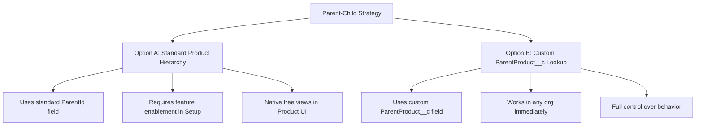
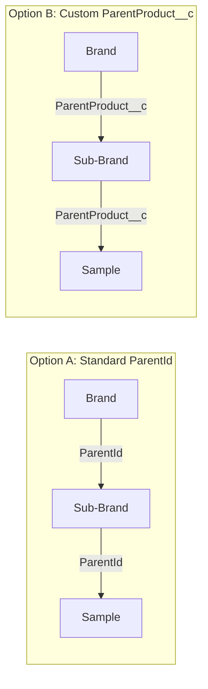

# README 06 — Parent-Child Relationship Approaches

## Overview

Product2 records in this project form a three-level hierarchy: **Brand > Sub-Brand > Sample**. Salesforce offers two ways to model this parent-child relationship. **It is the customer's choice which approach to use.**



---

## What It Looks Like in the Org

The screenshot below shows the **All Products** list view after running `scripts/create-products.apex`. Notice the three Product Family values (Brand, Sub-Brand, Sample) and the ProductCode naming convention that encodes the hierarchy.


> **Key observations:**
> - **Brands** (e.g., `IMMUNEXIS`) have no country suffix and Family = Brand
> - **Sub-Brands** (e.g., `IMMUNEXIS-DE`) include the country code and Family = Sub-Brand
> - **Samples** (e.g., `IMMUNEXIS-DE-10mg-SMPL`) include country + dosage + SMPL suffix and Family = Sample
> - The `ParentProduct__c` field (not shown in this view) links each level to its parent

---

## Option A: Standard Product Hierarchy (ParentId)

Salesforce provides a built-in **Product Hierarchy** feature that adds a standard `ParentId` field to Product2. This creates a native parent-child relationship managed by the platform.

### How to Enable

1. Navigate to **Setup > Product Settings**
2. Enable **Product Hierarchy**
3. The standard `ParentId` field becomes available on Product2

### Pros

| Advantage | Detail |
|-----------|--------|
| Native platform feature | Built-in UI for viewing product trees |
| No custom metadata | Uses standard field — no custom field deployment needed |
| Platform-maintained | Salesforce manages referential integrity |
| Report-friendly | Standard hierarchical rollups in reports |
| Managed package compatibility | ISV packages may expect ParentId |

### Cons

| Limitation | Detail |
|------------|--------|
| Requires explicit enablement | Not available by default — must be turned on in Setup |
| Org-wide change | Enabling Product Hierarchy affects all products, not just yours |
| Cannot disable once enabled | After enabling, the feature cannot be turned off |
| Limited customization | Cannot add custom logic (e.g., validation rules on reparenting) without triggers |
| Not always available in scratch orgs | May require specific org features/editions |

### Script Usage

In `scripts/create-products.apex`, swap the commented lines marked `[STANDARD HIERARCHY]`:

```apex
// CURRENT (custom lookup):
existing.ParentProduct__c = parentId;

// SWAP TO (standard hierarchy):
// existing.ParentId = parentId;
```

---

## Option B: Custom ParentProduct__c Lookup (Current Approach)

This project uses a custom lookup field `ParentProduct__c` on Product2 that points back to Product2. This provides the same parent-child relationship without requiring the Product Hierarchy feature.

### Field Definition

| Property | Value |
|----------|-------|
| API Name | `ParentProduct__c` |
| Type | Lookup(Product2) |
| Relationship Name | `ChildProducts` |
| Relationship Label | Child Products |
| Delete Constraint | SetNull |
| Required | No |

### Pros

| Advantage | Detail |
|-----------|--------|
| Works immediately | No feature enablement required |
| Safe to deploy | Adding a custom field has no org-wide side effects |
| Fully customizable | Add validation rules, triggers, or flow logic freely |
| Reversible | Can be removed without affecting other features |
| Coexists with ParentId | If Product Hierarchy is enabled later, both fields can exist |

### Cons

| Limitation | Detail |
|------------|--------|
| Not a standard field | Third-party packages won't recognize it |
| No native tree view | Product hierarchy UI features won't use this field |
| Manual reporting | Hierarchical rollups require custom report types |
| Migration needed if switching | If you later enable Product Hierarchy, records must be migrated from ParentProduct__c to ParentId |

---

## Comparison



| Criteria | Standard ParentId | Custom ParentProduct__c |
|----------|-------------------|-------------------------|
| Requires feature enablement | Yes | No |
| Available in all orgs | No (needs Product Hierarchy) | Yes |
| Native UI support | Yes (tree views) | No |
| Custom logic support | Limited (triggers only) | Full (validation, flows, triggers) |
| Reversible | No (cannot disable) | Yes (delete field) |
| ISV package compatibility | High | Low |
| Deployment risk | Medium (org-wide change) | Low (single custom field) |
| This project's default | No | **Yes** |

---

## Migration Path: Custom to Standard

If a customer starts with `ParentProduct__c` and later decides to enable Product Hierarchy, the migration is straightforward:

1. Enable Product Hierarchy in Setup
2. Run a data migration script to copy `ParentProduct__c` values to `ParentId`
3. Update `scripts/create-products.apex` to use the `[STANDARD HIERARCHY]` lines
4. Optionally remove `ParentProduct__c` after verifying all data migrated

```apex
// Migration script example:
List<Product2> products = [
    SELECT Id, ParentProduct__c
    FROM Product2
    WHERE ParentProduct__c != null
];
for (Product2 p : products) {
    p.ParentId = p.ParentProduct__c;
}
update products;
```

---

## Recommendation

**Start with `ParentProduct__c` (Option B)** unless your org already has Product Hierarchy enabled or you have a specific requirement for the standard field. The custom lookup gives you full flexibility with zero org-wide impact. You can always migrate to the standard field later.

---

## Deployed Metadata

| Component | Path | Status |
|-----------|------|--------|
| ParentProduct__c field | `force-app/main/default/objects/Product2/fields/ParentProduct__c.field-meta.xml` | Deployed |
| Permission Set (FLS) | `force-app/main/default/permissionsets/Multi_Country_Brand_Admin.permissionset-meta.xml` | Deployed |
| Create script | `scripts/create-products.apex` | Uses ParentProduct__c by default |
| Delete script | `scripts/delete-products.apex` | No change needed |

---

## Related READMEs

- [README-01: Product Hierarchy Architecture](README-01-Product-Hierarchy.md)
- [README-02: LSC Areas Where Products Appear](README-02-LSC-Product-Areas.md)
- [README-03: Country Field Requirements Per Object](README-03-Country-Field-Requirements.md)
- [README-04: Data Loading Scripts](README-04-Data-Loading-Scripts.md)
- [README-05: Country Global Value Set](README-05-Country-Global-Value-Set.md)
- [README-07: Provider Account Territory Info](README-07-Provider-Account-Territory-Info.md)
- [README-08: Sample Management Setup](README-08-Sample-Management-Setup.md)
