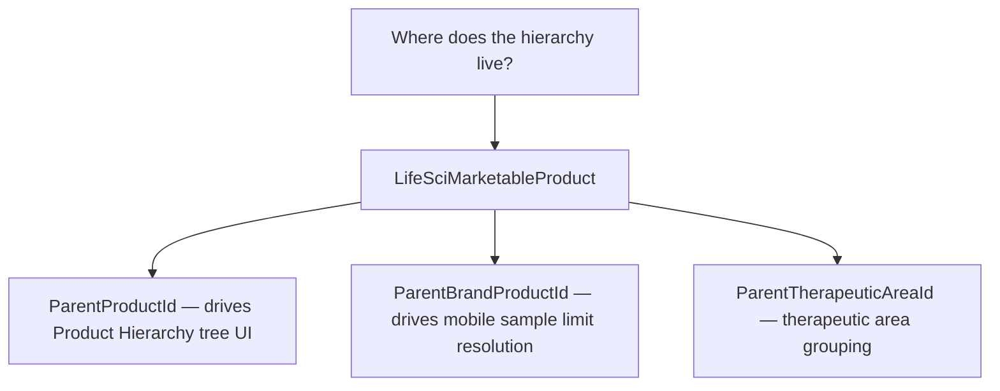
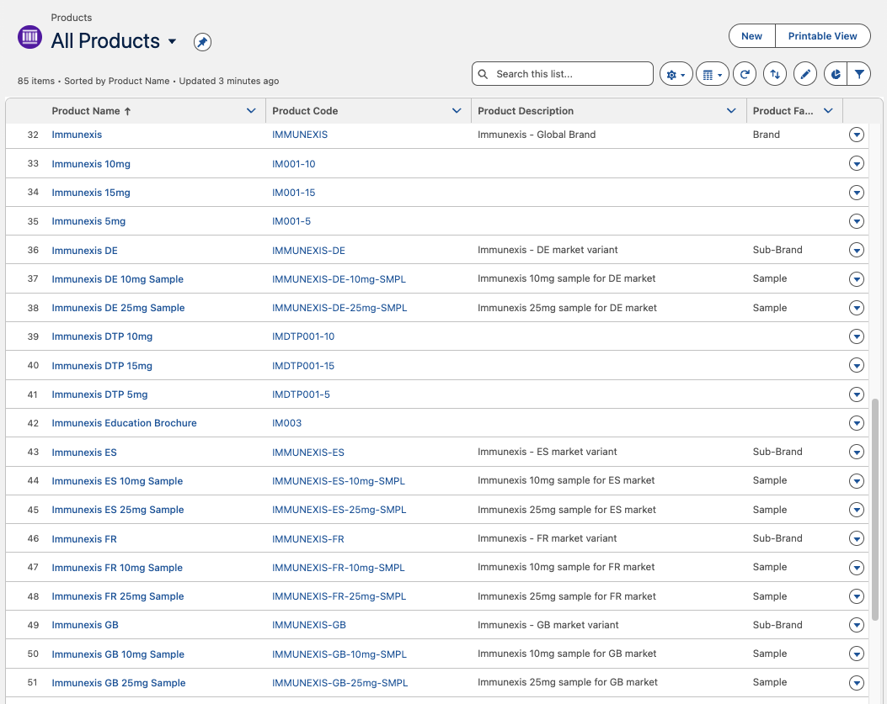

# README 06 — Product Hierarchy: Where It Lives

## Overview

Product2 records in this project form a three-level catalog: **Brand > Sub-Brand > Sample**. However, the actual parent-child hierarchy used by LSC — the Product Hierarchy UI, mobile sample limit resolution, territory alignment, and visit engagement — lives on **LifeSciMarketableProduct**, not on Product2.

---

## What It Looks Like in the Org

The screenshot below shows the **All Products** list view after running `scripts/create-products.apex`. Notice the three Product Family values (Brand, Sub-Brand, Sample) and the ProductCode naming convention that encodes the hierarchy.

> **Key observations:**
> - **Brands** (e.g., `IMMUNEXIS`) have no country suffix and Family = Brand
> - **Sub-Brands** (e.g., `IMMUNEXIS-DE`) include the country code and Family = Sub-Brand
> - **Samples** (e.g., `IMMUNEXIS-DE-10mg-SMPL`) include country + dosage + SMPL suffix and Family = Sample
> - Product2 records are flat catalog entries — the parent-child tree is on LifeSciMarketableProduct

---

## LifeSciMarketableProduct Hierarchy Fields

The LSC Product Hierarchy page (Setup > Product Configuration > Product Hierarchy) renders its tree from `LifeSciMarketableProduct` records. Three self-lookup fields control the relationships:

| Field | Purpose | Used By |
|-------|---------|---------|
| `ParentProductId` | Drives the tree in the Product Hierarchy UI (`WHERE ParentProductId = null` = root nodes) | Product Hierarchy page |
| `ParentBrandProductId` | Used by mobile app to walk up from SKU to Brand for sample limit resolution | Mobile sampling |
| `ParentTherapeuticAreaId` | Links to the therapeutic area grouping | Product Hierarchy page |

When creating country-specific marketable products, **both `ParentProductId` and `ParentBrandProductId` must be set**. If `ParentProductId` is missing, country sub-brands appear as root-level nodes instead of nesting under their parent Brand.

---

## Product2 vs LifeSciMarketableProduct

| Aspect | Product2 | LifeSciMarketableProduct |
|--------|----------|--------------------------|
| Role | Master product catalog | Activates products for LSC features |
| Hierarchy | None (flat catalog records) | `ParentProductId`, `ParentBrandProductId` |
| Product Hierarchy UI | Not used | Drives the tree |
| Mobile sampling | Not used directly | Resolves sample limits via `ParentBrandProductId` |
| Territory alignment | Not used | `ProductTerritoryAvailability` links to this object |

Think of Product2 as the **definition** and LifeSciMarketableProduct as the **activation** for LSC.

---

## Historical Note: ParentProduct__c

This project originally used a custom `ParentProduct__c` lookup on Product2 to model the hierarchy. This field has been removed because:

1. The LSC Product Hierarchy UI does not read Product2 parent-child relationships
2. The mobile app resolves sample limits via `LifeSciMarketableProduct.ParentBrandProductId`, not Product2
3. Maintaining parallel hierarchies on both objects adds confusion with no functional benefit

The hierarchy now lives exclusively on `LifeSciMarketableProduct`, which is where LSC expects it.

---

## Deployed Metadata

| Component | Path | Status |
|-----------|------|--------|
| Permission Set (FLS) | `force-app/main/default/permissionsets/Multi_Country_Brand_Admin.permissionset-meta.xml` | Deployed |
| Create products script | `scripts/create-products.apex` | Creates flat Product2 records |
| Create marketable products script | `scripts/create-marketable-products.apex` | Sets ParentProductId + ParentBrandProductId |
| Fix hierarchy script | `scripts/fix-sub-brand-parent-hierarchy.apex` | Corrects missing ParentProductId |

---

## Related READMEs

- [README-01: Product Hierarchy Architecture](README-01-Product-Hierarchy.md)
- [README-02: LSC Areas Where Products Appear](README-02-LSC-Product-Areas.md)
- [README-03: Country Field Requirements Per Object](README-03-Country-Field-Requirements.md)
- [README-04: Data Loading Scripts](README-04-Data-Loading-Scripts.md)
- [README-05: Country Global Value Set](README-05-Country-Global-Value-Set.md)
- [README-07: Provider Account Territory Info](README-07-Provider-Account-Territory-Info.md)
- [README-08: Sample Management Setup](README-08-Sample-Management-Setup.md)
