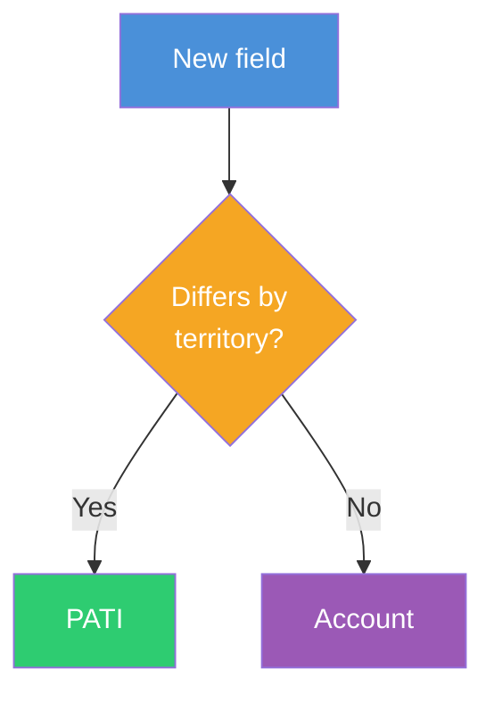
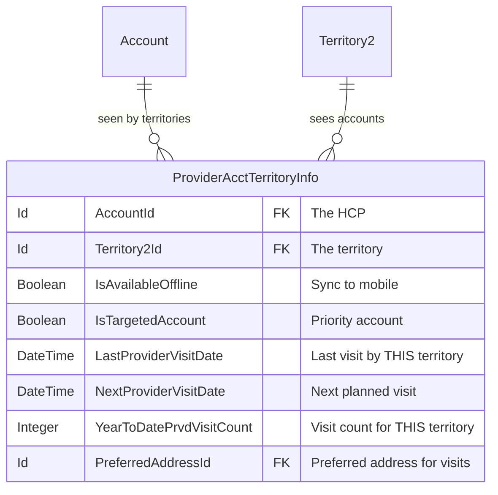
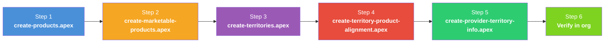

# Provider Account Territory Info (PATI)

## Where Does a Custom Field Belong?

When adding a new attribute to describe an account, use this decision flow to determine whether it belongs on the **Account** record or on the **PATI** record:



| PATI (territory-specific) | Account (universal) |
|---------------------------|---------------------|
| Is Targeted Account | NPI Number |
| Preferred Visit Address | Specialty |
| Next Visit Date | Mailing Address |
| Call Frequency | License Status |
| Territory Priority Tier | Date of Birth |

**The key question:** if two territories both see the same account, could they need different values for this attribute? If yes, the attribute belongs on PATI. If the value is the same regardless of who is looking, it belongs on Account.

---

## What Is ProviderAcctTerritoryInfo?

`ProviderAcctTerritoryInfo` (PATI) is the **intersection object** between an Account (healthcare provider) and a Territory. It represents how a specific territory views and interacts with a specific account.



### Why This Object Exists

Any data that describes the **relationship between a territory and an account** — rather than the account itself — belongs on PATI. This is the territory's view of the account.

**Example: Last Visit Date.** If you store "Last Visit Date" on the Account, you only know when *someone* last visited — but not which territory or rep. When an account is shared across territories (e.g., a hospital visited by both a cardiology rep and an oncology rep), the Account-level date would be overwritten by whichever rep visited last. On PATI, each territory tracks its own last visit date independently:

| Account | Territory | Last Visit | Next Visit |
|---------|-----------|------------|------------|
| Dr. Sarah Chen | GB-FSR-001-London | 2026-04-10 | 2026-04-24 |
| Dr. Sarah Chen | GB-FSR-004-Edinburgh | 2026-03-15 | 2026-05-01 |

The same principle applies to: targeted account status, preferred visit address, visit counts, and any custom territory-specific fields you add.

> **Rule of thumb:** If the value could differ depending on which rep/territory is looking at the account, it belongs on PATI. If it's a fact about the account itself (NPI number, specialty, address), it belongs on Account.

### How PATI Controls Account Visibility

Without PATI records, a rep will see **no accounts** — even if the accounts are assigned to their territory via `ObjectTerritory2Association`. LSC features (OMCC, My Accounts, visit planning) filter accounts using:

```sql
SELECT Id FROM Account
WHERE Id IN (
    SELECT AccountId FROM ProviderAcctTerritoryInfo
    WHERE IsAvailableOffline = true
    AND Territory2.Name = '{USER.TERRITORY}'
)
```

This filter requires three things to be true:
1. A `ProviderAcctTerritoryInfo` record exists for the account + territory
2. `IsAvailableOffline = true` on that record
3. The territory matches the logged-in user's territory

---

## How PATI Records Are Normally Created

In a production setup, PATI records are created automatically by **Territory Alignment Jobs** in the Admin Console:

1. **Setup > Territory Alignment** — configure alignment rules that match accounts to territories
2. **Run the alignment job** — the job evaluates rules and creates both `ObjectTerritory2Association` and `ProviderAcctTerritoryInfo` records
3. The job sets `IsAvailableOffline = true` and `IsActive = true` on the PATI records

For demo and development purposes, you can create them manually using the script below.

---

## PATI vs ObjectTerritory2Association

| Object | Purpose | Created By | Required For |
|--------|---------|-----------|--------------|
| `ObjectTerritory2Association` | Standard Salesforce account-territory assignment | Territory rules or manual | Sharing, territory hierarchy |
| `ProviderAcctTerritoryInfo` | LSC-specific account visibility and offline sync | Territory alignment job or manual | OMCC lists, My Accounts, visit planning, offline sync |

Both are needed. `ObjectTerritory2Association` alone is not enough — LSC features query `ProviderAcctTerritoryInfo`.

---

## Key Fields on ProviderAcctTerritoryInfo

| Field | Type | Required | Description |
|-------|------|----------|-------------|
| `AccountId` | Lookup(Account) | Yes | The account to make visible |
| `Territory2Id` | Lookup(Territory2) | Yes | The territory where this account should appear |
| `IsActive` | Boolean | Yes | Whether the assignment is active |
| `IsAvailableOffline` | Boolean | Yes | **Must be `true`** for the account to appear in OMCC and offline-synced views |
| `OwnerId` | Lookup(User) | Yes | **Must be the rep assigned to the territory.** If owned by an admin, the rep cannot see the record due to sharing rules |
| `IsTargetedAccount` | Boolean | Yes | Whether this is a targeted (priority) account for the territory |
| `AssignmentApprovalStatus` | Picklist | No | Approval workflow status |
| `PreferredAddressId` | Lookup(ContactPointAddress) | No | Preferred visit address |
| `LastProviderVisitDate` | DateTime | No | Auto-populated by visit tracking |
| `NextProviderVisitDate` | DateTime | No | Auto-populated by visit planning |
| `YearToDatePrvdVisitCount` | Integer | No | Auto-populated visit counter |

---

## Script: Create PATI Records

**Script:** `scripts/create-provider-territory-info.apex`

Assigns accounts to a territory and creates PATI records so reps can see them. The script is **configurable** — change the territory and account count at the top of the file:

```apex
String TERRITORY_DEV_NAME = 'GB_FSR_001_London';  // Change this
Integer ACCOUNT_LIMIT = 50;                        // Change this
```

**What it creates:**

| Object | Records | Description |
|--------|---------|-------------|
| `ObjectTerritory2Association` | Up to 50 | Assigns accounts to the territory |
| `ProviderAcctTerritoryInfo` | Up to 50 | Makes accounts visible in LSC features |

**Run it:**
```bash
sf apex run --file scripts/create-provider-territory-info.apex --target-org {your_org}
```

**How it works:**
1. Looks up the target territory by `DeveloperName`
2. Finds person accounts not already assigned to that territory
3. Creates `ObjectTerritory2Association` records (account → territory)
4. Creates `ProviderAcctTerritoryInfo` records with `IsAvailableOffline = true`
5. Idempotent — skips accounts that already have PATI records

### Cleanup

**Script:** `scripts/delete-provider-territory-info.apex`

Removes all PATI and OTA records for a territory. Useful for resetting and re-running.

```bash
sf apex run --file scripts/delete-provider-territory-info.apex --target-org {your_org}
```

---

## How It Fits in the Data Loading Sequence

PATI creation is **Step 5** — after products and territories are set up, but before reps can use the app:



---

## Troubleshooting

| Symptom | Cause | Fix |
|---------|-------|-----|
| Rep sees no accounts in OMCC | No PATI records for their territory | Run `create-provider-territory-info.apex` |
| Rep sees no accounts despite PATI existing | `IsAvailableOffline = false` on PATI | Update PATI records to set `IsAvailableOffline = true` |
| Accounts appear but aren't targeted | `IsTargetedAccount = false` | Update PATI records to set `IsTargetedAccount = true` |
| Account shows in OMCC but not in visit planning | PATI exists but `IsActive = false` | Update PATI to `IsActive = true` |
| PATI records exist but rep query returns 0 rows | `OwnerId` is set to admin, not the rep — sharing rules block access | Update `OwnerId` to the rep assigned to the territory |
| Account assigned to wrong territory | OTA points to wrong Territory2 | Delete and recreate OTA + PATI for correct territory |

---

## Related READMEs

- [README-01: Product Hierarchy Architecture](README-01-Product-Hierarchy.md)
- [README-02: LSC Areas Where Products Appear](README-02-LSC-Product-Areas.md)
- [README-03: Country Field Requirements Per Object](README-03-Country-Field-Requirements.md)
- [README-04: Data Loading Scripts](README-04-Data-Loading-Scripts.md)
- [README-05: Country Global Value Set](README-05-Country-Global-Value-Set.md)
- [README-06: Parent-Child Approaches](README-06-Parent-Child-Approaches.md)
- [README-08: Sample Management Setup](README-08-Sample-Management-Setup.md)
