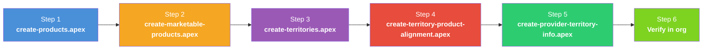

# Provider Account Territory Info (PATI)

## What Is ProviderAcctTerritoryInfo?

`ProviderAcctTerritoryInfo` (PATI) is the object that controls which accounts a rep can see in their territory. It is the bridge between an account and a territory for **LSC visit and account management features**.

Without PATI records, a rep will see **no accounts** — even if the accounts are assigned to their territory via `ObjectTerritory2Association`. This is because LSC features (OMCC, My Accounts, visit planning) filter accounts using:

```sql
SELECT Id FROM Account
WHERE Id IN (
    SELECT AccountId FROM ProviderAcctTerritoryInfo
    WHERE IsAvailableOffline = true
    AND Territory2.Name = '{USER.TERRITORY}'
)
```

This filter requires three things to be true:
1. A `ProviderAcctTerritoryInfo` record exists for the account + territory
2. `IsAvailableOffline = true` on that record
3. The territory matches the logged-in user's territory

---

## How PATI Records Are Normally Created

In a production setup, PATI records are created automatically by **Territory Alignment Jobs** in the Admin Console:

1. **Setup > Territory Alignment** — configure alignment rules that match accounts to territories
2. **Run the alignment job** — the job evaluates rules and creates both `ObjectTerritory2Association` and `ProviderAcctTerritoryInfo` records
3. The job sets `IsAvailableOffline = true` and `IsActive = true` on the PATI records

For demo and development purposes, you can create them manually using the script below.

---

## PATI vs ObjectTerritory2Association

| Object | Purpose | Created By | Required For |
|--------|---------|-----------|--------------|
| `ObjectTerritory2Association` | Standard Salesforce account-territory assignment | Territory rules or manual | Sharing, territory hierarchy |
| `ProviderAcctTerritoryInfo` | LSC-specific account visibility and offline sync | Territory alignment job or manual | OMCC lists, My Accounts, visit planning, offline sync |

Both are needed. `ObjectTerritory2Association` alone is not enough — LSC features query `ProviderAcctTerritoryInfo`.

---

## Key Fields on ProviderAcctTerritoryInfo

| Field | Type | Required | Description |
|-------|------|----------|-------------|
| `AccountId` | Lookup(Account) | Yes | The account to make visible |
| `Territory2Id` | Lookup(Territory2) | Yes | The territory where this account should appear |
| `IsActive` | Boolean | Yes | Whether the assignment is active |
| `IsAvailableOffline` | Boolean | Yes | **Must be `true`** for the account to appear in OMCC and offline-synced views |
| `IsTargetedAccount` | Boolean | Yes | Whether this is a targeted (priority) account for the territory |
| `AssignmentApprovalStatus` | Picklist | No | Approval workflow status |
| `PreferredAddressId` | Lookup(ContactPointAddress) | No | Preferred visit address |
| `LastProviderVisitDate` | DateTime | No | Auto-populated by visit tracking |
| `NextProviderVisitDate` | DateTime | No | Auto-populated by visit planning |
| `YearToDatePrvdVisitCount` | Integer | No | Auto-populated visit counter |

---

## Script: Create PATI Records

**Script:** `scripts/create-provider-territory-info.apex`

Assigns accounts to a territory and creates PATI records so reps can see them. The script is **configurable** — change the territory and account count at the top of the file:

```apex
String TERRITORY_DEV_NAME = 'GB_FSR_001_London';  // Change this
Integer ACCOUNT_LIMIT = 50;                        // Change this
```

**What it creates:**

| Object | Records | Description |
|--------|---------|-------------|
| `ObjectTerritory2Association` | Up to 50 | Assigns accounts to the territory |
| `ProviderAcctTerritoryInfo` | Up to 50 | Makes accounts visible in LSC features |

**Run it:**
```bash
sf apex run --file scripts/create-provider-territory-info.apex --target-org 260-pm
```

**How it works:**
1. Looks up the target territory by `DeveloperName`
2. Finds person accounts not already assigned to that territory
3. Creates `ObjectTerritory2Association` records (account → territory)
4. Creates `ProviderAcctTerritoryInfo` records with `IsAvailableOffline = true`
5. Idempotent — skips accounts that already have PATI records

### Cleanup

**Script:** `scripts/delete-provider-territory-info.apex`

Removes all PATI and OTA records for a territory. Useful for resetting and re-running.

```bash
sf apex run --file scripts/delete-provider-territory-info.apex --target-org 260-pm
```

---

## How It Fits in the Data Loading Sequence

PATI creation is **Step 5** — after products and territories are set up, but before reps can use the app:



---

## Troubleshooting

| Symptom | Cause | Fix |
|---------|-------|-----|
| Rep sees no accounts in OMCC | No PATI records for their territory | Run `create-provider-territory-info.apex` |
| Rep sees no accounts despite PATI existing | `IsAvailableOffline = false` on PATI | Update PATI records to set `IsAvailableOffline = true` |
| Accounts appear but aren't targeted | `IsTargetedAccount = false` | Update PATI records to set `IsTargetedAccount = true` |
| Account shows in OMCC but not in visit planning | PATI exists but `IsActive = false` | Update PATI to `IsActive = true` |
| Account assigned to wrong territory | OTA points to wrong Territory2 | Delete and recreate OTA + PATI for correct territory |

---

## Related READMEs

- [README-01: Product Hierarchy Architecture](README-01-Product-Hierarchy.md)
- [README-02: LSC Areas Where Products Appear](README-02-LSC-Product-Areas.md)
- [README-03: Country Field Requirements Per Object](README-03-Country-Field-Requirements.md)
- [README-04: Data Loading Scripts](README-04-Data-Loading-Scripts.md)
- [README-05: Country Global Value Set](README-05-Country-Global-Value-Set.md)
- [README-06: Parent-Child Approaches](README-06-Parent-Child-Approaches.md)
