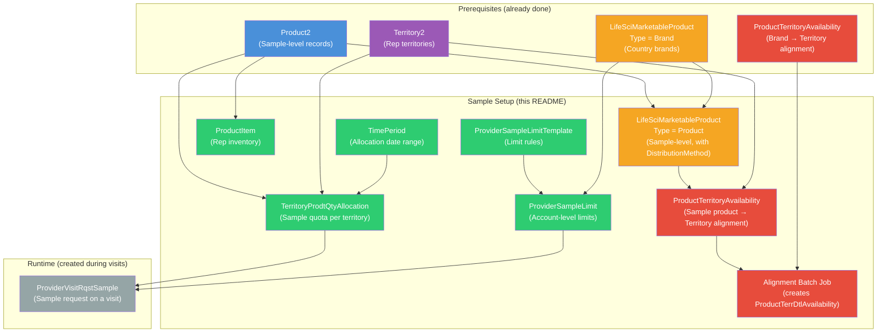
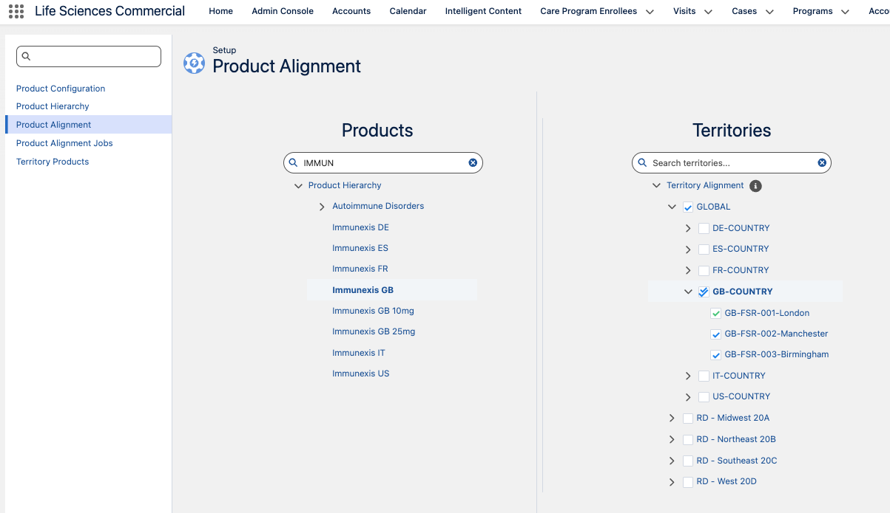

# README 08 — Sample Management Setup

## Overview

Sample Management in Life Sciences Cloud allows reps to request and track physical product samples during visits. Setting it up requires creating records across **multiple objects** in the correct order. This README documents each step.



---

## Object Relationship Map

| Object | API Name | References | Purpose |
|--------|----------|------------|---------|
| **Time Period** | `TimePeriod` | — | Defines a date range for sample allocations (e.g., "2026 First Half") |
| **Territory Product Qty Allocation** | `TerritoryProdtQtyAllocation` | `Product2`, `Territory2`, `TimePeriod` | How many units of a sample product a territory can distribute |
| **Provider Sample Limit Template** | `ProviderSampleLimitTemplate` | — | Defines the rules/limits for sample distribution (e.g., country-specific compliance rules) |
| **Provider Sample Limit** | `ProviderSampleLimit` | `LifeSciMarketableProduct`, `Account`, `ProviderSampleLimitTemplate` | Account-level limit — controls how many samples an HCP can receive |
| **Marketable Product (Sample-level)** | `LifeSciMarketableProduct` | `Product2`, parent `LifeSciMarketableProduct` | Sample-level marketable product with `Type = 'Product'`, `DistributionMethod`, and `ProductSpecificationType = 'LSSampleProduct'` |
| **Product Territory Availability (Sample)** | `ProductTerritoryAvailability` | `LifeSciMarketableProduct`, `Territory2` | Aligns each sample-level marketable product to the rep's territory. **Required** — without this, the alignment batch cannot create `ProductTerrDtlAvailability` records, and samples will not appear. |
| **Product Terr Dtl Availability** | `ProductTerrDtlAvailability` | `LifeSciMarketableProduct`, `Territory2` | Read-only records created by the alignment batch job. The Samples panel uses these as the master product pool for the territory. Cannot be inserted directly. |
| **Product Item (Rep Inventory)** | `ProductItem` | `Product2`, `Location` | Physical inventory of sample units in the rep's inventory location |
| **Provider Visit Requested Sample** | `ProviderVisitRqstSample` | `Product2`, `ProviderVisit` | Runtime record — created when a rep requests a sample during a visit |

> **Key distinction:** `TerritoryProdtQtyAllocation.ProductId` references **Product2** (the sample-level SKU), while `ProviderSampleLimit.ProductId` references **LifeSciMarketableProduct** (the brand-level marketable product).

---

## Prerequisites

Before setting up samples, you must have:

- [ ] **Sample-level Product2 records** — e.g., `Immunexis GB 10mg Sample`, `Cordim GB 5mg Sample` (created by `scripts/create-products.apex`)
- [ ] **Territory hierarchy** — e.g., `GB-FSR-001-London` (created by `scripts/create-territories.apex`)
- [ ] **Country LifeSciMarketableProduct records** — e.g., `Immunexis GB` with `Type = 'Brand'` (created by `scripts/create-marketable-products.apex`)
- [ ] **ProductTerritoryAvailability (Brands)** — Country brands aligned to country territories (created by `scripts/create-territory-product-alignment.apex`)
- [ ] **Admin Console > Sample Drop** setting is **active** (check via Tooling API — see [Verify Admin Console](#step-5-verify-admin-console-settings))
- [ ] **Rep assigned to territory** via `UserTerritory2Association`

---

## How Samples Are Resolved During a Visit

When a rep opens the **Samples** panel during Visit Engagement, the platform executes a series of SOQL queries to determine which sample products to display. Understanding this chain is critical for troubleshooting "No items found" issues.

#### Query 1 — `UserAdditionalInfo`

```sql
SELECT Preference, UserId
FROM UserAdditionalInfo
WHERE UserId IN (:currentUserId)
```

Loads the current user's preferences (language, display settings) to personalize the visit experience. Returns 1 row.

#### Query 2 — `ProductTerrDtlAvailability`

```sql
SELECT ProductId, SortOrder
FROM ProductTerrDtlAvailability
WHERE SortOrder != null
  AND RelatedTerritory.Name = '{territory}'
```

Checks for territory-aligned marketable products with sort orders. **This query often returns 0 rows** because `SortOrder` is null by default and `RelatedTerritory` may point to the parent territory (not the leaf). However, returning 0 here does **not** block samples — the platform uses **all PTDAs for the territory** (via `TerritoryId`, regardless of `SortOrder` or `RelatedTerritory.Name`) as the master product pool for downstream queries. The real requirement is that PTDA records **exist** for the sample-level marketable products.

#### Query 3 — `ApexClass`

```sql
SELECT Id, Name, NamespacePrefix, ApiVersion
FROM ApexClass
WHERE Name = 'ClassUtilities'
  AND NamespacePrefix = 'lsc4ce'
```

Internal framework lookup — loads the LSC managed package utility class. Returns 1 row.

#### Query 4 — `LifeSciProductAcctRstrc` (Global)

```sql
SELECT AccountId, ProductId, Product.Name
FROM LifeSciProductAcctRstrc
WHERE TerritoryId = null
```

Loads **global** product-account restrictions. Products matching a restriction are excluded.

#### Query 5 — `LifeSciProductAcctRstrc` (Territory)

```sql
SELECT AccountId, ProductId, Product.Name, TerritoryId, Territory.Name
FROM LifeSciProductAcctRstrc
WHERE Territory.Name = '{territory}'
```

Loads **territory-specific** product-account restrictions.

#### Query 6 — `LifeSciMarketableProduct` (Brands)

```sql
SELECT Id, Name, Type, SortOrder, ...
FROM LifeSciMarketableProduct
WHERE IsActive = true
  AND Id IN (:allPTDAProductIds)
  AND Type IN ('Brand','Indication','TherapeuticArea','BrandIndication')
  AND IsCompetitorProduct = false
```

Resolves the **Brand-level** marketable products for Product Details. The `Id IN` clause contains **all PTDA ProductIds** for the territory (not just those from Query #2). Returns the parent brands (e.g., Immunexis GB, Cordim GB).

#### Query 7 — `LifeSciMarketableProduct` (Full Fields)

```sql
SELECT Id, Name, Type, ...
FROM LifeSciMarketableProduct
WHERE Id IN (:brandIdsFromQuery6)
```

Re-queries the brand marketable products with full field set including `DistributionMethod` and `DefaultDistributionQuantity`.

#### Query 8 — `ProductItem` (Rep Inventory)

```sql
SELECT Id, Product2Id, Product2.Name, ProductName
FROM ProductItem
WHERE LocationId IN (
    SELECT Id FROM Location
    WHERE PrimaryUserId = :userId
      AND IsInventoryLocation = true
      AND LocationType = 'User Inventory'
)
```

**Key query.** Loads the rep's physical inventory. Returns `Product2Id` values for products the rep actually has in stock. If the rep has no `ProductItem` records for sample products, no samples will appear.

#### Query 9 — `LifeSciMarketableProduct` (Sample Filter)

```sql
SELECT Id
FROM LifeSciMarketableProduct
WHERE IsCompetitorProduct != true
  AND Type IN ('Product')
  AND ParentBrandProductId IN (:brandIdsFromQuery6)
  AND DistributionMethod IN ('Drop','DropAndShip')
  AND ProductId IN (:product2IdsFromQuery8)
  AND ProductSpecificationType IN ('LSSampleProduct')
```

**The critical sample filter.** This is where most "No items found" issues originate. ALL conditions must pass — see filter analysis below.

#### Query 10 — `Territory2Model`

```sql
SELECT Id FROM Territory2Model WHERE State = 'Active' LIMIT 1
```

Finds the active territory model for subsequent territory lookups.

#### Query 11 — `Territory2`

```sql
SELECT Name, DeveloperName, ...
FROM Territory2
WHERE Territory2ModelId = :modelId
  AND Name = '{territory}'
```

Loads the rep's territory details.

#### Query 12 — `ProductItem` (Re-query)

Same as Query 8 — re-queried, possibly for a different code path.

### Query #9 Filter Conditions (All Must Pass)

This is the query that determines which sample products appear in the Samples panel:

| Condition | What It Checks | Common Failure |
|---|---|---|
| `IsCompetitorProduct != true` | Must not be a competitor product | Flagged as competitor |
| **`Type IN ('Product')`** | **Must be a Product-level (not Brand) marketable product** | **Only Brand-level marketable products exist — no sample-level `Type = 'Product'` records created** |
| **`ParentBrandProductId IN (:brandIds)`** | **Must be a child of a Brand marketable product aligned to the territory** | **`ParentBrandProductId` doesn't point to the correct GB Brand marketable product** |
| **`DistributionMethod IN ('Drop','DropAndShip')`** | **Must have a distribution method set** | **`DistributionMethod` is null — field not populated on the marketable product** |
| **`ProductId IN (:product2Ids)`** | **The linked Product2 must be in the rep's inventory (ProductItem)** | **No `ProductItem` records exist for the rep's inventory location** |
| **`ProductSpecificationType IN ('LSSampleProduct')`** | **The linked Product2 must have `SpecificationType = 'LSSampleProduct'`** | **Product2.SpecificationType not set (auto-populates to marketable product)** |

> **Multi-country gotcha:** The `create-marketable-products.apex` script creates Brand-level marketable products (`Type = 'Brand'`). For samples, you also need **Product-level** marketable products (`Type = 'Product'`) with `DistributionMethod` set and `ProductId` linking to the sample Product2 records. These are created by `scripts/create-sample-marketable-products.apex`.

---

## Step-by-Step Setup

### Step 1: Sample-Level LifeSciMarketableProduct Records

The Samples panel requires **Product-level** marketable products (separate from the Brand-level ones used for Product Details). These must have:
- `Type = 'Product'`
- `ProductId` → the sample-level Product2 record
- `ParentBrandProductId` → the country Brand marketable product
- `DistributionMethod` → `Drop`, `Ship`, or `DropAndShip`

The platform auto-populates `ProductSpecificationType` from `Product2.SpecificationType`.

**Script:** `scripts/create-sample-marketable-products.apex`

```bash
sf apex run --file scripts/create-sample-marketable-products.apex --target-org 260-pm
```

Creates 4 records for GB:

| Name | Type | ProductId | ParentBrandProductId | DistributionMethod |
|------|------|-----------|---------------------|--------------------|
| Immunexis GB 10mg | Product | Immunexis GB 10mg Sample | Immunexis GB (Brand) | DropAndShip |
| Immunexis GB 25mg | Product | Immunexis GB 25mg Sample | Immunexis GB (Brand) | DropAndShip |
| Cordim GB 5mg | Product | Cordim GB 5mg Sample | Cordim GB (Brand) | DropAndShip |
| Cordim GB 20mg | Product | Cordim GB 20mg Sample | Cordim GB (Brand) | DropAndShip |

---

### Step 2: Align Sample Products to Territory + Run Alignment Job

**This is the most commonly missed step.** The Samples panel requires `ProductTerrDtlAvailability` (PTDA) records to exist for **each sample-level marketable product** in the rep's territory. PTDAs are read-only and can only be created by the alignment batch job from `ProductTerritoryAvailability` (PTA) records.

Step 4 in the main data loading flow (README-04) creates PTAs for **Brand-level** marketable products only (e.g., Immunexis GB, Cordim GB). For samples, you also need PTAs for the **sample-level** marketable products created in Step 1 above.

**How to align sample products:**

1. Go to **Admin Console > Product (tile) > Product Alignment**
2. In the **Products** panel, find each sample-level product (e.g., `Cordim GB 5mg`, `Immunexis GB 10mg`)
3. In the **Territories** panel, check the box next to the rep's territory (e.g., `GB-FSR-001-London`)
4. After aligning all sample products, go to **Product Alignment Jobs** (in the left sidebar) and run the alignment batch job



The batch job creates `ProductTerrDtlAvailability` records for each aligned product in the territory. The platform uses PTDAs as the **master product pool** — without them, samples will not appear even if all other data is correct.

> **Why can't this be scripted?** PTA records can be created via Apex (see `scripts/create-territory-product-alignment.apex`), but PTDA records can only be created by the managed package alignment batch job. The batch job is not callable from anonymous Apex — it must be triggered from the Admin Console UI via **Admin Console > Product > Product Alignment Jobs**.

> **Verifying PTDAs exist:** After the batch job completes, verify with:
> ```apex
> SELECT ProductId, Product.Name, SortOrder
> FROM ProductTerrDtlAvailability
> WHERE TerritoryId = '<territory-id>'
> ```
> You should see records for both Brand-level AND sample-level marketable products.

---

### Step 3: ProductItem (Rep Inventory)

The rep must have physical inventory of the sample products. The platform checks `ProductItem` records in the rep's `Location` (type = `User Inventory`).

**Script:** `scripts/create-sample-inventory.apex`

```bash
sf apex run --file scripts/create-sample-inventory.apex --target-org 260-pm
```

Creates `ProductItem` records with `QuantityOnHand = 1000` for each GB sample product in the rep's inventory location.

> **Note:** The rep must have a `Location` record with `LocationType = 'User Inventory'` and `IsInventoryLocation = true`. This is typically created automatically when the rep is provisioned for sample management.

---

### Step 4: TimePeriod

A `TimePeriod` defines the date range during which sample allocations are valid. The org may already have time periods — check first.

**Existing time periods covering today (2026-04-15):**

| Name | Start Date | End Date |
|------|-----------|----------|
| 2026 | 2025-01-01 | 2026-12-31 |
| 2026 First Half | 2026-01-01 | 2026-06-30 |

If a suitable time period exists, use it. If not, create one:

```apex
TimePeriod tp = new TimePeriod(
    Name = '2026 H1 - GB Samples',
    StartDate = Date.newInstance(2026, 1, 1),
    EndDate = Date.newInstance(2026, 6, 30)
);
insert tp;
```

---

### Step 5: TerritoryProdtQtyAllocation

This is the **sample quota** — how many units of each sample product a territory can distribute during the time period.

**Key fields:**

| Field | Type | Description |
|-------|------|-------------|
| `ProductId` | Lookup(Product2) | The **sample-level** Product2 record (e.g., `Immunexis GB 10mg Sample`) |
| `TerritoryId` | Lookup(Territory2) | The rep's territory (e.g., `GB-FSR-001-London`) |
| `TimePeriodId` | Lookup(TimePeriod) | The active time period |
| `AllocationType` | Picklist | `Drop` (in-person) or `Ship` (mailed to HCP) |
| `AllocatedQuantity` | Number | Total units available for this territory/product/type |
| `OwnerId` | Lookup(User) | **Must be the rep assigned to the territory** — if sharing is Private, the rep cannot see allocations owned by the admin |
| `MaxDisbursementLimitQty` | Number | Max units per single transaction (optional) |

**Script:** `scripts/create-sample-allocations.apex`

Creates allocation records for all GB sample products in the target territory:

```bash
sf apex run --file scripts/create-sample-allocations.apex --target-org 260-pm
```

The script creates **2 allocations per sample product** (Drop + Ship):

| Product | Territory | Type | Allocated Qty |
|---------|-----------|------|---------------|
| Immunexis GB 10mg Sample | GB-FSR-001-London | Drop | 10000 |
| Immunexis GB 10mg Sample | GB-FSR-001-London | Ship | 1000 |
| Immunexis GB 25mg Sample | GB-FSR-001-London | Drop | 10000 |
| Immunexis GB 25mg Sample | GB-FSR-001-London | Ship | 1000 |
| Cordim GB 5mg Sample | GB-FSR-001-London | Drop | 10000 |
| Cordim GB 5mg Sample | GB-FSR-001-London | Ship | 1000 |
| Cordim GB 20mg Sample | GB-FSR-001-London | Drop | 10000 |
| Cordim GB 20mg Sample | GB-FSR-001-London | Ship | 1000 |

> **Quantities are configurable** — edit `DROP_QUANTITY` and `SHIP_QUANTITY` at the top of the script.

---

### Step 6: ProviderSampleLimitTemplate

Sample limit templates define the **rules** governing how samples can be distributed. The org has a pre-configured template:

| DeveloperName | Label | Active |
|---------------|-------|--------|
| `lsc4ce_GenericTemplate` | Generic Template | Yes |

Country-specific templates (Germany AMG, Italy Class A/C, Belgium, etc.) exist but are **inactive**. For a basic setup, the Generic Template is sufficient.

> **To activate a country-specific template:** Go to **Setup > Provider Sample Limit Templates** or use Tooling API. For GB, no specific UK regulatory template exists in the demo data — use the Generic Template.

---

### Step 7: ProviderSampleLimit

This links an **account** (HCP) to a **marketable product** with a **limit template**, controlling how many samples the HCP can receive.

**Key fields:**

| Field | Type | Description |
|-------|------|-------------|
| `AccountId` | Lookup(Account) | The HCP/provider account |
| `ProductId` | Lookup(LifeSciMarketableProduct) | The **brand-level** marketable product (e.g., `Immunexis GB`) |
| `PrvdSampleLimitTemplateId` | Lookup(ProviderSampleLimitTemplate) | The active limit template |

**Script:** `scripts/create-sample-limits.apex`

Creates sample limit records for GB accounts in the London territory:

```bash
sf apex run --file scripts/create-sample-limits.apex --target-org 260-pm
```

The script:
1. Finds accounts with `ProviderAcctTerritoryInfo` in the target territory
2. Finds GB-country marketable products (`Immunexis GB`, `Cordim GB`)
3. Creates a `ProviderSampleLimit` for each account × product combination using the Generic Template

---

### Step 8: Verify Admin Console Settings

The **Sample Drop** configuration must be active in Admin Console. Verify with Tooling API:

```bash
sf data query --use-tooling-api \
  --query "SELECT Id, DeveloperName, MasterLabel, IsActive FROM LifeSciConfigRecord WHERE DeveloperName = 'Sample_Drop'" \
  --api-version 65.0 --target-org 260-pm
```

Expected result: `Sample_Drop` is **active**.

Also verify the DB Schema records exist:

```bash
sf data query --use-tooling-api \
  --query "SELECT Id, DeveloperName, IsActive FROM LifeSciConfigRecord WHERE DeveloperName IN ('DbSchema_ProviderSampleLimit', 'DbSchema_TerritoryProdtQtyAllocation')" \
  --api-version 65.0 --target-org 260-pm
```

Both should be active.

---

### Prerequisites Checklist

For a sample product to appear in the **Samples** panel during a visit, ALL of these must be true:

- [ ] **Brand marketable product aligned to territory**: A `ProductTerritoryAvailability` record links the Brand marketable product (e.g., `Immunexis GB`) to the rep's territory
- [ ] **Sample-level marketable product exists**: A `LifeSciMarketableProduct` with `Type = 'Product'`, `ParentBrandProductId` → the Brand, `ProductId` → the sample Product2, `DistributionMethod` set, and `ProductSpecificationType = 'LSSampleProduct'` (auto-populated from Product2)
- [ ] **Sample-level products aligned to territory**: Each sample-level marketable product must have a `ProductTerritoryAvailability` record linking it to the rep's territory (e.g., `Cordim GB 5mg` → `GB-FSR-001-London`)
- [ ] **Alignment batch job has been run**: After creating PTAs, the alignment batch job must run to create `ProductTerrDtlAvailability` records. **This is the #1 cause of "No items found"** — PTDAs are the master product pool the Samples panel reads from, and they can only be created by the batch job.
- [ ] **Rep has inventory**: A `ProductItem` record exists in the rep's `Location` (User Inventory) for the sample Product2
- [ ] **Territory has allocation**: A `TerritoryProdtQtyAllocation` record exists for the sample Product2 in the rep's territory with a current `TimePeriod`
- [ ] **Allocation OwnerId is the rep**: Under Private sharing, the rep can't see allocations owned by the admin
- [ ] **Allocated quantity > 0 remaining**: Not all samples already distributed
- [ ] **Account has sample limit**: A `ProviderSampleLimit` record exists for the account + Brand marketable product
- [ ] **Sample limit template is active**: The `ProviderSampleLimitTemplate` referenced by the limit must be active
- [ ] **Admin Console > Sample Drop is active**: The `Sample_Drop` config record must be active

---

## Data Loading Order

Sample setup is **Step 6** in the overall data loading sequence:

```mermaid
flowchart LR
    S1["Step 1<br/><b>create-products</b>"] --> S2["Step 2<br/><b>create-marketable-products</b>"]
    S2 --> S3["Step 3<br/><b>create-territories</b>"]
    S3 --> S4["Step 4<br/><b>create-territory-product-alignment</b>"]
    S4 --> S5["Step 5<br/><b>create-provider-territory-info</b>"]
    S5 --> S6a["Step 6a<br/><b>create-sample-marketable-products</b>"]
    S6a --> S6b["Step 6b<br/><b>Align samples to territory<br/>+ Run alignment batch job</b>"]
    S6b --> S6c["Step 6c<br/><b>create-sample-inventory</b>"]
    S6c --> S6d["Step 6d<br/><b>create-sample-allocations</b>"]
    S6d --> S6e["Step 6e<br/><b>create-sample-limits</b>"]

    style S1 fill:#4a90d9,color:#fff
    style S2 fill:#f5a623,color:#fff
    style S3 fill:#9b59b6,color:#fff
    style S4 fill:#e74c3c,color:#fff
    style S5 fill:#2ecc71,color:#fff
    style S6a fill:#2ecc71,color:#fff
    style S6b fill:#e74c3c,color:#fff
    style S6c fill:#2ecc71,color:#fff
    style S6d fill:#2ecc71,color:#fff
    style S6e fill:#2ecc71,color:#fff
```



---

## Scripts

| Script | Creates | Records | Object |
|--------|---------|---------|--------|
| `scripts/create-sample-marketable-products.apex` | Sample-level marketable products | 4 per country | LifeSciMarketableProduct |
| `scripts/create-sample-inventory.apex` | Rep inventory items | 4 per rep | ProductItem |
| `scripts/create-sample-allocations.apex` | Territory sample quotas | 8 (4 products x 2 types) | TerritoryProdtQtyAllocation |
| `scripts/create-sample-limits.apex` | Account sample limits | N accounts x 2 products | ProviderSampleLimit |
| `scripts/delete-sample-data.apex` | Cleanup all sample data | — | All of the above |

---

## Cleanup

```bash
sf apex run --file scripts/delete-sample-data.apex --target-org 260-pm
```

Deletes `TerritoryProdtQtyAllocation` and `ProviderSampleLimit` records for the target territory and GB products.

---

## Related READMEs

- [README-01: Product Hierarchy Architecture](README-01-Product-Hierarchy.md)
- [README-02: LSC Areas Where Products Appear](README-02-LSC-Product-Areas.md)
- [README-03: Country Field Requirements Per Object](README-03-Country-Field-Requirements.md)
- [README-04: Data Loading Scripts](README-04-Data-Loading-Scripts.md)
- [README-05: Country Global Value Set](README-05-Country-Global-Value-Set.md)
- [README-06: Parent-Child Approaches](README-06-Parent-Child-Approaches.md)
- [README-07: Provider Account Territory Info](README-07-Provider-Account-Territory-Info.md)
