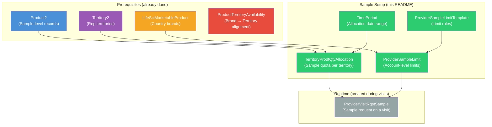
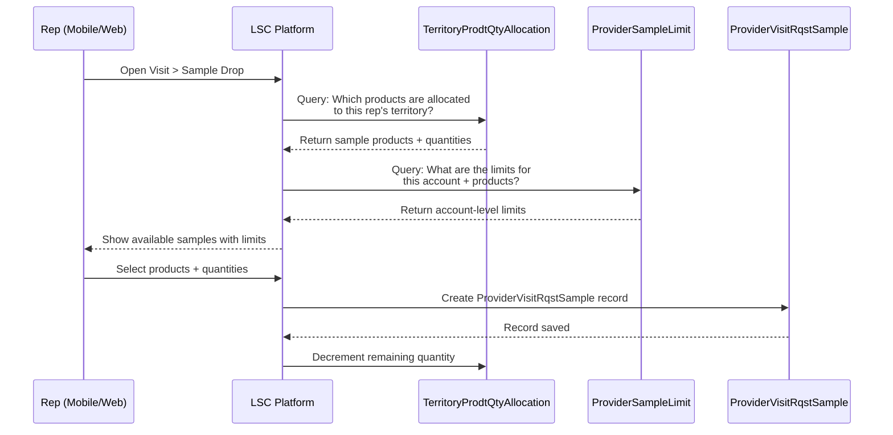

# README 08 — Sample Management Setup

## Overview

Sample Management in Life Sciences Cloud allows reps to request and track physical product samples during visits. Setting it up requires creating records across **multiple objects** in the correct order. This README documents each step.



---

## Object Relationship Map

| Object | API Name | References | Purpose |
|--------|----------|------------|---------|
| **Time Period** | `TimePeriod` | — | Defines a date range for sample allocations (e.g., "2026 First Half") |
| **Territory Product Qty Allocation** | `TerritoryProdtQtyAllocation` | `Product2`, `Territory2`, `TimePeriod` | How many units of a sample product a territory can distribute |
| **Provider Sample Limit Template** | `ProviderSampleLimitTemplate` | — | Defines the rules/limits for sample distribution (e.g., country-specific compliance rules) |
| **Provider Sample Limit** | `ProviderSampleLimit` | `LifeSciMarketableProduct`, `Account`, `ProviderSampleLimitTemplate` | Account-level limit — controls how many samples an HCP can receive |
| **Provider Visit Requested Sample** | `ProviderVisitRqstSample` | `Product2`, `ProviderVisit` | Runtime record — created when a rep requests a sample during a visit |

> **Key distinction:** `TerritoryProdtQtyAllocation.ProductId` references **Product2** (the sample-level SKU), while `ProviderSampleLimit.ProductId` references **LifeSciMarketableProduct** (the brand-level marketable product).

---

## Prerequisites

Before setting up samples, you must have:

- [ ] **Sample-level Product2 records** — e.g., `Immunexis GB 10mg Sample`, `Cordim GB 5mg Sample` (created by `scripts/create-products.apex`)
- [ ] **Territory hierarchy** — e.g., `GB-FSR-001-London` (created by `scripts/create-territories.apex`)
- [ ] **Country LifeSciMarketableProduct records** — e.g., `Immunexis GB` with `Type = 'Brand'` (created by `scripts/create-marketable-products.apex`)
- [ ] **ProductTerritoryAvailability** — Country brands aligned to country territories (created by `scripts/create-territory-product-alignment.apex`)
- [ ] **Admin Console > Sample Drop** setting is **active** (check via Tooling API — see [Verify Admin Console](#step-5-verify-admin-console-settings))
- [ ] **Rep assigned to territory** via `UserTerritory2Association`

---

## Step-by-Step Setup

### Step 1: TimePeriod

A `TimePeriod` defines the date range during which sample allocations are valid. The org may already have time periods — check first.

**Existing time periods covering today (2026-04-15):**

| Name | Start Date | End Date |
|------|-----------|----------|
| 2026 | 2025-01-01 | 2026-12-31 |
| 2026 First Half | 2026-01-01 | 2026-06-30 |

If a suitable time period exists, use it. If not, create one:

```apex
TimePeriod tp = new TimePeriod(
    Name = '2026 H1 - GB Samples',
    StartDate = Date.newInstance(2026, 1, 1),
    EndDate = Date.newInstance(2026, 6, 30)
);
insert tp;
```

---

### Step 2: TerritoryProdtQtyAllocation

This is the **sample quota** — how many units of each sample product a territory can distribute during the time period.

**Key fields:**

| Field | Type | Description |
|-------|------|-------------|
| `ProductId` | Lookup(Product2) | The **sample-level** Product2 record (e.g., `Immunexis GB 10mg Sample`) |
| `TerritoryId` | Lookup(Territory2) | The rep's territory (e.g., `GB-FSR-001-London`) |
| `TimePeriodId` | Lookup(TimePeriod) | The active time period |
| `AllocationType` | Picklist | `Drop` (in-person) or `Ship` (mailed to HCP) |
| `AllocatedQuantity` | Number | Total units available for this territory/product/type |
| `MaxDisbursementLimitQty` | Number | Max units per single transaction (optional) |

**Script:** `scripts/create-sample-allocations.apex`

Creates allocation records for all GB sample products in the target territory:

```bash
sf apex run --file scripts/create-sample-allocations.apex --target-org 260-pm
```

The script creates **2 allocations per sample product** (Drop + Ship):

| Product | Territory | Type | Allocated Qty |
|---------|-----------|------|---------------|
| Immunexis GB 10mg Sample | GB-FSR-001-London | Drop | 10000 |
| Immunexis GB 10mg Sample | GB-FSR-001-London | Ship | 1000 |
| Immunexis GB 25mg Sample | GB-FSR-001-London | Drop | 10000 |
| Immunexis GB 25mg Sample | GB-FSR-001-London | Ship | 1000 |
| Cordim GB 5mg Sample | GB-FSR-001-London | Drop | 10000 |
| Cordim GB 5mg Sample | GB-FSR-001-London | Ship | 1000 |
| Cordim GB 20mg Sample | GB-FSR-001-London | Drop | 10000 |
| Cordim GB 20mg Sample | GB-FSR-001-London | Ship | 1000 |

> **Quantities are configurable** — edit `DROP_QUANTITY` and `SHIP_QUANTITY` at the top of the script.

---

### Step 3: ProviderSampleLimitTemplate

Sample limit templates define the **rules** governing how samples can be distributed. The org has a pre-configured template:

| DeveloperName | Label | Active |
|---------------|-------|--------|
| `lsc4ce_GenericTemplate` | Generic Template | Yes |

Country-specific templates (Germany AMG, Italy Class A/C, Belgium, etc.) exist but are **inactive**. For a basic setup, the Generic Template is sufficient.

> **To activate a country-specific template:** Go to **Setup > Provider Sample Limit Templates** or use Tooling API. For GB, no specific UK regulatory template exists in the demo data — use the Generic Template.

---

### Step 4: ProviderSampleLimit

This links an **account** (HCP) to a **marketable product** with a **limit template**, controlling how many samples the HCP can receive.

**Key fields:**

| Field | Type | Description |
|-------|------|-------------|
| `AccountId` | Lookup(Account) | The HCP/provider account |
| `ProductId` | Lookup(LifeSciMarketableProduct) | The **brand-level** marketable product (e.g., `Immunexis GB`) |
| `PrvdSampleLimitTemplateId` | Lookup(ProviderSampleLimitTemplate) | The active limit template |

**Script:** `scripts/create-sample-limits.apex`

Creates sample limit records for GB accounts in the London territory:

```bash
sf apex run --file scripts/create-sample-limits.apex --target-org 260-pm
```

The script:
1. Finds accounts with `ProviderAcctTerritoryInfo` in the target territory
2. Finds GB-country marketable products (`Immunexis GB`, `Cordim GB`)
3. Creates a `ProviderSampleLimit` for each account × product combination using the Generic Template

---

### Step 5: Verify Admin Console Settings

The **Sample Drop** configuration must be active in Admin Console. Verify with Tooling API:

```bash
sf data query --use-tooling-api \
  --query "SELECT Id, DeveloperName, MasterLabel, IsActive FROM LifeSciConfigRecord WHERE DeveloperName = 'Sample_Drop'" \
  --api-version 65.0 --target-org 260-pm
```

Expected result: `Sample_Drop` is **active**.

Also verify the DB Schema records exist:

```bash
sf data query --use-tooling-api \
  --query "SELECT Id, DeveloperName, IsActive FROM LifeSciConfigRecord WHERE DeveloperName IN ('DbSchema_ProviderSampleLimit', 'DbSchema_TerritoryProdtQtyAllocation')" \
  --api-version 65.0 --target-org 260-pm
```

Both should be active.

---

## How Samples Work at Runtime

When a rep opens a visit and goes to **Sample Drop**:



### What Must Be True for Samples to Appear

| Condition | Object | Common Failure |
|-----------|--------|---------------|
| Sample products exist in Product2 | `Product2` (Family = 'Sample') | Missing sample-level records |
| Territory has allocations for the sample products | `TerritoryProdtQtyAllocation` | No allocation for rep's territory |
| Allocation is for the current time period | `TimePeriod` | Time period expired or not yet started |
| Allocated quantity > 0 remaining | `TerritoryProdtQtyAllocation` | All samples already distributed |
| Account has a sample limit record | `ProviderSampleLimit` | No limit record for this account + product |
| Sample limit template is active | `ProviderSampleLimitTemplate` | Template inactive |
| Admin Console > Sample Drop is active | `LifeSciConfigRecord` | Feature not enabled |

---

## Data Loading Order

Sample setup is **Step 6** in the overall data loading sequence:

```mermaid
flowchart LR
    S1["Step 1<br/><b>create-products</b>"] --> S2["Step 2<br/><b>create-marketable-products</b>"]
    S2 --> S3["Step 3<br/><b>create-territories</b>"]
    S3 --> S4["Step 4<br/><b>create-territory-product-alignment</b>"]
    S4 --> S5["Step 5<br/><b>create-provider-territory-info</b>"]
    S5 --> S6a["Step 6a<br/><b>create-sample-allocations</b>"]
    S6a --> S6b["Step 6b<br/><b>create-sample-limits</b>"]

    style S1 fill:#4a90d9,color:#fff
    style S2 fill:#f5a623,color:#fff
    style S3 fill:#9b59b6,color:#fff
    style S4 fill:#e74c3c,color:#fff
    style S5 fill:#2ecc71,color:#fff
    style S6a fill:#2ecc71,color:#fff
    style S6b fill:#2ecc71,color:#fff
```



---

## Scripts

| Script | Creates | Records | Object |
|--------|---------|---------|--------|
| `scripts/create-sample-allocations.apex` | Territory sample quotas | 8 (4 products x 2 types) | TerritoryProdtQtyAllocation |
| `scripts/create-sample-limits.apex` | Account sample limits | N accounts x 2 products | ProviderSampleLimit |
| `scripts/delete-sample-data.apex` | Cleanup all sample data | — | TerritoryProdtQtyAllocation + ProviderSampleLimit |

---

## Cleanup

```bash
sf apex run --file scripts/delete-sample-data.apex --target-org 260-pm
```

Deletes `TerritoryProdtQtyAllocation` and `ProviderSampleLimit` records for the target territory and GB products.

---

## Related READMEs

- [README-01: Product Hierarchy Architecture](README-01-Product-Hierarchy.md)
- [README-02: LSC Areas Where Products Appear](README-02-LSC-Product-Areas.md)
- [README-03: Country Field Requirements Per Object](README-03-Country-Field-Requirements.md)
- [README-04: Data Loading Scripts](README-04-Data-Loading-Scripts.md)
- [README-05: Country Global Value Set](README-05-Country-Global-Value-Set.md)
- [README-06: Parent-Child Approaches](README-06-Parent-Child-Approaches.md)
- [README-07: Provider Account Territory Info](README-07-Provider-Account-Territory-Info.md)
