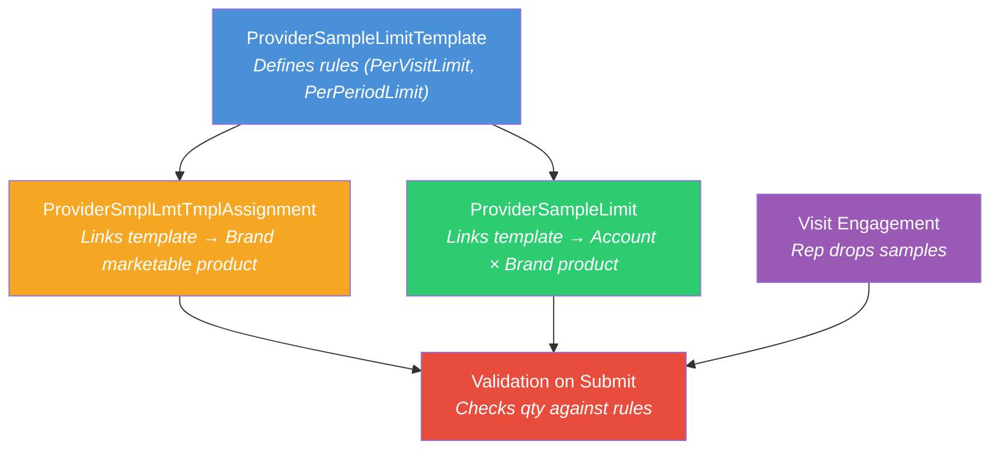

# README 09 — Sample Limit Troubleshooting

## Overview

This document captures the lessons learned from setting up sample limit validation on the LSC mobile iPad app. Sample limits control how many sample units a rep can drop per visit or per period for a given HCP account. Getting them to work on mobile requires several data records, correct JSON formats, and Admin Console settings — all aligned.

---

## How Sample Limits Work



### Key Objects

| Object | API Name | Purpose |
|--------|----------|---------|
| **Sample Limit Template** | `ProviderSampleLimitTemplate` | Defines the limit rules (quota, period, strategy) |
| **Template Product Assignment** | `ProviderSmplLmtTmplAssignment` | Links a template to a **Brand-level** marketable product |
| **Sample Limit** | `ProviderSampleLimit` | Links a template to an **Account × Brand product** — the per-HCP limit |
| **Visit Sample Limit Transaction** | `ProviderVisitSampleLimitTransaction` | Runtime record — created when validation runs during submit |

---

## Critical Configuration Requirements

### 1. ProviderSampleLimit.ProductId Must Point to Brand-Level Products

```
✅ ProviderSampleLimit.ProductId → LifeSciMarketableProduct (Type = 'Brand')
❌ ProviderSampleLimit.ProductId → LifeSciMarketableProduct (Type = 'Product')  ← won't work
```

The mobile app resolves sample limits by walking up the product hierarchy. The limit must be at the **Brand** level (e.g., `Cordim GB`), not at the SKU level (e.g., `Cordim GB 20mg`). The `strategy: "SKU"` in the rule JSON means the quota is calculated per-SKU, but the limit record itself is on the Brand.

### 2. ProviderSmplLmtTmplAssignment Must Also Be at Brand Level

Template assignments must point to the same Brand-level marketable products as the limits.

### 3. PrvdSampleLmtTemplateName Must Be the DeveloperName

```
✅ PrvdSampleLmtTemplateName = 'GB_Sample_Limit_Template'   (DeveloperName)
❌ PrvdSampleLmtTemplateName = 'GB Sample Limit Template'    (MasterLabel)
```

The managed package code queries by `PrvdSampleLmtTemplateName` using the **DeveloperName**, not the label. If this is wrong, the batch job returns 0 rows and hits a null reference.

### 4. Rule JSON Format — Object/Map, Not Array

The `Rule` field on `ProviderSampleLimit` and `RuleCondition` on `ProviderSmplLmtTmplAssignment` must use the **object/map format** keyed by template DeveloperName:

```json
{
  "GB_Sample_Limit_Template": {
    "rules": [
      {
        "strategy": "SKU",
        "quota": 10,
        "period": {
          "type": "SampleLimitDateRangePeriod",
          "params": { "starts": "2025-10-07", "ends": "2026-10-08" }
        },
        "name": "PerPeriodLimit",
        "label": "Maximum Quantity per Period",
        "calculation": "SamplesInPeriod"
      },
      {
        "strategy": "SKU",
        "quota": 2,
        "period": {
          "type": "SampleLimitDateRangePeriod",
          "params": { "starts": "2025-10-07", "ends": "2026-10-08" }
        },
        "name": "PerVisitLimit",
        "label": "Maximum Quantity per Visit",
        "calculation": "SamplesPerVisit"
      }
    ],
    "priority": 1.0,
    "name": "GB_Sample_Limit_Template",
    "label": "GB Sample Limit Template",
    "isCustom": true
  }
}
```

**Do NOT use the array format** (`[{...}, {...}]`) — the template's own `RuleCondition` uses the array format, but the limit and assignment records need the map format.

### 5. Date Ranges Must Be Valid

Empty date strings (`"starts":"","ends":""`) cause null dereference errors in the managed package. Always set valid date ranges that cover the current date.

### 6. Default Salesforce Templates Are NOT Editable

The `lsc4ce_GenericTemplate` (Generic Template) is a Salesforce-managed default template. Its `RuleCondition` field cannot be updated via DML — attempting it throws:

```
You can only change the active status on this default template provided by Salesforce. Other properties aren't editable.
```

**The Generic Template has empty date ranges in its RuleCondition** (`"starts":"","ends":""`), which causes the "Assign Sample Limit Templates to Accounts" batch job to fail with a null reference. **You must create a custom template** with valid dates instead.

### 7. ProviderSmplLmtTmplAssignment OWD Is Private

After creating template-product assignments, you must share them with the rep user:

```apex
ProviderSmplLmtTmplAssignmentShare share = new ProviderSmplLmtTmplAssignmentShare(
    ParentId = assignmentId,
    UserOrGroupId = repUserId,
    AccessLevel = 'Read'
);
insert share;
```

Alternatively, change the OWD to Public Read Only in Setup > Sharing Settings.

### 8. Admin Console "Validate Sample Limits" Must Be Enabled

In **Admin Console > Visit Administration > Visit Settings**, the **"Validate sample limits"** checkbox must be checked. Without this, sample limits are not enforced on submit.

### 9. DbSchema Entries Required for Mobile Sync

All three objects need active DbSchema entries in Admin Console for mobile cache sync:

- `DbSchema_ProviderSampleLimit`
- `DbSchema_ProviderSampleLimitTemplate`
- `DbSchema_ProviderSmplLmtTmplAssignment`

### 10. Product Hierarchy Must Be Fully Linked

Every marketable product in the chain must have `ParentTherapeuticAreaId` set:

```
TherapeuticArea (e.g., Rheumatology)
  ↑ ParentBrandProductId
Brand (e.g., Cordim)           — ParentTherapeuticAreaId → Rheumatology
  ↑ ParentBrandProductId
Brand/Country (e.g., Cordim GB) — ParentTherapeuticAreaId → Rheumatology
  ↑ ParentBrandProductId
Product/SKU (e.g., Cordim GB 20mg) — ParentTherapeuticAreaId → Rheumatology
```

If `ParentTherapeuticAreaId` is null, the batch job that creates sample limits hits a null dereference.

---

## "Classes with Limits" Error — What It Actually Means

The message **"There are no products that belong to Classes with limits"** appears when tapping the **"i" button** next to the Samples section header on mobile. Per internal Slack discussion:

- The "i" button is designed for **Italy Class A/C templates** with `"strategy":"SHARED"` between brands
- The **3-dot menu** on individual Brands shows limits for generic templates
- The "i" button message does NOT necessarily mean limits are broken — it may just mean Italy-specific templates aren't configured
- Sample limit **validation on submit** works independently of the "i" button display

---

## Batch Job Issues

### "Assign Sample Limit Templates to Accounts" — Null Dereference

This batch job (`SampleLimitFactory` / `SampleLimitInitialization`) fails with "Attempt to de-reference a null object" when:

1. **Template RuleCondition has empty dates** — The Generic Template (`lsc4ce_GenericTemplate`) has `"starts":"","ends":""` which can't be parsed
2. **Template assignments exist at wrong hierarchy level** — TherapeuticArea-level assignments have null `ProductId`, `ParentBrandProductId`, etc.
3. **Product hierarchy has null `ParentTherapeuticAreaId`** — The batch walks up the hierarchy and hits null
4. **Existing ProviderSampleLimit records exist** — The job may say "delete all sample limit records first"

**Fix:** Create a custom template with valid dates, assign only to Brand-level products, ensure full hierarchy linkage.

### "Before you run this job, delete all sample limit records"

The batch job expects a clean slate. Delete all `ProviderSampleLimit` records before running:

```apex
delete [SELECT Id FROM ProviderSampleLimit];
```

---

## Setup Script — Custom Template for One Account

```apex
// 1. Create custom template
ProviderSampleLimitTemplate t = new ProviderSampleLimitTemplate(
    MasterLabel = 'GB Sample Limit Template',
    DeveloperName = 'GB_Sample_Limit_Template',
    IsActive = true,
    DiscrepancyAlertType = 'Error',
    RuleCondition = '[{"rule":"PerPeriodLimit","strategy":"SKU","quota":10,...}]',
    RuleExpression = '[{"operation":"RULE","rule":"PerVisitLimit"},{"operation":"RULE","rule":"PerPeriodLimit"},{"operation":"AND"}]',
    PriorityNumber = 1
);
insert t;

// 2. Create template assignments (Brand-level)
ProviderSmplLmtTmplAssignment assign = new ProviderSmplLmtTmplAssignment(
    ProductId = cordimGBMarketableProductId,  // Brand-level!
    PrvdSampleLimitTemplateId = t.Id,
    RuleCondition = '{"GB_Sample_Limit_Template":{...}}'  // Map format
);
insert assign;

// 3. Share assignments with rep
insert new ProviderSmplLmtTmplAssignmentShare(
    ParentId = assign.Id,
    UserOrGroupId = repUserId,
    AccessLevel = 'Read'
);

// 4. Create sample limits (Brand-level)
insert new ProviderSampleLimit(
    AccountId = accountId,
    ProductId = cordimGBMarketableProductId,  // Brand-level!
    PrvdSampleLimitTemplateId = t.Id,
    PrvdSampleLmtTemplateName = 'GB_Sample_Limit_Template',  // DeveloperName!
    Rule = '{"GB_Sample_Limit_Template":{...}}'  // Map format
);
```

---

## Current Org State (as of 2026-04-16)

| Record | Details |
|--------|---------|
| **Custom Template** | `GB_Sample_Limit_Template` — PerVisitLimit=2, PerPeriodLimit=10, dates 2025-10-07 to 2026-10-08 |
| **Template Assignments** | Cordim GB (Brand), Immunexis GB (Brand) → shared with gb.rep |
| **Sample Limits** | Aaron Smith × Cordim GB, Aaron Smith × Immunexis GB |
| **Validate Sample Limits** | Enabled in Visit Settings |
| **DbSchema entries** | All 3 active |

---

## Troubleshooting Checklist

- [ ] Custom template created (not the default Generic Template) with valid date ranges
- [ ] `PrvdSampleLmtTemplateName` uses DeveloperName, not MasterLabel
- [ ] `ProviderSampleLimit.ProductId` points to Brand-level marketable product
- [ ] `ProviderSmplLmtTmplAssignment.ProductId` points to Brand-level marketable product
- [ ] `Rule` / `RuleCondition` JSON uses object/map format keyed by template DeveloperName
- [ ] Template assignments shared with rep (Private OWD)
- [ ] "Validate sample limits" enabled in Visit Settings
- [ ] DbSchema entries active for all 3 sample limit objects
- [ ] Product hierarchy fully linked (`ParentTherapeuticAreaId` set on all levels)
- [ ] Date ranges in rules cover the current date
- [ ] Mobile synced after changes

---

## Related READMEs

- [README-08: Sample Management Setup](README-08-Sample-Management-Setup.md) — Full sample data chain
- [README-04: Data Loading Scripts](README-04-Data-Loading-Scripts.md) — Script execution order
- [README-01: Product Hierarchy Architecture](README-01-Product-Hierarchy.md) — Product hierarchy structure
