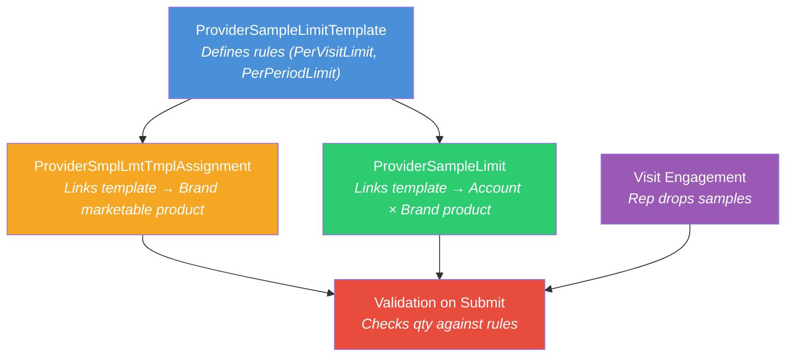

# README 09 — Sample Limit Troubleshooting

## Overview

This document captures the lessons learned from setting up sample limit validation on the LSC mobile iPad app. Sample limits control how many sample units a rep can drop per visit or per period for a given HCP account. Getting them to work on mobile requires several data records, correct JSON formats, and Admin Console settings — all aligned.

When validation does not fire during visit engagement on mobile, work through the checks below in order.

---

## How Sample Limits Work



### Key Objects

| Object | API Name | Purpose |
|--------|----------|---------|
| **Sample Limit Template** | `ProviderSampleLimitTemplate` | Defines the limit rules (quota, period, strategy) |
| **Template Product Assignment** | `ProviderSmplLmtTmplAssignment` | Links a template to a **Brand-level** marketable product |
| **Sample Limit** | `ProviderSampleLimit` | Links a template to an **Account × Brand product** — the per-HCP limit |
| **Visit Sample Limit Transaction** | `ProviderVisitSampleLimitTransaction` | Runtime record — created when validation runs during submit |

### Key Admin Console Paths

| Action | Path |
|--------|------|
| Run sample limit batch job | Admin Console > Sample Limits (tile) > Sample Limit Jobs > Assign Sample Limit Templates to Accounts |
| Enable sample limit validation | Admin Console > Visit Settings > Validate sample limits |
| Product alignment | Admin Console > Product (tile) > Product Alignment |
| Product alignment jobs | Admin Console > Product (tile) > Product Alignment Jobs |

---

## Check 1 — Are Assignments and Limits at Brand Level?

`ProviderSampleLimit.ProductId` and `ProviderSmplLmtTmplAssignment.ProductId` must point to **Brand-level** marketable products (Type = `Brand`), NOT SKU-level (Type = `Product`).

```
✅ ProviderSampleLimit.ProductId → LifeSciMarketableProduct (Type = 'Brand')
❌ ProviderSampleLimit.ProductId → LifeSciMarketableProduct (Type = 'Product')  ← won't work
```

**Diagnose:**

```sql
SELECT Id, ProductId, Product.Name, Product.Type
FROM ProviderSmplLmtTmplAssignment
WHERE Product.Name LIKE '%<your product>%'
```

If `Product.Type` = `Product` instead of `Brand`, the assignment is at the wrong level.

**Why this breaks limits:** The mobile app resolves limits by walking **up** the product hierarchy from the dropped SKU to find its parent Brand, then queries `ProviderSampleLimit` for that Brand × Account. If the PSL record points to a SKU, the hierarchy walk never finds it, and validation **silently skips**.

**How to verify in Rule JSON:** Check `productType` in the `ProviderSampleLimit.Rule` JSON:

| productType in Rule JSON | What it means |
|--------------------------|---------------|
| `"Brand"` | Correct — limit is on a Brand-level marketable product |
| `"LSSampleProduct"` | Wrong — generated from SKU-level assignment, must fix and re-run batch job |

**Fix:**

1. Delete the incorrect SKU-level assignment(s) and PSL records
2. Create `ProviderSmplLmtTmplAssignment` with `ProductId` set to the Brand-level marketable product
3. Run the batch job to regenerate `ProviderSampleLimit` records
4. Verify `productType: "Brand"` in the generated Rule JSON

---

## Check 2 — Do ProviderSampleLimit Records Exist?

`ProviderSampleLimit` records are what the mobile app validates against. They are generated by a batch job — they do not exist by default.

**Diagnose:**

```sql
SELECT Id, ProductId, Product.Name, Product.Type, PrvdSampleLmtTemplateName, Rule
FROM ProviderSampleLimit
WHERE Product.Name LIKE '%<your product>%'
```

If 0 records are returned, the batch job was either never run or produced no output (e.g., because assignments were at SKU level).

**Fix:**

1. Ensure assignments are at Brand level (Check 1)
2. Run the batch job: **Admin Console > Sample Limits (tile) > Sample Limit Jobs > Assign Sample Limit Templates to Accounts**
3. After the job completes, re-run the query and verify:
   - `Product.Type` = `Brand`
   - The `Rule` JSON contains `"productType": "Brand"` (not `"LSSampleProduct"`)

---

## Check 3 — Are Assignments Shared with the Rep User?

`ProviderSmplLmtTmplAssignment` has **Private** Organization-Wide Default (OWD) sharing. This is the most common cause of "validation works on web but not mobile":

| Context | Data Access | Validation Result |
|---------|------------|-------------------|
| **Web** (server-side API) | System context — reads all records | Works regardless of sharing |
| **Mobile** (local SQLite cache) | User context — only syncs shared records | Silently skips if assignment not shared |

**Diagnose:**

```sql
SELECT Id, ParentId, UserOrGroupId, AccessLevel, RowCause
FROM ProviderSmplLmtTmplAssignmentShare
WHERE UserOrGroupId = '<rep user ID>'
```

If 0 records are returned for the rep, the assignment is not shared with them.

**Fix:**

```apex
insert new ProviderSmplLmtTmplAssignmentShare(
    ParentId = assignmentId,
    UserOrGroupId = repUserId,
    AccessLevel = 'Read'
);
```

**Alternative:** Change the OWD for `ProviderSmplLmtTmplAssignment` to **Public Read Only** in Setup > Sharing Settings.

---

## Check 4 — Are All 3 DbSchema (OMCC) Entries Active?

The mobile app uses DbSchema entries (stored as `LifeSciConfigRecord` metadata in the OMCC framework) to determine which objects to sync to the local SQLite database. Three entries are required for sample limits:

- `DbSchema_ProviderSampleLimit`
- `DbSchema_ProviderSampleLimitTemplate`
- `DbSchema_ProviderSmplLmtTmplAssignment`

**Diagnose (Tooling API only — not queryable via standard SOQL):**

```sql
SELECT Id, DeveloperName, IsActive FROM LifeSciConfigRecord
WHERE DeveloperName IN (
  'DbSchema_ProviderSampleLimit',
  'DbSchema_ProviderSampleLimitTemplate',
  'DbSchema_ProviderSmplLmtTmplAssignment'
)
```

All 3 must exist and have `IsActive = true`. If any are missing, the mobile app will not sync the corresponding object and validation silently skips.

**Fix — Deploy missing DbSchema entries:**

Deploy as `LifeSciConfigRecord` metadata XML. Each file must include:

- `<fieldValues>` entries, especially `<fieldName>SObject</fieldName>` with `<objectValue>` set to the target object API name
- Profile `<assignments>` for all profiles that need mobile sync
- `<lifeSciConfigCategory>DbSchema</lifeSciConfigCategory>`
- `<type>DATA</type>`

**Two-phase deployment required:**

1. Deploy with `<isActive>false</isActive>` — this creates the records
2. Redeploy the same files with `<isActive>true</isActive>` — this activates them

Deploying active in a single step fails with the error `Enter: [Type, SObject]`.

**Example metadata XML** (for `ProviderSampleLimitTemplate` — adapt `<objectValue>` and `<masterLabel>` for other objects):

```xml
<?xml version="1.0" encoding="UTF-8"?>
<LifeSciConfigRecord xmlns="http://soap.sforce.com/2006/04/metadata">
    <assignments>
        <assignedTo>LS PH Field Sales Representative</assignedTo>
        <assignmentLevel>Profile</assignmentLevel>
    </assignments>
    <assignments>
        <assignedTo>System Administrator</assignedTo>
        <assignmentLevel>Profile</assignmentLevel>
    </assignments>
    <fieldValues>
        <dataType>PICKLIST</dataType>
        <fieldName>Status</fieldName>
        <hasBooleanValue>false</hasBooleanValue>
        <picklistValue>Valid</picklistValue>
    </fieldValues>
    <fieldValues>
        <dataType>PICKLIST</dataType>
        <fieldName>Type</fieldName>
        <hasBooleanValue>false</hasBooleanValue>
        <picklistValue>DATA</picklistValue>
    </fieldValues>
    <fieldValues>
        <dataType>OBJECT</dataType>
        <fieldName>SObject</fieldName>
        <hasBooleanValue>false</hasBooleanValue>
        <objectValue>ProviderSampleLimitTemplate</objectValue>
    </fieldValues>
    <fieldValues>
        <dataType>FIELD</dataType>
        <fieldName>DeltaDateField</fieldName>
        <fieldValue>LastModifiedDate</fieldValue>
        <hasBooleanValue>false</hasBooleanValue>
    </fieldValues>
    <fieldValues>
        <dataType>BOOLEAN</dataType>
        <fieldName>EnableDataUploadNotification</fieldName>
        <hasBooleanValue>true</hasBooleanValue>
    </fieldValues>
    <isActive>true</isActive>
    <isOrgLevel>false</isOrgLevel>
    <lifeSciConfigCategory>DbSchema</lifeSciConfigCategory>
    <masterLabel>DbSchema_ProviderSampleLimitTemplate</masterLabel>
    <type>DATA</type>
</LifeSciConfigRecord>
```

---

## Check 5 — Is "Validate Sample Limits" Enabled?

In **Admin Console > Visit Settings**, the **"Validate sample limits"** checkbox must be checked. Without this, sample limits are not enforced on submit.

---

## Check 6 — Is the RuleCondition JSON Format Correct?

The `RuleCondition` on `ProviderSmplLmtTmplAssignment` must use the **map/object format**, not the array format.

### Correct (map format)

```json
{
  "PerPeriodLimit": {
    "name": "PerPeriodLimit",
    "label": "Maximum Quantity per Period",
    "strategy": "SKU",
    "quota": 10,
    "calculation": "SamplesInPeriod",
    "period": {
      "type": "SampleLimitDateRangePeriod",
      "params": { "starts": "2026-01-01", "ends": "2026-12-31" }
    }
  },
  "PerVisitLimit": {
    "name": "PerVisitLimit",
    "label": "Maximum Quantity per Visit",
    "strategy": "SKU",
    "quota": 2,
    "calculation": "SamplesPerVisit",
    "period": {
      "type": "SampleLimitDateRangePeriod",
      "params": { "starts": "2026-01-01", "ends": "2026-12-31" }
    }
  }
}
```

### Incorrect (array format — do NOT use)

```json
[{ "name": "PerPeriodLimit", ... }, { "name": "PerVisitLimit", ... }]
```

**Note:** The template's own `RuleCondition` on `ProviderSampleLimitTemplate` uses the array format. But the assignment record (`ProviderSmplLmtTmplAssignment.RuleCondition`) needs the map format. They're named the same field but expect different structures.

**Validation checklist:**

- [ ] Map/object format (not array)
- [ ] Date range in `params.starts` / `params.ends` covers the current date
- [ ] `strategy` = `SKU`
- [ ] `calculation` values are `SamplesInPeriod` and `SamplesPerVisit`
- [ ] `period.type` = `SampleLimitDateRangePeriod`

---

## Check 7 — Is the ProviderSampleLimit Rule JSON Format Correct?

The `Rule` field on `ProviderSampleLimit` is auto-generated by the batch job. Always verify the format after running.

**Diagnose:**

```sql
SELECT Id, ProductId, Product.Name, PrvdSampleLmtTemplateName, Rule
FROM ProviderSampleLimit
WHERE Product.Name LIKE '%<your product>%'
```

**Expected Rule JSON format:**

```json
{
  "template": {
    "operations": [
      { "rule": "PerVisitLimit", "operation": "RULE" },
      { "rule": "PerPeriodLimit", "operation": "RULE" },
      { "operation": "AND" }
    ],
    "name": "lsc4ce_GenericTemplate",
    "label": "Generic Template",
    "blockType": "Error"
  },
  "products": {
    "<Brand Marketable Product Id>": {
      "rules": {
        "PerVisitLimit": {
          "strategy": "SKU",
          "starts": "2026-01-01",
          "remaining": 2,
          "quota": 2,
          "period": { "type": "SampleLimitDateRangePeriod", "params": {} },
          "label": "Maximum Quantity per Visit",
          "ends": "2026-12-31",
          "calculation": "SamplesPerVisit"
        },
        "PerPeriodLimit": {
          "strategy": "SKU",
          "starts": "2026-01-01",
          "remaining": 10,
          "quota": 10,
          "period": { "type": "SampleLimitDateRangePeriod", "params": {} },
          "label": "Maximum Quantity per Period",
          "ends": "2026-12-31",
          "calculation": "SamplesInPeriod"
        }
      },
      "info": {
        "productType": "Brand",
        "excludedChildProducts": [],
        "annualAllocations": {}
      }
    }
  },
  "groups": {}
}
```

**Rule JSON validation checklist:**

| Field | Expected Value | Red Flag |
|-------|----------------|----------|
| `template.blockType` | `"Error"` or `"Warning"` | Missing or null — validation won't fire |
| `template.name` | Template `DeveloperName` | Mismatch with actual template |
| `products` key | Brand-level marketable product ID | SKU-level ID — hierarchy walk won't match |
| `info.productType` | `"Brand"` | `"LSSampleProduct"` = wrong level, must fix |
| `info.excludedChildProducts` | `[]` (empty array) | Missing = may cause null reference on mobile |
| `rules.*.starts` / `rules.*.ends` | Date range covering current date | Expired or future = validation won't apply |
| `rules.*.remaining` | Equal to `quota` initially | Less than `quota` on fresh record = prior drops counted |
| `groups` | `{}` (empty object) | Should be present even if empty |

---

## Check 8 — Additional Checks

| Check | How to Verify |
|-------|---------------|
| `PrvdSampleLmtTemplateName` uses DeveloperName | Must match `DeveloperName` (e.g., `lsc4ce_GenericTemplate`), not `MasterLabel` |
| Product hierarchy fully linked | `ParentTherapeuticAreaId` set at all levels of the marketable product hierarchy |
| Default template not used for assignments | `lsc4ce_GenericTemplate` has empty dates — create a custom template instead |
| Device synced after changes | After any data or metadata fix, the rep must perform a full sync on mobile |

---

## Batch Job Issues

### "Assign Sample Limit Templates to Accounts" — Null Dereference

This batch job (`SampleLimitFactory` / `SampleLimitInitialization`) fails with "Attempt to de-reference a null object" when:

1. **Template RuleCondition has empty dates** — The Generic Template (`lsc4ce_GenericTemplate`) has `"starts":"","ends":""` which can't be parsed
2. **Template assignments exist at wrong hierarchy level** — TherapeuticArea-level assignments have null `ProductId`, `ParentBrandProductId`, etc.
3. **Product hierarchy has null `ParentTherapeuticAreaId`** — The batch walks up the hierarchy and hits null
4. **Existing ProviderSampleLimit records exist** — The job may say "delete all sample limit records first"

**Fix:** Create a custom template with valid dates, assign only to Brand-level products, ensure full hierarchy linkage.

### "Before you run this job, delete all sample limit records"

The batch job expects a clean slate. Delete all `ProviderSampleLimit` records before running:

```apex
delete [SELECT Id FROM ProviderSampleLimit];
```

---

## "Classes with Limits" Error — What It Actually Means

The message **"There are no products that belong to Classes with limits"** appears when tapping the **"i" button** next to the Samples section header on mobile:

- The "i" button is designed for **Italy Class A/C templates** with `"strategy":"SHARED"` between brands
- The **3-dot menu** on individual Brands shows limits for generic templates
- The "i" button message does NOT necessarily mean limits are broken — it may just mean Italy-specific templates aren't configured
- Sample limit **validation on submit** works independently of the "i" button display

---

## Setup Script — Custom Template for One Account

```apex
// 1. Create custom template
ProviderSampleLimitTemplate t = new ProviderSampleLimitTemplate(
    MasterLabel = 'GB Sample Limit Template',
    DeveloperName = 'GB_Sample_Limit_Template',
    IsActive = true,
    DiscrepancyAlertType = 'Error',
    RuleCondition = '[{"rule":"PerPeriodLimit","strategy":"SKU","quota":10,...}]',
    RuleExpression = '[{"operation":"RULE","rule":"PerVisitLimit"},{"operation":"RULE","rule":"PerPeriodLimit"},{"operation":"AND"}]',
    PriorityNumber = 1
);
insert t;

// 2. Create template assignments (Brand-level)
ProviderSmplLmtTmplAssignment assign = new ProviderSmplLmtTmplAssignment(
    ProductId = brandMarketableProductId,  // Brand-level!
    PrvdSampleLimitTemplateId = t.Id,
    RuleCondition = '{"PerPeriodLimit":{...},"PerVisitLimit":{...}}'  // Map format!
);
insert assign;

// 3. Share assignments with rep
insert new ProviderSmplLmtTmplAssignmentShare(
    ParentId = assign.Id,
    UserOrGroupId = repUserId,
    AccessLevel = 'Read'
);

// 4. Run batch job to create ProviderSampleLimit records
// Admin Console > Sample Limits (tile) > Sample Limit Jobs
// > Assign Sample Limit Templates to Accounts
```

---

## Quick Diagnostic Checklist

When sample limits don't fire on mobile:

- [ ] `ProviderSampleLimit.ProductId` points to a **Brand-level** marketable product (Type = 'Brand')
- [ ] Rule JSON has `productType: "Brand"` (not `"LSSampleProduct"`)
- [ ] `ProviderSmplLmtTmplAssignment.ProductId` also at Brand level
- [ ] Template assignments **shared** with the rep user (Private OWD)
- [ ] "Validate sample limits" enabled in Admin Console > Visit Settings
- [ ] All 3 DbSchema entries active (`ProviderSampleLimit`, `ProviderSampleLimitTemplate`, `ProviderSmplLmtTmplAssignment`)
- [ ] Product hierarchy fully linked (`ParentTherapeuticAreaId` set on all levels)
- [ ] `RuleCondition` on assignment uses map format (not array)
- [ ] Rule JSON date ranges cover the current date
- [ ] `PrvdSampleLmtTemplateName` uses DeveloperName, not MasterLabel
- [ ] Custom template used (not the default Generic Template with empty dates)
- [ ] Mobile synced after changes

---

## Related READMEs

- [README-10: Sample Limit Validation Analysis](README-10-Sample-Limit-SOQL-Analysis.md) — SOQL execution trace and best practices
- [README-08: Sample Management Setup](README-08-Sample-Management-Setup.md) — Full sample data chain
- [README-04: Data Loading Scripts](README-04-Data-Loading-Scripts.md) — Script execution order
- [README-01: Product Hierarchy Architecture](README-01-Product-Hierarchy.md) — Product hierarchy structure
