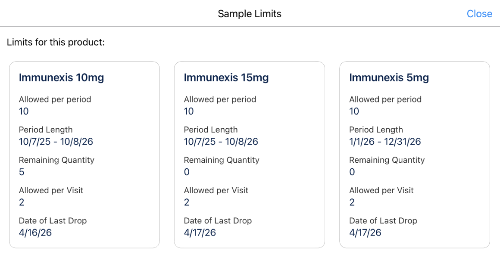

# README 10 — Sample Limit Validation: How It Works and Best Practices

## Overview

This document explains how sample limit validation works on the LSC mobile iPad app, including the server-side SOQL execution flow, the data requirements for mobile sync, and the key configuration pitfalls that prevent validation from firing.

---

## How Validation Runs: SOQL Execution Trace

When a rep submits a sample drop, the server-side API (`/connect/life-sciences/commercial/sample-limits-validation`) executes the following query sequence. Understanding this flow is essential for diagnosing issues.

The following trace is from a typical sample drop validation for a single SKU product.

| # | Object | Purpose | Expected |
|---|--------|---------|----------|
| 1 | `ProductItem` | Look up the inventory item being dropped | Required |
| 2 | `LifeSciMarketableProduct` | Get marketable product for the Product2 | Required |
| 3 | `ApexClass` | Load managed package utility class | Required |
| 4 | `LifeSciMarketableProduct` | Validate the marketable product is active | Required |
| 5 | `Account` | Load account for the visit | Required |
| 6 | `UserAdditionalInfo` | Get user preferences (locale, etc.) | Required |
| 7–8 | `LifeSciProductAcctRstrc` | Check global and territory-specific product-account restrictions | Optional |
| 9 | `HealthcareProvider` | Get HCP provider record | Required |
| 10–11 | `LifeSciMarketableProduct` | Check if product requires signature | Optional |
| 12 | `ProductItem` | Re-fetch inventory item | Required |
| 13 | `ProductBatchItem` | Validate batch assignment | Required |
| 14 | `LifeSciMarketableProduct` | Get full marketable product with name | Required |
| **15** | **`ProviderSampleLimit`** | **Find sample limit for this account × product** | **Required** |
| 16 | `InventoryCountAssessment` | Get last completed inventory count | Optional |
| 17 | `DeviceSyncTransactionRecord` | Check pending mobile sync transactions | Optional |
| 18 | `Account` | Re-fetch account name | Required |
| 19 | `Product2` | Fetch product names for error message | Required |
| **20** | **`ProviderSampleLimit`** | **Load the Rule JSON for validation** | **Required** |
| 21–22 | `LifeSciMarketableProduct` | Walk product hierarchy (ParentBrandProduct) | Required |
| **23** | **`ProviderSmplLmtTmplAssignment`** | **Load template assignment for the product** | **Required** |
| 24 | `ProviderSampleLimit` | Load all limits for the account | Required |
| 25 | `LifeSciMarketableProduct` | Final hierarchy walk | Required |
| **26** | **EXCEPTION** | **"exceeds the remaining sample limit"** | — |

### Critical Query: ProviderSmplLmtTmplAssignment (#23)

```sql
SELECT Id, PrvdSampleLimitTemplateId, RuleCondition, ProductId
FROM ProviderSmplLmtTmplAssignment
WHERE ProductId IN ('1KeHs000000fy7gKAA')
```

This query must return at least 1 row. If the assignment record doesn't exist or isn't accessible to the user (due to Private OWD), validation silently skips.

---

## Objects Required for Sample Limit Validation

All these objects must have:
1. **Active DbSchema entries** in Admin Console (for mobile sync)
2. **Correct data** linking the hierarchy
3. **Sharing** configured for the rep user (where OWD is Private)

| Object | DbSchema Entry | Purpose |
|--------|---------------|---------|
| `ProductItem` | `DbSchema_ProductItem` | Rep's inventory |
| `LifeSciMarketableProduct` | `DbSchema_LifeSciMarketableProduct` | Product hierarchy and metadata |
| `Account` | `DbSchema_Account` | Visit account |
| `UserAdditionalInfo` | `DbSchema_UserAdditionalInfo` | User preferences |
| `LifeSciProductAcctRstrc` | `DbSchema_LifeSciProductAcctRstrc` | Product-account restrictions |
| `HealthcareProvider` | `DbSchema_HealthcareProvider` | HCP record |
| `ProductBatchItem` | `DbSchema_ProductBatchItem` | Batch-item linkage |
| `ProviderSampleLimit` | `DbSchema_ProviderSampleLimit` | Sample limit rules per account × product |
| `InventoryCountAssessment` | `DbSchema_InventoryCountAssessment` | Last inventory count |
| `Product2` | `DbSchema_Product2` | Base product records |
| `ProviderSmplLmtTmplAssignment` | `DbSchema_ProviderSmplLmtTmplAssignment` | Template-product linkage (**Private OWD!**) |
| `ProviderSampleLimitTemplate` | `DbSchema_ProviderSampleLimitTemplate` | Template definitions |
| `PrvdVstSmplLmtTransaction` | `DbSchema_PrvdVstSmplLmtTransaction` | Validation transaction records |
| `PrvdVstSmplLmtDiscrepancy` | `DbSchema_PrvdVstSmplLmtDiscrepancy` | Discrepancy records |
| `ProviderVisitSettings` | `DbSchema_ProviderVisitSettings` | Visit settings (validate sample limits flag) |

---

## Best Practice #1: Sample Limits Must Be at Brand Level

The most common cause of sample limits not working is creating `ProviderSampleLimit` and `ProviderSmplLmtTmplAssignment` records at the **SKU level** instead of the **Brand level**.

```
✅ ProviderSampleLimit.ProductId → LifeSciMarketableProduct (Type = 'Brand')
❌ ProviderSampleLimit.ProductId → LifeSciMarketableProduct (Type = 'Product')
```

### What the rep sees on mobile

On the iPad, when a rep taps the 3-dot menu on a Brand in the Samples section, they see per-SKU limits like this:



Each card shows limits for an individual SKU (e.g., Immunexis 10mg, 15mg, 5mg) with its allowed-per-period, period length, remaining quantity, allowed-per-visit, and date of last drop. Even though the **display is per-SKU**, the underlying data is stored as a **single `ProviderSampleLimit` record on the Brand**.

### Why Brand level?

The mobile app resolves sample limits by walking **up** the product hierarchy. When a rep drops a sample of "Immunexis 10mg" (a SKU), the app:

1. Looks up the SKU's `ParentBrandProductId` to find the Brand (e.g., "Immunexis")
2. Queries `ProviderSampleLimit` for that Brand × Account combination
3. Reads the Rule JSON, which contains per-SKU quotas inside a single Brand-level record

If the `ProviderSampleLimit` record points to a SKU instead of the Brand, the hierarchy walk never finds it, and validation silently skips.

### One record, multiple SKU limits

A single `ProviderSampleLimit` record on the Brand contains rules that apply to **all SKUs** under that Brand. The `strategy: "SKU"` in the Rule JSON means quotas are **tracked independently per SKU** at runtime, but the **quota values are the same** for all SKUs. This is how one `ProviderSampleLimit` record produces the three separate cards shown in the screenshot above — each SKU gets its own remaining count, but they all share the same allowed-per-period and allowed-per-visit values.

For example, in the screenshot: Immunexis 10mg, 15mg, and 5mg each show "Allowed per period: 10" and "Allowed per Visit: 2", but their "Remaining Quantity" differs (5, 0, and 0) because each SKU's usage is tracked independently.

> **Can different SKUs have different quotas (e.g., 5mg allowed 3 per visit, 10mg allowed 1)?**
> No — the Rule JSON defines a single `quota` per rule at the Brand level. All SKUs under that Brand inherit the same quota. To enforce different limits for different SKUs, you would need separate Brands or a custom validation approach.

### The actual Rule JSON

Here is the actual `ProviderSampleLimit.Rule` JSON that corresponds to the screenshot above. This is what gets stored on a single Brand-level record and drives both the mobile display and validation:

```json
{
  "template": {
    "operations": [
      { "operation": "RULE", "rule": "PerVisitLimit" },
      { "operation": "RULE", "rule": "PerPeriodLimit" },
      { "operation": "AND" }
    ],
    "name": "lsc4ce_GenericTemplate",
    "blockType": "Error",
    "label": "Generic Template"
  },
  "products": {
    "<Brand MktProd Id>": {
      "rules": {
        "PerVisitLimit": {
          "quota": 2,
          "remaining": 2,
          "strategy": "SKU",
          "calculation": "SamplesPerVisit",
          "label": "Maximum Quantity per Visit",
          "starts": "2026-01-01",
          "ends": "2026-12-31",
          "period": {
            "type": "SampleLimitDateRangePeriod",
            "params": {}
          }
        },
        "PerPeriodLimit": {
          "quota": 10,
          "remaining": 10,
          "strategy": "SKU",
          "calculation": "SamplesInPeriod",
          "label": "Maximum Quantity per Period",
          "starts": "2026-01-01",
          "ends": "2026-12-31",
          "period": {
            "type": "SampleLimitDateRangePeriod",
            "params": {}
          }
        }
      },
      "info": {
        "productType": "Brand",
        "excludedChildProducts": [],
        "annualAllocations": {}
      }
    }
  }
}
```

Key fields explained:

| Field | Description |
|-------|-------------|
| `template.blockType` | `"Error"` blocks submission; `"Warning"` shows a warning but allows it |
| `template.operations` | Boolean logic combining rules — `AND` means both must pass |
| `products.<id>.rules.PerVisitLimit.quota` | Max samples of any single SKU per visit (2 in screenshot) |
| `products.<id>.rules.PerPeriodLimit.quota` | Max samples of any single SKU per period (10 in screenshot) |
| `products.<id>.rules.*.remaining` | Runtime counter — decremented as drops are recorded |
| `products.<id>.rules.*.strategy` | `"SKU"` = track per SKU independently under the Brand |
| `products.<id>.info.productType` | Must be `"Brand"` for validation to work |
| `products.<id>.info.excludedChildProducts` | SKU IDs excluded from this limit (e.g., inactive SKUs) |

### How to tell if limits are at the wrong level

Check the `productType` in the Rule JSON on `ProviderSampleLimit`:

| productType in Rule JSON | What it means |
|--------------------------|---------------|
| `"Brand"` | Correct — limit is on a Brand-level marketable product |
| `"LSSampleProduct"` | Wrong — limit is on a SKU-level product, validation will not fire |

Key differences from an incorrectly configured (SKU-level) record:
- `productType` is `"Brand"` (not `"LSSampleProduct"`)
- `excludedChildProducts` array is present (not missing)
- The product key in `products` is a Brand-level marketable product ID

---

## Best Practice #2: ProviderSmplLmtTmplAssignment Must Be Shared

The OWD for `ProviderSmplLmtTmplAssignment` is **Private**. This creates a critical difference between web and mobile:

| Context | Data Access | Validation Result |
|---------|------------|-------------------|
| **Web** (server-side API) | System context — reads all records | Works regardless of sharing |
| **Mobile** (local SQLite cache) | User context — only syncs shared records | Silently skips if assignment not shared |

The mobile app syncs data to a local SQLite cache using the **rep user's context**. If the `ProviderSmplLmtTmplAssignment` record is not shared with the rep, it won't sync to the device, and the client-side validation silently skips — no error, no warning.

### Fix: Create sharing records

```apex
insert new ProviderSmplLmtTmplAssignmentShare(
    ParentId = assignmentId,
    UserOrGroupId = repUserId,
    AccessLevel = 'Read'
);
```

**Alternative:** Change the OWD for `ProviderSmplLmtTmplAssignment` to **Public Read Only** in Setup > Sharing Settings.

---

## Best Practice #3: Use the Batch Job, Don't Create PSL Records Manually

The "Assign Sample Limit Templates to Accounts" batch job generates the correct Rule JSON format automatically. Manually crafted Rule JSON is error-prone. The recommended workflow is:

1. Create a custom `ProviderSampleLimitTemplate` with valid date ranges
2. Create `ProviderSmplLmtTmplAssignment` records at the **Brand level**
3. Share assignments with rep users
4. Run the batch job — it creates `ProviderSampleLimit` records with correct Rule JSON
5. Verify the generated records have `productType: "Brand"`

If the batch job fails, check:
- Template `RuleCondition` has valid dates (not empty strings)
- Template assignments are at Brand level (not TherapeuticArea or SKU level)
- Product hierarchy has `ParentTherapeuticAreaId` set at all levels
- No existing PSL records conflict (delete them first if needed)

---

## Best Practice #4: Product Hierarchy Must Be Complete

Every marketable product in the chain must have `ParentTherapeuticAreaId` set:

```
TherapeuticArea (e.g., Rheumatology)
  ↑ ParentBrandProductId
Brand (e.g., Immunexis)           — ParentTherapeuticAreaId → Rheumatology
  ↑ ParentBrandProductId
Brand/Country (e.g., Immunexis GB) — ParentTherapeuticAreaId → Rheumatology
  ↑ ParentBrandProductId
Product/SKU (e.g., Immunexis GB 10mg) — ParentTherapeuticAreaId → Rheumatology
```

If `ParentTherapeuticAreaId` is null at any level, the batch job hits a null dereference.

---

## Best Practice #5: Template Name Must Be the DeveloperName

```
✅ PrvdSampleLmtTemplateName = 'lsc4ce_GenericTemplate'     (DeveloperName)
❌ PrvdSampleLmtTemplateName = 'Generic Template'            (MasterLabel)
```

The managed package queries by `PrvdSampleLmtTemplateName` using the **DeveloperName**. If this is wrong, the batch job returns 0 rows and hits a null reference.

---

## Quick Diagnostic Checklist

When sample limits don't fire on mobile:

- [ ] `ProviderSampleLimit.ProductId` points to a **Brand-level** marketable product (Type = 'Brand')
- [ ] Rule JSON has `productType: "Brand"` (not `"LSSampleProduct"`)
- [ ] `ProviderSmplLmtTmplAssignment.ProductId` also at Brand level
- [ ] Template assignments **shared** with the rep user (Private OWD)
- [ ] "Validate sample limits" enabled in Admin Console > Visit Settings
- [ ] All DbSchema entries active (see table above)
- [ ] Product hierarchy fully linked (`ParentTherapeuticAreaId` at all levels)
- [ ] Rule JSON date ranges cover the current date
- [ ] `PrvdSampleLmtTemplateName` uses DeveloperName, not MasterLabel
- [ ] iPad synced after configuration changes

---

## Related READMEs

- [README-09: Sample Limit Troubleshooting](README-09-Sample-Limit-Troubleshooting.md) — Configuration requirements and batch job issues
- [README-08: Sample Management Setup](README-08-Sample-Management-Setup.md) — Full sample data chain
- [README-01: Product Hierarchy Architecture](README-01-Product-Hierarchy.md) — Product hierarchy structure
