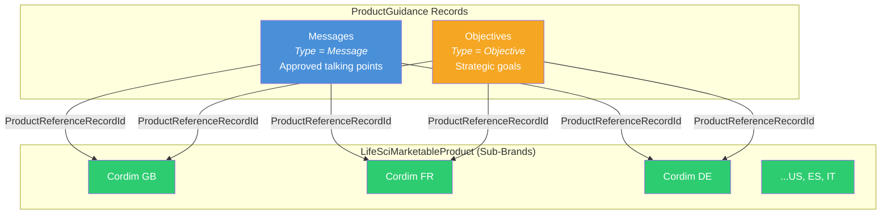
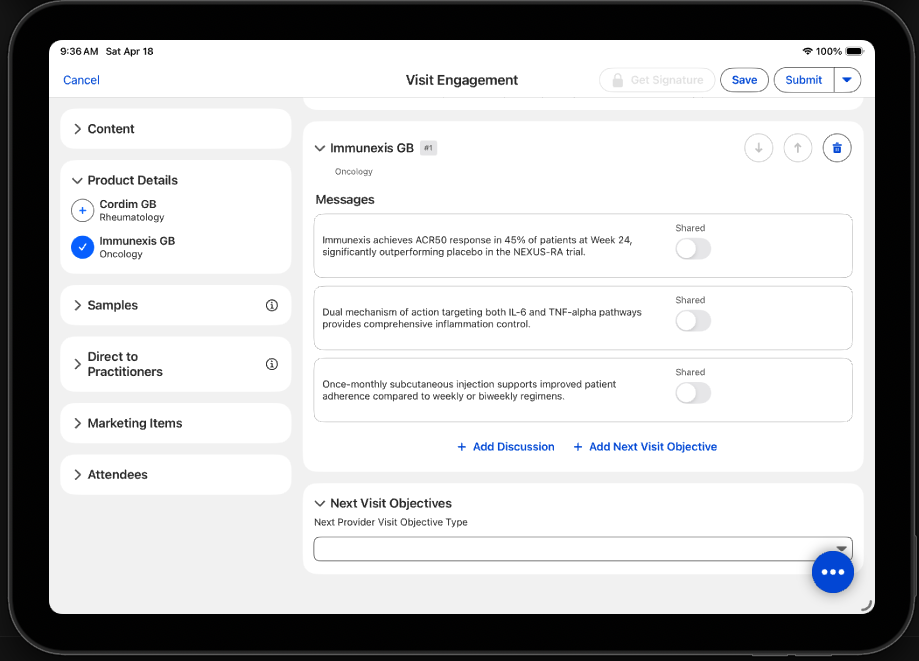
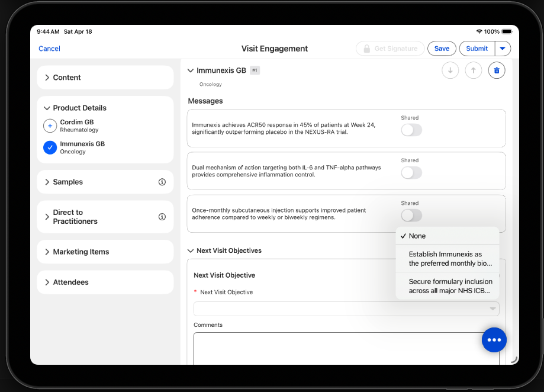

# README 11 — Product Messages & Objectives

## Overview

Product Messages and Objectives provide reps with approved talking points and strategic goals during visits. In LSC, both are stored on a single object — **ProductGuidance** — distinguished by the `Type` field. Each record is linked to a country-specific sub-brand `LifeSciMarketableProduct`, enabling localized content per market.



---

## Key Concepts

### Messages vs Objectives

Both live on the same object (`ProductGuidance`) and share the same fields. The `Type` picklist determines how they appear in the UI:

| Type | Purpose | Example |
|------|---------|---------|
| **Message** | Approved talking points reps deliver to HCPs during calls | "Delivers rapid symptom relief with up to 60% improvement by Week 12." |
| **Objective** | Strategic goals reps should work toward for the product | "Position Cordim as first-line biologic for moderate-to-severe RA." |

Messages appear in the **Messages** section and Objectives appear in the **Objectives** section of the Product Hierarchy detail panel and during Visit Engagement.

### Why Attach to the Sub-Brand (Not the Top-Level Brand)?

Each country has different:
- **Regulatory approvals** — approved indications and claims vary by market
- **Language requirements** — French reps need French content, German reps need German content
- **Market positioning** — competitive landscape differs by country
- **Payer/formulary context** — objectives reference local health authorities (NICE, HAS, G-BA, AIFA, AEMPS)

Attaching messages to `Cordim FR` (not `Cordim`) ensures French reps see French-language, France-specific content.

---

## ProductGuidance Object

### Key Fields

| Field API Name | Label | Type | Description |
|----------------|-------|------|-------------|
| `Name` | Name | String | Unique identifier (e.g., "Cordim GB Message1") |
| `ContentText` | Content Text | String | The message body or objective description |
| `Type` | Type | Picklist | `Message`, `Objective`, or `Other` |
| `Priority` | Priority | Integer | Numeric ordering (1 = highest priority) |
| `ProductReferenceRecordId` | Product Reference Record ID | Reference | Polymorphic lookup to `LifeSciMarketableProduct` or `Product2` |
| `EffectiveStartDate` | Effective Start Date | Date | When the guidance becomes active |
| `EffectiveEndDate` | Effective End Date | Date | When the guidance expires |
| `IsActive` | Active | Boolean | Must be `true` for the record to appear |
| `GroupName` | Group Name | String | Optional grouping label |
| `GroupSequence` | Group Sequence | Integer | Order within a group |
| `Reactions` | Reactions | String | Reaction options (e.g., Positive/Neutral/Negative) |

### ProductReferenceRecordId

This is a **polymorphic lookup** — it can point to either `LifeSciMarketableProduct` or `Product2`. For multi-country setups, always point to the **LifeSciMarketableProduct** sub-brand record (e.g., "Cordim GB"), because:

1. The Product Hierarchy UI resolves messages by this field
2. Territory-filtered product alignment flows through `LifeSciMarketableProduct`
3. Visit Engagement resolves detailable products from `LifeSciMarketableProduct`

---

## Data Created by the Script

**Script:** `scripts/create-product-guidance.apex`

The script creates 60 `ProductGuidance` records — 3 messages and 2 objectives for each of the 12 country sub-brands:

| Brand | Countries | Messages | Objectives | Total |
|-------|-----------|----------|------------|-------|
| Cordim | GB, US, FR, DE, ES, IT | 18 | 12 | 30 |
| Immunexis | GB, US, FR, DE, ES, IT | 18 | 12 | 30 |
| **Total** | | **36** | **24** | **60** |

All records have:
- `EffectiveStartDate` = 2025-01-01
- `EffectiveEndDate` = 2028-12-31
- `IsActive` = true

### Localization

Content is localized per country language:

| Country | Language | Example Message (Cordim) |
|---------|----------|--------------------------|
| GB | English | "Delivers rapid and sustained symptom relief, with up to 60% improvement in joint pain and swelling by Week 12." |
| US | English | "Now FDA-approved for moderate-to-severe rheumatoid arthritis in adults who have had an inadequate response to one or more DMARDs." |
| FR | French | "Cordim offre un soulagement rapide et durable des symptômes, avec une amélioration allant jusqu'à 60 % des douleurs articulaires et du gonflement à la semaine 12." |
| DE | German | "Cordim bietet eine schnelle und anhaltende Symptomlinderung mit bis zu 60 % Verbesserung von Gelenkschmerzen und Schwellungen bis Woche 12." |
| ES | Spanish | "Cordim ofrece un alivio rápido y sostenido de los síntomas, con una mejora de hasta el 60 % en el dolor articular y la hinchazón en la semana 12." |
| IT | Italian | "Cordim offre un sollievo rapido e duraturo dei sintomi, con un miglioramento fino al 60% del dolore articolare e del gonfiore entro la settimana 12." |

Objectives reference country-specific regulatory bodies and market context:

| Country | Regulatory Body Referenced |
|---------|---------------------------|
| GB | NICE (National Institute for Health and Care Excellence) / NHS ICBs |
| US | FDA |
| FR | HAS (Haute Autorité de Santé) |
| DE | G-BA (Gemeinsamer Bundesausschuss) / DGRh |
| ES | AEMPS (Agencia Española de Medicamentos) |
| IT | AIFA (Agenzia Italiana del Farmaco) |

---

## Sharing

### Why Sharing Matters

ProductGuidance has a **Private** Organization-Wide Default (OWD). This means records are only visible to the record owner unless explicitly shared. If you create ProductGuidance records as an admin, reps will **not** see them during Visit Engagement until you grant access.

### Sharing Approaches

There are three ways to make ProductGuidance records visible to reps:

| Approach | Best For | How It Works |
|----------|----------|--------------|
| **Role Hierarchy** | Simple orgs with a clear management chain | If the record owner is above the rep in the role hierarchy, the rep inherits access automatically |
| **Sharing Rules** | Scalable, criteria-based access | Create criteria-based sharing rules in Setup (e.g., share all records where `Country__c = 'GB'` with a public group containing GB reps) |
| **Manual Shares (Apex)** | Script-based setup, full control | Insert `ProductGuidanceShare` records via Apex to grant specific users Read access |

### Script-Based Sharing

**Script:** `scripts/share-product-guidance.apex`

This script creates `ProductGuidanceShare` records to grant Read access to reps based on their territory assignment:

1. Queries `UserTerritory2Association` to build a map of users by country (territory names prefixed with country code, e.g., `GB-FSR-001-London`)
2. Matches ProductGuidance records to countries by parsing the record Name (e.g., "Immunexis GB Message1" → GB)
3. Creates `ProductGuidanceShare` records linking each guidance record to the appropriate country's reps

```bash
sf apex run --file scripts/share-product-guidance.apex --target-org {your_org}
```

The script is idempotent — it checks for existing manual shares before inserting.

### Production Recommendation

For production deployments, **criteria-based sharing rules** are the most maintainable approach:

1. Add `Country__c` to `ProductGuidance` (already included in the create script)
2. Create a **public group** per country (e.g., "GB Reps", "FR Reps")
3. Create a **sharing rule**: "Share ProductGuidance where `Country__c = 'GB'` with public group 'GB Reps' — Read access"

This way, new ProductGuidance records automatically become visible to the correct reps without running a script.

---

## Running the Scripts

### Step 1: Create ProductGuidance Records

**Prerequisites:**
- Country sub-brand `LifeSciMarketableProduct` records exist (from `scripts/create-marketable-products.apex`)
- Sub-brands have `ParentProductId` set (from `scripts/fix-sub-brand-parent-hierarchy.apex`)

```bash
sf apex run --file scripts/create-product-guidance.apex --target-org {your_org}
```

The script is idempotent — it checks for existing records by `Name` and skips duplicates.

**Expected Output:**

```
Found: Cordim GB (CORDIM-GB) → 1KeHs0000010wBcKAI
Found: Immunexis GB (IMMUNEXIS-GB) → 1KeHs0000010wBWKAY
...
Inserted 60 ProductGuidance records.
============================================
PRODUCT GUIDANCE RECORDS
  Messages:   36
  Objectives: 24
  Total:      60
============================================
```

### Step 2: Share Records with Reps

```bash
sf apex run --file scripts/share-product-guidance.apex --target-org {your_org}
```

**Expected Output:**

```
============================================
PRODUCT GUIDANCE SHARING
  GB: 10 records → 1 reps
  US: 10 records → 40 reps
  FR: 10 records → 0 reps
  ...
  Shares created:     400
============================================
```

Countries with no territory-assigned reps will show 0 — shares are created when reps are assigned to territories.

---

## How Messages and Objectives Appear

### Product Hierarchy UI (Setup)

In **Setup > Product Configuration > Product Hierarchy**, select a country sub-brand (e.g., "Cordim GB"). The detail panel on the right shows two sections:

- **Messages** — lists each `Type = 'Message'` record with Name, Content Text, Effective Start Date, Effective End Date, and Priority
- **Objectives** — same layout but for `Type = 'Objective'` records (visible by scrolling down or clicking the Objectives tab)

Both sections have an **Edit** button for inline modification.

### Visit Engagement (Mobile / Web)

During a visit, when a rep selects a product for detailing:
1. The platform resolves which `LifeSciMarketableProduct` records are aligned to the rep's territory
2. For each aligned product, it queries `ProductGuidance` where `ProductReferenceRecordId` matches and `IsActive = true` and the current date falls within the effective date range
3. Messages appear as talking points the rep can mark as discussed
4. Objectives appear as goals the rep can track progress against

The screenshot below shows Visit Engagement on iPad for Immunexis GB. The three country-specific messages appear under the **Messages** section with a **Shared** toggle. The rep can mark each message as shared during the visit.



> **Key observations:**
> - **Product Details** (left panel) shows only the products aligned to the rep's territory — here Cordim GB and Immunexis GB
> - **Messages** are the `Type = 'Message'` ProductGuidance records linked to the Immunexis GB `LifeSciMarketableProduct`
> - The **Shared** toggle creates a `ProviderVisitDtlProductMsg` record when enabled
> - **+ Add Discussion** lets the rep add free-text notes beyond the pre-defined messages
> - **+ Add Next Visit Objective** opens the objectives picker (see below)

### Objectives in Visit Engagement

Objectives appear in the **Next Visit Objectives** section after clicking **+ Add Next Visit Objective**. The rep selects an objective from a dropdown populated by `Type = 'Objective'` ProductGuidance records linked to the same sub-brand. The dropdown shows the `ContentText` of each objective, and the rep can add comments.



> **Key observations:**
> - The **Next Visit Objective** dropdown lists the two Immunexis GB objectives: "Establish Immunexis as the preferred monthly bio..." and "Secure formulary inclusion across all major NHS ICB..."
> - Unlike Messages (which appear automatically), Objectives must be **explicitly added** by clicking **+ Add Next Visit Objective**
> - The **Comments** field lets the rep record progress notes against the selected objective

### Call Discussion Records

When a rep marks a message as discussed during a visit, the platform creates a `ProviderVisitDtlProductMsg` record linking:
- The visit (`ProviderVisitDetail`)
- The product (`LifeSciMarketableProduct`)
- The message (`ProductGuidance`)
- The reaction (if reactions are configured)

---

## Cleanup

To delete all guidance records created by the script:

```apex
List<ProductGuidance> toDelete = [
    SELECT Id FROM ProductGuidance
    WHERE Name LIKE 'Cordim%' OR Name LIKE 'Immunexis%'
];
delete toDelete;
System.debug('Deleted ' + toDelete.size() + ' ProductGuidance records.');
```

---

## Design Decisions

### Naming Convention

Records follow the pattern `{Brand} {Country} {Type}{Sequence}`:
- `Cordim GB Message1`, `Cordim GB Message2`, `Cordim GB Message3`
- `Cordim FR Objectif1`, `Cordim FR Objectif2`

For non-English countries, the Type word is localized in the Name (Objectif, Ziel, Objetivo, Obiettivo) to make records immediately identifiable by language when browsing in list views.

### Priority as Integer

`Priority` is a numeric integer field, not a picklist. Lower numbers = higher priority. The script assigns:
- Messages: Priority 1, 2, 3
- Objectives: Priority 1, 2

### Effective Dates

All records use a calendar-year range (2025-01-01 to 2028-12-31). In production, you would:
- Align to your commercial planning cycle (e.g., quarterly brand plans)
- Expire outdated messages when new clinical data is available
- Create new records for the next cycle rather than editing existing ones (for audit trail)

---

## Script Summary

| Script | Creates | Records | Object |
|--------|---------|---------|--------|
| `scripts/create-product-guidance.apex` | Localized messages and objectives | 60 | ProductGuidance |
| `scripts/share-product-guidance.apex` | Share records granting reps Read access | Varies by rep count | ProductGuidanceShare |

---

## Troubleshooting

### Messages Don't Appear in Visit Engagement

If a rep opens Visit Engagement and no messages or objectives appear for a product, work through these checks in order:

**1. Is the ProductGuidance record shared with the rep?**

ProductGuidance has **Private OWD**. Query `ProductGuidanceShare` to verify the rep has access:

```apex
SELECT Parent.Name, UserOrGroupId, AccessLevel, RowCause
FROM ProductGuidanceShare
WHERE Parent.Name LIKE 'Immunexis GB%'
```

If only the owner share exists, the rep cannot see the record. Run `scripts/share-product-guidance.apex` or create a sharing rule.

**2. Is `IsActive` = true?**

```apex
SELECT Name, IsActive FROM ProductGuidance WHERE Name LIKE 'Immunexis GB%'
```

Inactive records are filtered out by the platform.

**3. Is the current date within the effective date range?**

```apex
SELECT Name, EffectiveStartDate, EffectiveEndDate
FROM ProductGuidance WHERE Name LIKE 'Immunexis GB%'
```

If `EffectiveEndDate` is in the past, the record won't appear. Update the date range or create new records for the current cycle.

**4. Does `ProductReferenceRecordId` point to the correct sub-brand?**

```apex
SELECT Name, ProductReferenceRecordId, ProductReferenceRecord.Name
FROM ProductGuidance WHERE Name LIKE 'Immunexis GB%'
```

The reference must point to the **country sub-brand** `LifeSciMarketableProduct` (e.g., "Immunexis GB"), not the global brand ("Immunexis") or a `Product2` record. Visit Engagement resolves messages through the territory-aligned `LifeSciMarketableProduct`.

**5. Is the product aligned to the rep's territory?**

```apex
SELECT Product.Name, Territory2.Name
FROM ProductTerritoryAvailability
WHERE Product.Name = 'Immunexis GB'
```

If no `ProductTerritoryAvailability` record exists for the sub-brand and the rep's territory, the product won't appear in the visit at all — and neither will its messages.

**6. Does the rep have the correct permission set?**

The rep's permission set must include Read access to:
- `ProductGuidance` object
- Fields: `Name`, `ContentText`, `Type`, `Priority`, `EffectiveStartDate`, `EffectiveEndDate`, `IsActive`, `ProductReferenceRecordId`

---

## Related READMEs

- [README-01: Product Hierarchy Architecture](README-01-Product-Hierarchy.md)
- [README-02: LSC Areas Where Products Appear](README-02-LSC-Product-Areas.md)
- [README-04: Data Loading Scripts](README-04-Data-Loading-Scripts.md)
- [README-06: Parent-Child Approaches](README-06-Parent-Child-Approaches.md)
- [README-08: Sample Management Setup](README-08-Sample-Management-Setup.md)
