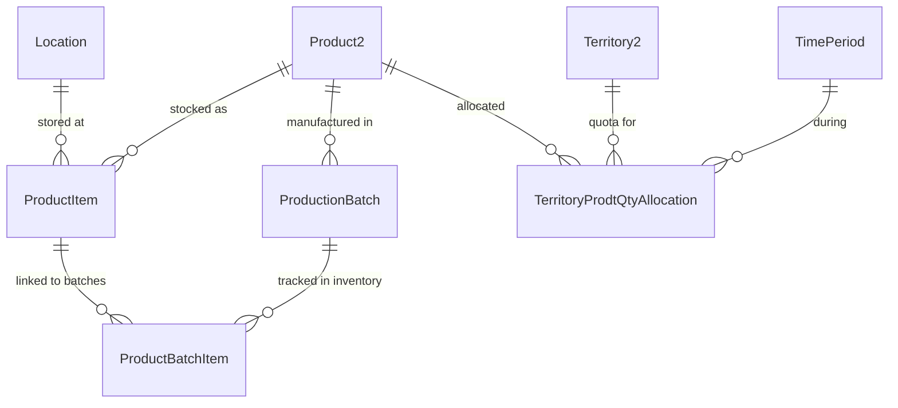
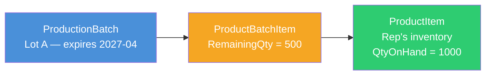
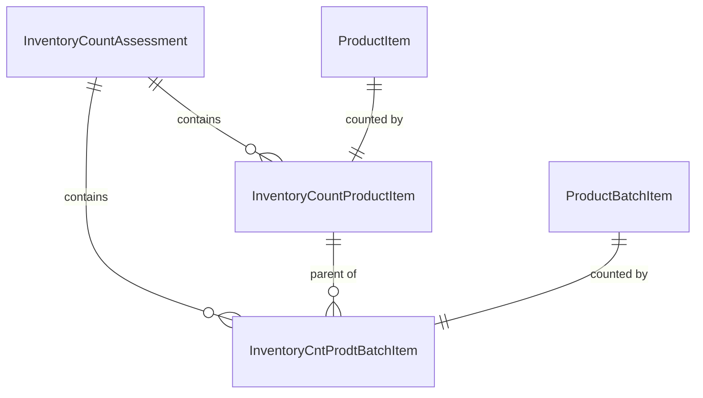

# README 12 — Sample Inventory Setup

## Overview

Before a rep can drop samples during a visit, the platform needs to know **what stock the rep has on hand**, **which production lots those samples came from**, and **how many the territory is allowed to distribute**. Three objects model this:

| Object | Purpose |
|--------|---------|
| `ProductItem` | The rep's physical inventory — what they have in their bag |
| `ProductionBatch` + `ProductBatchItem` | Lot/batch tracking with expiry dates |
| `TerritoryProdtQtyAllocation` | Territory-level quota — how many samples the territory can distribute |



---

## Prerequisites

Before creating inventory records, the following must already exist:

1. **Sample-level Product2 records** (Family = 'Sample') — from `scripts/create-products.apex`
2. **Sample-level LifeSciMarketableProduct records** (Type = 'Product') — from `scripts/create-sample-marketable-products.apex`
3. **Territory assignments** — rep assigned to territory via `UserTerritory2Association`
4. **Rep inventory location** — see [Inventory Location Setup](#inventory-location-setup) below

---

## Inventory Location Setup

Each rep needs an **inventory Location** before they can receive or hold sample stock. The platform enforces a **one location per rep** constraint — you cannot create a second inventory location for the same user.

**Script:** `scripts/create-inventory-location.apex`

```bash
sf apex run --file scripts/create-inventory-location.apex --target-org {your_org}
```

**Configurable variables:**

| Variable | Default | Description |
|----------|---------|-------------|
| `TERRITORY_DEV_NAME` | `GB_FSR_001_London` | Target territory — the rep is looked up from this |
| `ADDR_STREET` | `42 Harley Street` | Inventory storage street address |
| `ADDR_CITY` | `London` | City |
| `ADDR_POSTCODE` | `W1G 9PR` | Postal code |
| `ADDR_COUNTRY` | `United Kingdom` | Country |

**What it creates:**

| Object | Record | Purpose |
|--------|--------|---------|
| `Location` | 1 per rep | The rep's inventory location (`LocationType = 'User Inventory'`) |
| `Address` | 1 per location | The physical storage address displayed on the Sample Inventory Management page |

The script is idempotent — if the rep already has an inventory location, it updates the name and address rather than creating a new one.

### Location Object — Key Fields

| Field | Type | Required | Description |
|-------|------|----------|-------------|
| `Name` | String | Yes | Display name (e.g., "Andrew Whitaker Inventory") |
| `LocationType` | Picklist | Yes | Must be `User Inventory` for sample management |
| `PrimaryUserId` | Lookup(User) | Yes | The rep who owns this inventory |
| `IsInventoryLocation` | Boolean | Yes | Must be `true` — cannot be set to `false` while `PrimaryUserId` is set |

### Address Object — Key Fields

The `Address` record is a child of the `Location` and provides the **Inventory Storage Address** shown on the Sample Inventory Management page.

| Field | Type | Description |
|-------|------|-------------|
| `ParentId` | Lookup(Location) | The rep's inventory location |
| `Street` | String | Street address |
| `City` | String | City |
| `State` | String | State/Province (leave blank for countries that don't use states, e.g., UK) |
| `PostalCode` | String | Postal/ZIP code |
| `Country` | String | Country name |
| `AddressType` | Picklist | Set to `Mailing` |

### Platform Constraints

- **One location per rep** — attempting to create a second `Location` with the same `PrimaryUserId` fails with: *"The user is already assigned to a location."*
- **Cannot deactivate** — setting `IsInventoryLocation = false` or clearing `PrimaryUserId` fails with validation errors while the location has dependent records (ProductItems, InventoryCounts)
- **To change the address**, update the existing `Address` record rather than deleting and recreating

---

## ProductItem — Rep Inventory

### What It Is

A `ProductItem` record represents a quantity of a specific product at a specific location. In the sampling context, it is the rep's on-hand stock of a sample product. Without a ProductItem record, the sample product will not appear in the Samples panel during Visit Engagement.

### Key Fields

| Field | Type | Description |
|-------|------|-------------|
| `Product2Id` | Lookup(Product2) | The sample product (e.g., "Immunexis GB 10mg Sample") |
| `LocationId` | Lookup(Location) | The rep's inventory location |
| `QuantityOnHand` | Decimal | Current stock count |
| `QuantityUnitOfMeasure` | Picklist | Unit of measure (e.g., "Each") |

### How the Platform Uses It

During Visit Engagement, the platform runs a query to find products the rep has in stock:

```sql
SELECT Id, Product2Id, QuantityOnHand
FROM ProductItem
WHERE LocationId IN (
    SELECT Id FROM Location
    WHERE PrimaryUserId = :currentUserId
    AND IsInventoryLocation = true
)
```

If this query returns no rows for a sample product, that product will not appear in the Samples panel — even if every other piece of setup is correct.

### Location Setup

Each rep needs a `Location` record before ProductItem records can be created:

| Field | Value |
|-------|-------|
| `LocationType` | `User Inventory` |
| `PrimaryUserId` | The rep's User Id |
| `IsInventoryLocation` | `true` |
| `Name` | Convention: "{Rep Name} Inventory" |

> **Note:** In the demo org, Location records are typically pre-created when setting up the rep user. The inventory script checks for an existing location and errors if one is not found.

### How Inventory Gets Initialized

There are two approaches to putting initial stock into a rep's inventory:

#### Approach 1: Direct Creation (Demo / Development)

Create `ProductItem` records directly with a starting `QuantityOnHand`. This is what our scripts do — `create-sample-inventory.apex` inserts ProductItem records with `QuantityOnHand = 1000` at the rep's Location.


This is fine for demos and development but skips the audit trail of where stock came from.

#### Approach 2: Transfer Order / Shipment (Production)

In production, reps receive inventory through the **Transfer Order** flow, which models the physical shipment of samples from a warehouse to the rep:


The objects involved:

| Object | Purpose |
|--------|---------|
| `Location` (warehouse) | The distribution center that holds bulk stock |
| `TransferOrder` | Header record for a shipment from warehouse to rep |
| `TransferOrderItem` | Line item — which product and quantity is being shipped |
| `Location` (rep) | The rep's inventory location that receives the shipment |

When the rep confirms receipt, the platform increments `QuantityOnHand` on the rep's `ProductItem`. This creates a full chain of custody: **warehouse → shipment → rep inventory** — required for compliance in regulated markets (e.g., PDMA in the US).

#### Which Approach to Use

| | Direct Creation | Transfer Order |
|---|---|---|
| **Use when** | Demos, development, initial data load | Production deployments |
| **Audit trail** | None — stock appears from nothing | Full — every unit traced from warehouse |
| **Compliance** | Not suitable for regulated markets | Required for PDMA, EU sample tracking |
| **Setup effort** | One script | Warehouse Location + Transfer Order flow |

Our scripts use Approach 1. In production, you would set up the Transfer Order flow and use it for all inventory replenishment after the initial load.

---

## ProductionBatch — Lot Tracking

### What It Is

A `ProductionBatch` record represents a manufactured lot/batch of a product with an expiry date. During Visit Engagement, when a rep drops a sample, the "Production Batch ID" picker appears so the rep can record which lot the sample came from. This is required for compliance and recall tracking.

### Key Fields

| Field | Type | Description |
|-------|------|-------------|
| `ProductId` | Lookup(Product2) | The sample product |
| `IsActive` | Boolean | Must be `true` to appear in the picker |
| `BatchCreatedDate` | DateTime | When the batch was manufactured |
| `ExpirationDate` | DateTime | When the batch expires — expired batches should not be distributed |
| `QuantityUnitOfMeasure` | Picklist | Unit of measure (e.g., "Each") |

### ProductBatchItem — Junction to Inventory

A `ProductBatchItem` is the junction object that links a `ProductionBatch` to a rep's `ProductItem`. Without this link, the batch will not appear in the Production Batch ID picker during a visit.

| Field | Type | Description |
|-------|------|-------------|
| `ProductionBatchId` | Lookup(ProductionBatch) | The batch/lot |
| `ProductItemId` | Lookup(ProductItem) | The rep's inventory for this product |
| `RemainingQuantity` | Decimal | How many units remain from this batch |
| `IsActive` | Boolean | Must be `true` |



### How Many Batches?

The script creates **2 batches per sample product** with staggered expiry dates:
- Batch 1: expires in 12 months
- Batch 2: expires in 24 months

In production, batches correspond to real manufacturing lots and are created as physical inventory is received.

---

## TerritoryProdtQtyAllocation — Territory Quotas

### What It Is

A `TerritoryProdtQtyAllocation` record defines how many units of a sample product a territory is allowed to distribute during a time period. This is the compliance mechanism that prevents over-distribution.

### Key Fields

| Field | Type | Description |
|-------|------|-------------|
| `ProductId` | Lookup(Product2) | The sample product |
| `TerritoryId` | Lookup(Territory2) | The territory |
| `TimePeriodId` | Lookup(TimePeriod) | The allocation time window |
| `AllocationType` | Picklist | `Drop` (left at office) or `Ship` (mailed to HCP) |
| `AllocatedQuantity` | Integer | Maximum units for this type |
| `OwnerId` | Lookup(User) | Must be the rep assigned to the territory |

### TimePeriod

Each allocation requires a `TimePeriod` record that defines the date range. The script finds a TimePeriod that covers the current date:

```sql
SELECT Id, Name, StartDate, EndDate
FROM TimePeriod
WHERE StartDate <= TODAY AND EndDate >= TODAY
```

If no TimePeriod covers today, allocations cannot be created. Create one in Setup or via the Admin Console.

### Drop vs Ship

Each sample product gets **two allocation records** per territory:

| AllocationType | Default Qty | Description |
|----------------|-------------|-------------|
| `Drop` | 10,000 | Samples physically left at the HCP's office during a visit |
| `Ship` | 1,000 | Samples shipped/mailed to the HCP after the visit |

The `DistributionMethod` on `LifeSciMarketableProduct` must include the allocation type — a product with `DistributionMethod = 'DropAndShip'` supports both.

### OwnerId Matters

The `OwnerId` on the allocation record **must be the rep assigned to the territory**. If it is set to an admin user, the rep may not be able to see the allocation due to sharing rules.

---

## Running the Scripts

### Step 0: Create Inventory Location

```bash
sf apex run --file scripts/create-inventory-location.apex --target-org {your_org}
```

This must be done before creating inventory items. See [Inventory Location Setup](#inventory-location-setup) above for details.

### Step 1: Create Rep Inventory

```bash
sf apex run --file scripts/create-sample-inventory.apex --target-org {your_org}
```

**Configurable variables** (edit at the top of the script):

| Variable | Default | Description |
|----------|---------|-------------|
| `TERRITORY_DEV_NAME` | `GB_FSR_001_London` | Target territory |
| `COUNTRY_CODE` | `GB` | Country filter for products |
| `INITIAL_QUANTITY` | `1000` | Starting inventory per product |

**What it does:**
1. Looks up the rep assigned to the territory
2. Finds the rep's inventory Location (must already exist)
3. Finds sample Product2 records for the country
4. Creates a `ProductItem` per sample product at the rep's location

**Expected output:**
```
Rep: andrew.whitaker@lsc.demo
Inventory location: Andrew Whitaker Inventory (131Hs...)
Found 4 sample products
INSERT: Cordim GB 5mg Sample qty=1000
INSERT: Cordim GB 20mg Sample qty=1000
INSERT: Immunexis GB 10mg Sample qty=1000
INSERT: Immunexis GB 25mg Sample qty=1000
Inserted 4 ProductItem records.
```

### Step 2: Create Production Batches

```bash
sf apex run --file scripts/create-sample-production-batches.apex --target-org {your_org}
```

**Configurable variables:**

| Variable | Default | Description |
|----------|---------|-------------|
| `COUNTRY_CODE` | `GB` | Country filter |
| `REMAINING_QTY` | `500` | Remaining quantity per batch item |

**What it does:**
1. Finds sample Product2 records for the country
2. Creates 2 `ProductionBatch` records per product (staggered expiry)
3. Links each batch to the rep's `ProductItem` via `ProductBatchItem`

**Expected output:**
```
Created 8 ProductionBatch records.
Created 8 ProductBatchItem records.
============================================
PRODUCTION BATCHES SUMMARY
  ProductionBatch created:  8
  ProductBatchItem created: 8
============================================
```

### Step 3: Create Territory Allocations

```bash
sf apex run --file scripts/create-sample-allocations.apex --target-org {your_org}
```

**Configurable variables:**

| Variable | Default | Description |
|----------|---------|-------------|
| `TERRITORY_DEV_NAME` | `GB_FSR_001_London` | Target territory |
| `COUNTRY_CODE` | `GB` | Country filter |
| `DROP_QUANTITY` | `10000` | Drop allocation per product |
| `SHIP_QUANTITY` | `1000` | Ship allocation per product |

**What it does:**
1. Looks up the territory and assigned rep
2. Finds sample Product2 records for the country
3. Finds a `TimePeriod` that covers today
4. Creates 2 `TerritoryProdtQtyAllocation` records per product (Drop + Ship)

**Expected output:**
```
INSERT: Cordim GB 5mg Sample / Drop -> 10000
INSERT: Cordim GB 5mg Sample / Ship -> 1000
INSERT: Cordim GB 20mg Sample / Drop -> 10000
INSERT: Cordim GB 20mg Sample / Ship -> 1000
...
Inserted 8 allocation records.
```

### Step 4: Create Inventory Count

```bash
sf apex run --file scripts/create-inventory-count.apex --target-org {your_org}
```

**Configurable variables:**

| Variable | Default | Description |
|----------|---------|-------------|
| `TERRITORY_DEV_NAME` | `GB_FSR_001_London` | Target territory |
| `COUNT_TYPE` | `Periodic` | Assessment type |
| `COUNT_PURPOSE` | `Accuracy` | Assessment purpose |

**What it does:**
1. Looks up the rep's inventory location
2. Creates an `InventoryCountAssessment` header
3. Creates `InventoryCountProductItem` records with actual = expected quantities
4. Creates `InventoryCntProdtBatchItem` records with `ProductId` set
5. Marks the assessment as Complete

**Expected output:**
```
Rep: Andrew Whitaker (005Hs...)
Location: Andrew Whitaker Inventory (131Hs...)
Found 5 product items.
Found 9 active batch items.
Created InventoryCountAssessment: 1LiHs...
Created 5 InventoryCountProductItem records.
Created 7 InventoryCntProdtBatchItem records (2 skipped).
```

---

## Data Created (Per Territory)

| Object | Records | Description |
|--------|---------|-------------|
| `ProductItem` | 4 | One per sample product (2 brands × 2 dosages) |
| `ProductionBatch` | 8 | Two per sample product (staggered expiry) |
| `ProductBatchItem` | 8 | Links each batch to the rep's inventory |
| `TerritoryProdtQtyAllocation` | 8 | Two per product (Drop + Ship) |
| `InventoryCountAssessment` | 1 | One completed count |
| `InventoryCountProductItem` | 4 | One per ProductItem |
| `InventoryCntProdtBatchItem` | 8 | One per active ProductBatchItem |
| **Total** | **41** | Per territory |

---

## How It Fits in the Full Setup Sequence

Sample inventory is **Steps 3–5** of the sample management setup. The full sequence is:

```mermaid
flowchart LR
    S1["Step 1<br/><b>Sample Marketable<br/>Products</b>"]
    S2["Step 2<br/><b>Territory Alignment<br/>+ Batch Job</b>"]
    S2b["Step 2b<br/><b>Inventory Location</b><br/><i>Location + Address</i>"]
    S3["Step 3<br/><b>Rep Inventory</b><br/><i>ProductItem</i>"]
    S4["Step 4<br/><b>Production Batches</b><br/><i>ProductionBatch +<br/>ProductBatchItem</i>"]
    S5["Step 5<br/><b>Allocations</b><br/><i>TerritoryProdtQty<br/>Allocation</i>"]
    S6["Step 6<br/><b>Sample Limits</b><br/><i>(README-08)</i>"]

    S5b["Step 5b<br/><b>Inventory Count</b><br/><i>InventoryCount<br/>Assessment</i>"]

    S1 --> S2 --> S2b --> S3 --> S4 --> S5 --> S5b --> S6

    style S1 fill:#ccc,color:#333
    style S2 fill:#ccc,color:#333
    style S2b fill:#2ecc71,color:#fff
    style S3 fill:#2ecc71,color:#fff
    style S4 fill:#2ecc71,color:#fff
    style S5 fill:#2ecc71,color:#fff
    style S5b fill:#2ecc71,color:#fff
    style S6 fill:#ccc,color:#333
```



Steps 1–2 are covered in [README-08](README-08-Sample-Management-Setup.md). Step 6 (sample limits) is also in README-08, with troubleshooting in [README-09](README-09-Sample-Limit-Troubleshooting.md) and [README-10](README-10-Sample-Limit-SOQL-Analysis.md).

---

## Inventory Count Assessment

### What It Is

An `InventoryCountAssessment` is a formal count of a rep's sample inventory. It records what the rep has on hand (by product and by batch) and compares it against expected quantities. Inventory counts are required for compliance — they verify that the rep's physical stock matches what the system says they should have.

### When It's Needed

The platform requires an inventory count before a rep can drop samples. Without a completed count, the Samples panel during Visit Engagement may show an error or be blocked entirely.

### Objects Involved

| Object | Purpose |
|--------|---------|
| `InventoryCountAssessment` | Header — the assessment itself |
| `InventoryCountProductItem` | Product-level count — one per ProductItem |
| `InventoryCntProdtBatchItem` | Batch-level count — one per ProductBatchItem |



### Key Fields

**InventoryCountAssessment (header):**

| Field | Type | Notes |
|-------|------|-------|
| `LocationId` | Lookup(Location) | The rep's inventory location |
| `AssigneeId` | Lookup(User) | The rep performing the count |
| `Type` | Picklist | `Initial`, `Periodic`, `Adhoc`, `Audited` |
| `Purpose` | Picklist | `Audit`, `Verification`, `Reconciliation`, `Adjustment`, `Compliance`, `Accuracy` |
| `Status` | Picklist | `Assigned`, `InProgress`, `Complete`, `AuditorApproved`, `Saved` |
| `PlannedStartDateTime` | DateTime | Required for non-Initial types |
| `PlannedEndDateTime` | DateTime | Required for non-Initial types |

**InventoryCountProductItem (product-level):**

| Field | Type | Notes |
|-------|------|-------|
| `InventoryCountAssessmentId` | Lookup | Parent assessment |
| `ProductItemId` | Lookup(ProductItem) | The inventory being counted |
| `ExpectedQuantity` | Decimal | System's expected quantity |
| `ActualQuantity` | Decimal | Rep's counted quantity |
| `Status` | Picklist | `Assigned`, `In_Progress`, `Complete`, `Inactive` |

**InventoryCntProdtBatchItem (batch-level):**

| Field | Type | Notes |
|-------|------|-------|
| `InventoryCountAssessmentId` | Lookup | Parent assessment |
| `InventoryCountProductItemId` | Lookup | Parent product-level count |
| `ProductBatchItemId` | Lookup(ProductBatchItem) | The batch being counted |
| `ProductId` | Lookup(Product2) | **Required** — must be set for the UI to display batch data in the Details table |
| `ExpectedQuantity` | Decimal | System's expected quantity |
| `ActualQuantity` | Decimal | Rep's counted quantity |
| `Status` | Picklist | `NotStarted`, `InProgress`, `Completed` |

> **Important:** The `ProductId` field on `InventoryCntProdtBatchItem` must be explicitly set. Without it, the Inventory Count Assessment detail page shows an empty Details table even though child records exist.

### What It Looks Like

A completed Inventory Count Assessment showing the Details table with product and batch data:


The Details table shows each batch with its product name, batch number, and actual stock count.

### Status Values Differ Across Objects

The status picklist values are **not consistent** across the three objects:

| Object | Status Values |
|--------|---------------|
| `InventoryCountAssessment` | Assigned, InProgress, Complete, AuditorApproved, Saved |
| `InventoryCountProductItem` | Assigned, In_Progress, Complete, Inactive |
| `InventoryCntProdtBatchItem` | NotStarted, InProgress, Completed |

### Platform Constraints

- **One Initial count per location** — the `Initial` type can only be used once per location. Use `Periodic`, `Adhoc`, or `Audited` for subsequent counts
- **Locked when Complete** — once an assessment is marked Complete, child records cannot be updated or deleted
- **PlannedStartDateTime / PlannedEndDateTime** required for non-Initial types on both the header and product-level children

### Script

**Script:** `scripts/create-inventory-count.apex`

```bash
sf apex run --file scripts/create-inventory-count.apex --target-org {your_org}
```

**Configurable variables:**

| Variable | Default | Description |
|----------|---------|-------------|
| `TERRITORY_DEV_NAME` | `GB_FSR_001_London` | Target territory |
| `COUNT_TYPE` | `Periodic` | Assessment type |
| `COUNT_PURPOSE` | `Accuracy` | Assessment purpose |

**What it does:**

1. Looks up the rep and their inventory location
2. Finds all ProductItem records at the location
3. Finds all active ProductBatchItem records
4. Creates an `InventoryCountAssessment` header
5. Creates `InventoryCountProductItem` records (one per ProductItem) with `ActualQuantity = ExpectedQuantity`
6. Creates `InventoryCntProdtBatchItem` records (one per active batch) with `ProductId` set
7. Marks the assessment as Complete

The script uses `Database.insert` with `allOrNone = false` for batch items to gracefully skip any that fail (e.g., due to unresolved product disbursements from prior activity).

---

## Cleanup

To remove all inventory data for a country:

```apex
String COUNTRY_CODE = 'GB';

// Delete in reverse dependency order
Set<Id> productIds = new Set<Id>();
for (Product2 p : [SELECT Id FROM Product2 WHERE Family = 'Sample' AND Country__c = :COUNTRY_CODE]) {
    productIds.add(p.Id);
}

delete [SELECT Id FROM ProductBatchItem WHERE ProductionBatchId IN (
    SELECT Id FROM ProductionBatch WHERE ProductId IN :productIds)];
delete [SELECT Id FROM ProductionBatch WHERE ProductId IN :productIds];
delete [SELECT Id FROM TerritoryProdtQtyAllocation WHERE ProductId IN :productIds];
delete [SELECT Id FROM ProductItem WHERE Product2Id IN :productIds];
System.debug('Deleted all sample inventory data for ' + COUNTRY_CODE);
```

---

## Troubleshooting

### Samples Panel Is Empty During Visit Engagement

**1. Does the rep have ProductItem records?**

```apex
SELECT Product2.Name, QuantityOnHand, Location.Name
FROM ProductItem
WHERE Location.PrimaryUserId = '{repUserId}'
```

If no rows, run `scripts/create-sample-inventory.apex`. If the query errors on Location, the rep has no inventory Location — create one first.

**2. Does the rep have an inventory Location?**

```apex
SELECT Id, Name, PrimaryUserId
FROM Location
WHERE PrimaryUserId = '{repUserId}'
  AND IsInventoryLocation = true
  AND LocationType = 'User Inventory'
```

If no rows, create a Location before running the inventory script.

**3. Is QuantityOnHand > 0?**

If the rep has distributed all samples, `QuantityOnHand` may be 0. The platform filters out products with no remaining inventory.

### Production Batch Picker Is Empty

**1. Do ProductionBatch records exist and are they active?**

```apex
SELECT Id, Name, ProductId, Product.Name, IsActive, ExpirationDate
FROM ProductionBatch
WHERE ProductId IN (SELECT Id FROM Product2 WHERE Family = 'Sample' AND Country__c = 'GB')
```

Check `IsActive = true` and `ExpirationDate` is in the future.

**2. Are ProductBatchItem junction records linking batches to inventory?**

```apex
SELECT ProductionBatch.Name, ProductItem.Product2.Name, RemainingQuantity, IsActive
FROM ProductBatchItem
WHERE ProductionBatchId IN (SELECT Id FROM ProductionBatch WHERE ProductId IN (
    SELECT Id FROM Product2 WHERE Family = 'Sample' AND Country__c = 'GB'))
```

If no rows, run `scripts/create-sample-production-batches.apex`.

### Inventory Count Details Table Is Empty

The assessment record exists but clicking into it shows no data in the Details table.

**1. Do InventoryCntProdtBatchItem records have ProductId set?**

```apex
SELECT Id, ProductId, ProductBatchItemId, ExpectedQuantity
FROM InventoryCntProdtBatchItem
WHERE InventoryCountAssessmentId = '{assessmentId}'
```

If `ProductId` is null, the UI will not display the records. This field must be set during creation — completed assessments lock their child records and cannot be updated.

**2. Is the assessment status Complete?**

The Details table may not render for assessments in `Assigned` or `InProgress` status. Verify the assessment is marked `Complete`.

### "Allocation exceeded" Error on Sample Drop

The territory has reached its distribution quota. Check:

```apex
SELECT Product.Name, AllocationType, AllocatedQuantity, Territory2.Name
FROM TerritoryProdtQtyAllocation
WHERE TerritoryId = '{territoryId}'
```

Increase `AllocatedQuantity` or create a new allocation for the next time period.

---

## Script Summary

| Script | Creates | Object |
|--------|---------|--------|
| `scripts/create-inventory-location.apex` | Rep inventory location + address | Location, Address |
| `scripts/create-sample-inventory.apex` | Rep inventory items | ProductItem |
| `scripts/create-sample-production-batches.apex` | Production lots + junction records | ProductionBatch, ProductBatchItem |
| `scripts/create-sample-allocations.apex` | Territory distribution quotas | TerritoryProdtQtyAllocation |
| `scripts/create-inventory-count.apex` | Inventory count assessment | InventoryCountAssessment, InventoryCountProductItem, InventoryCntProdtBatchItem |

---

## Related READMEs

- [README-01: Product Hierarchy Architecture](README-01-Product-Hierarchy.md)
- [README-04: Data Loading Scripts](README-04-Data-Loading-Scripts.md)
- [README-08: Sample Management Setup](README-08-Sample-Management-Setup.md)
- [README-09: Sample Limit Troubleshooting](README-09-Sample-Limit-Troubleshooting.md)
- [README-10: Sample Limit SOQL Analysis](README-10-Sample-Limit-SOQL-Analysis.md)
