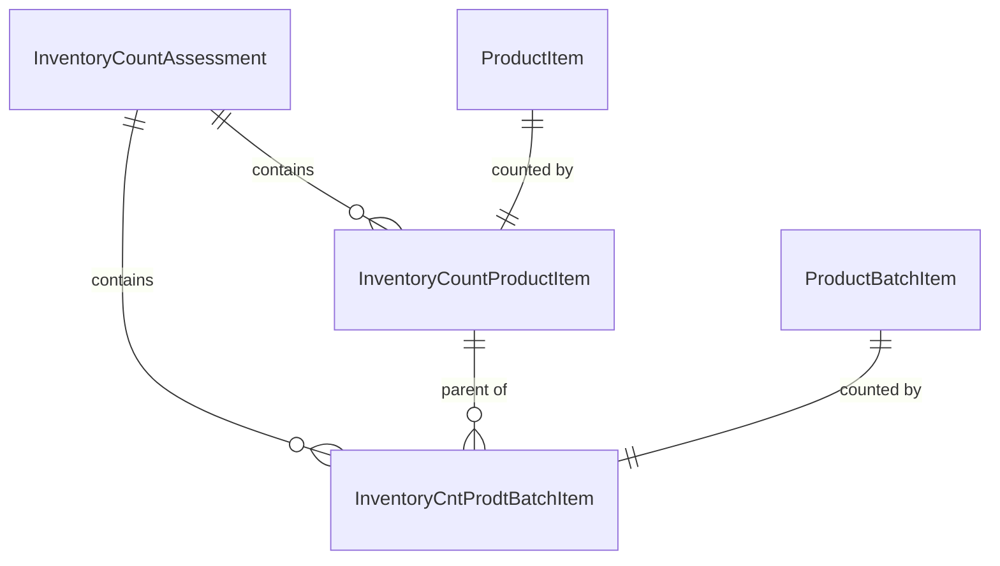
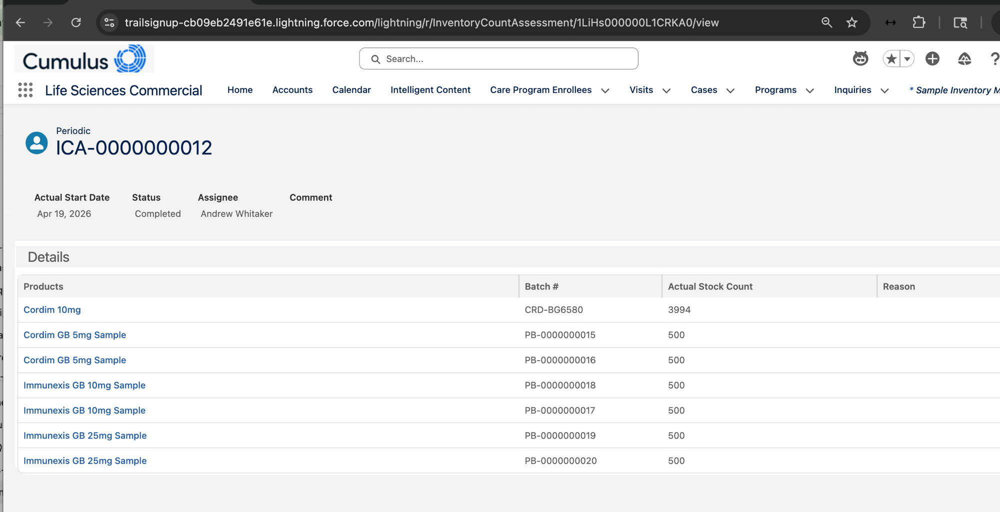
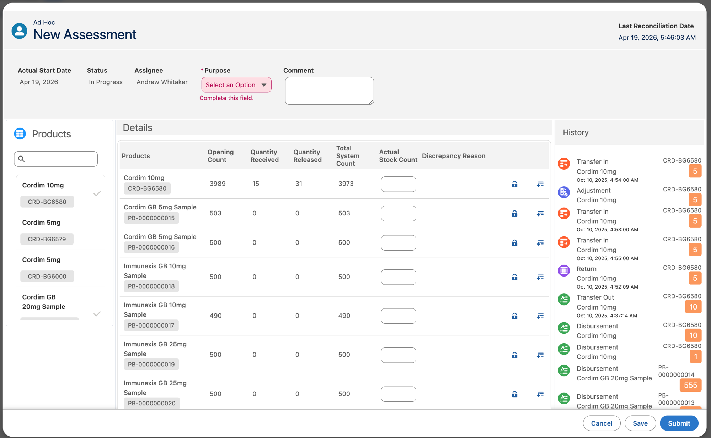
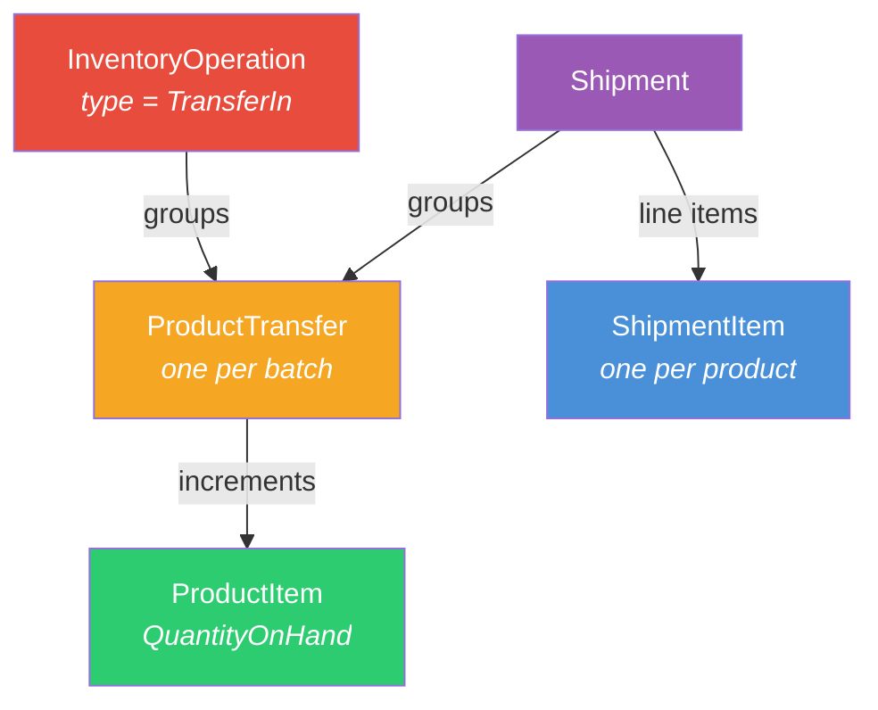
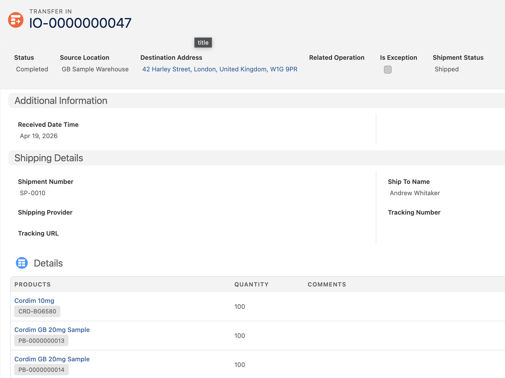

# README 13 — Inventory Count Assessment

## Overview

An `InventoryCountAssessment` is a formal count of a rep's sample inventory. It records what the rep has on hand (by product and by batch) and compares it against expected quantities. Inventory counts are required for compliance — they verify that the rep's physical stock matches what the system says they should have.

### When It's Needed

The platform requires an inventory count before a rep can drop samples. Without a completed count, the Samples panel during Visit Engagement may show an error or be blocked entirely.

### Objects Involved

| Object | Purpose |
|--------|---------|
| `InventoryCountAssessment` | Header — the assessment itself |
| `InventoryCountProductItem` | Product-level count — one per ProductItem |
| `InventoryCntProdtBatchItem` | Batch-level count — one per ProductBatchItem |



---

## Key Fields

**InventoryCountAssessment (header):**

| Field | Type | Notes |
|-------|------|-------|
| `LocationId` | Lookup(Location) | The rep's inventory location |
| `AssigneeId` | Lookup(User) | The rep performing the count |
| `Type` | Picklist | `Initial`, `Periodic`, `Adhoc`, `Audited` |
| `Purpose` | Picklist | `Audit`, `Verification`, `Reconciliation`, `Adjustment`, `Compliance`, `Accuracy` |
| `Status` | Picklist | `Assigned`, `InProgress`, `Complete`, `AuditorApproved`, `Saved` |
| `PlannedStartDateTime` | DateTime | Required for non-Initial types |
| `PlannedEndDateTime` | DateTime | Required for non-Initial types |

**InventoryCountProductItem (product-level):**

| Field | Type | Notes |
|-------|------|-------|
| `InventoryCountAssessmentId` | Lookup | Parent assessment |
| `ProductItemId` | Lookup(ProductItem) | The inventory being counted |
| `ExpectedQuantity` | Decimal | System's expected quantity |
| `ActualQuantity` | Decimal | Rep's counted quantity |
| `DiscrepancyReasonType` | Picklist | Same values as batch-level |
| `Status` | Picklist | `Assigned`, `In_Progress`, `Complete`, `Inactive` |

**InventoryCntProdtBatchItem (batch-level):**

| Field | Type | Notes |
|-------|------|-------|
| `InventoryCountAssessmentId` | Lookup | Parent assessment |
| `InventoryCountProductItemId` | Lookup | Parent product-level count |
| `ProductBatchItemId` | Lookup(ProductBatchItem) | The batch being counted |
| `ProductId` | Lookup(Product2) | **Required** — must be set for the UI to display batch data in the Details table |
| `ExpectedQuantity` | Decimal | System's expected quantity |
| `ActualQuantity` | Decimal | Rep's counted quantity |
| `IsDiscrepancyInQuantity` | Boolean | Read-only — auto-set by platform when actual ≠ expected |
| `DiscrepancyReasonType` | Picklist | Damage, Theft, Expiry, Misplacement, Overcount, Undercount, Mismatch, Lost, Adjustment, Other |
| `Status` | Picklist | `NotStarted`, `InProgress`, `Completed` |

> **Important:** The `ProductId` field on `InventoryCntProdtBatchItem` must be explicitly set. Without it, the Inventory Count Assessment detail page shows an empty Details table even though child records exist.

### Status Values Differ Across Objects

The status picklist values are **not consistent** across the three objects:

| Object | Status Values |
|--------|---------------|
| `InventoryCountAssessment` | Assigned, InProgress, Complete, AuditorApproved, Saved |
| `InventoryCountProductItem` | Assigned, In_Progress, Complete, Inactive |
| `InventoryCntProdtBatchItem` | NotStarted, InProgress, Completed |

---

## Matching Count (No Discrepancies)

The simplest case: the rep counts their inventory and everything matches what the system expects. The script sets `ActualQuantity = ExpectedQuantity` for both product-level and batch-level records.

### What It Looks Like

A completed Inventory Count Assessment showing the Details table with product and batch data:



The Details table shows each batch with its product name, batch number, and actual stock count. When actual matches expected, no discrepancy is flagged.

### Script: Matching Count

**Script:** `scripts/create-inventory-count.apex`

```bash
sf apex run --file scripts/create-inventory-count.apex --target-org {your_org}
```

**Configurable variables:**

| Variable | Default | Description |
|----------|---------|-------------|
| `TERRITORY_DEV_NAME` | `GB_FSR_001_London` | Target territory |
| `COUNT_TYPE` | `Periodic` | Assessment type |
| `COUNT_PURPOSE` | `Accuracy` | Assessment purpose |

**What it does:**

1. Looks up the rep and their inventory location
2. Finds all ProductItem records at the location
3. Finds all active ProductBatchItem records
4. Creates an `InventoryCountAssessment` header
5. Creates `InventoryCountProductItem` records (one per ProductItem) with `ActualQuantity = ExpectedQuantity`
6. Creates `InventoryCntProdtBatchItem` records (one per active batch) with `ProductId` set
7. Marks the assessment as Complete

The script uses `Database.insert` with `allOrNone = false` for batch items to gracefully skip any that fail (e.g., due to unresolved product disbursements from prior activity).

---

## Count with Discrepancies

When the rep's physical count doesn't match the system's expected quantity, the assessment records a **discrepancy**. This is the more realistic scenario — reps may have lost, damaged, or miscounted samples.

### How Discrepancies Work

A discrepancy occurs when `ActualQuantity ≠ ExpectedQuantity` on an `InventoryCountProductItem` or `InventoryCntProdtBatchItem` record. Three scenarios:

| Scenario | Meaning | Example |
|----------|---------|---------|
| Actual < Expected | **Short** — rep has fewer than expected | Expected 500, counted 490 → short by 10 |
| Actual = Expected | **Match** — no discrepancy | Expected 500, counted 500 |
| Actual > Expected | **Over** — rep has more than expected | Expected 500, counted 503 → over by 3 |

The discrepancy is applied at the **batch level** — one specific lot may be short while others match. The product-level count sums across all batches.

### Example: GB Rep Discrepancy Count

The script creates an assessment with a mix of matches, shortages, and overages:

| Product | Expected | Actual | Discrepancy |
|---------|----------|--------|-------------|
| Cordim 10mg | 3994 | 3989 | Short by 5 |
| Cordim GB 20mg Sample | 1973 | 1973 | Match |
| Cordim GB 5mg Sample | 2000 | 2003 | Over by 3 |
| Immunexis GB 10mg Sample | 2000 | 1990 | Short by 10 |
| Immunexis GB 25mg Sample | 2000 | 2000 | Match |

At the batch level, the discrepancy is applied to the **first batch** of each product (simulating a shortage or overage in a specific lot), while the second batch matches.

### What the Rep Sees (Ad Hoc Assessment)

When a rep creates an Ad Hoc assessment from the Sample Inventory Management page, this is the counting interface:



The interface has three panels:

| Panel | Description |
|-------|-------------|
| **Products** (left) | List of all products with batch numbers. Checkmarks indicate products the rep has finished counting |
| **Details** (center) | The count table showing Opening Count, Quantity Received, Quantity Released, Total System Count, and editable Actual Stock Count and Discrepancy Reason fields |
| **History** (right) | Transaction history for the selected batch — Transfer In, Transfer Out, Disbursement, Adjustment, Return events with quantities |

Key observations from the Details table:

- **Opening Count** — the quantity at the start of the count period (from the last completed assessment)
- **Quantity Received** — units received via Transfer Orders since the last count
- **Quantity Released** — units distributed (disbursements) since the last count
- **Total System Count** — calculated: Opening Count + Received - Released. This is the expected quantity
- **Actual Stock Count** — editable field where the rep enters their physical count
- **Discrepancy Reason** — required when actual ≠ expected. Values: Damage, Theft, Expiry, Misplacement, Overcount, Undercount, Mismatch, Lost, Adjustment, Other

The History panel provides an audit trail explaining *why* the system count is what it is — the rep can trace each Transfer In, Disbursement, and Adjustment to understand where units went.

### Script: Discrepancy Count

**Script:** `scripts/create-inventory-count-discrepancy.apex`

```bash
sf apex run --file scripts/create-inventory-count-discrepancy.apex --target-org {your_org}
```

**Configurable variables:**

| Variable | Default | Description |
|----------|---------|-------------|
| `TERRITORY_DEV_NAME` | `GB_FSR_001_London` | Target territory |
| `COUNT_TYPE` | `Periodic` | Assessment type |
| `COUNT_PURPOSE` | `Accuracy` | Assessment purpose |
| `DISCREPANCIES` | `{-5, 0, 3, -10}` | Per-product adjustments (alphabetical order). Negative = short, positive = over, 0 = match |

**What it does:**

1. Same setup as the matching count script (looks up rep, location, inventory)
2. Creates `InventoryCountProductItem` records with `ActualQuantity = ExpectedQuantity + discrepancy`
3. Applies the discrepancy to the **first batch** of each product at the batch level
4. Marks the assessment as Complete

---

## Sample Shipment (Product Transfer)

A sample shipment models the flow of samples from a warehouse to a rep's inventory. When the rep receives the shipment, the platform automatically increments `ProductItem.QuantityOnHand`. The shipment appears in the "Received Inventory Acknowledgements" panel on the Sample Inventory Management page and as "Transfer In" entries in the Inventory Operations Timeline.

### Objects Involved

A complete shipment requires **four objects** working together:



| Object | Purpose | Records Created |
|--------|---------|-----------------|
| `InventoryOperation` | Drives the UI — appears in Inventory Operations Timeline and "Received Inventory Acknowledgements" | 1 per shipment |
| `Shipment` | Groups the transfers and provides shipping details | 1 per shipment |
| `ShipmentItem` | Line items on the shipment (what the rep sees in the Details table) | 1 per product |
| `ProductTransfer` | The actual inventory movement — triggers `QuantityOnHand` increment | 1 per batch |

### Why InventoryOperation Is Required

Creating `ProductTransfer` records alone **does** move inventory (QuantityOnHand is incremented), but the transfer will **not appear** in:
- The "Received Inventory Acknowledgements" panel
- The Inventory Operations Timeline
- The "Transfer In" detail page

These UI components query `InventoryOperation`, not `ProductTransfer` directly. The `ProductTransfer.InventoryOperationId` field links transfers to their parent operation.

### What It Looks Like

A completed Transfer In as seen by the GB rep:



The Transfer In detail page shows:
- **Status / Source Location / Destination Address / Shipment Status** in the header
- **Shipping Details** — Shipment Number, Ship To Name, Shipping Provider, Tracking Number
- **Details table** — each product with batch number and quantity received

### Key Fields

**InventoryOperation:**

| Field | Type | Notes |
|-------|------|-------|
| `OperationType` | Picklist | `TransferIn` for incoming shipments |
| `SourceLocationId` | Lookup(Location) | Warehouse location |
| `DestinationLocationId` | Lookup(Location) | Rep's inventory location |
| `DestinationAddressId` | Lookup(Address) | Rep's storage address (displayed in header) |
| `ShipmentStatus` | Picklist | `Created`, `Shipped`, `In Transit`, `Voided`, `Deliver` |
| `Status` | Picklist | `Draft`, `In Progress`, `Submitted`, `Completed` |

**ProductTransfer:**

| Field | Type | Notes |
|-------|------|-------|
| `InventoryOperationId` | Lookup | Links to the parent InventoryOperation |
| `ShipmentId` | Lookup(Shipment) | Links to the Shipment |
| `DestinationLocationId` | Lookup(Location) | Rep's inventory location |
| `Product2Id` | Lookup(Product2) | The product being shipped |
| `ProductionBatchId` | Lookup(ProductionBatch) | The specific batch/lot |
| `QuantitySent` | Decimal | Units shipped |
| `QuantityReceived` | Decimal | Units received |
| `IsReceived` | Boolean | Set to `true` to trigger inventory increment |

> **Important:** When a ProductTransfer is linked to a TransferIn InventoryOperation, you **cannot** set `SourceLocationId` on the ProductTransfer — the source is defined on the InventoryOperation. Setting both causes the error: *"You can't select a source location when the inventory operation type is Transfer In."*

### Warehouse Setup

The warehouse must have its own inventory records. The script creates these automatically:

1. **Location** with `LocationType = 'Warehouse'` and `IsInventoryLocation = true`
2. **ProductItem** per product — the warehouse's stock (set to 100,000 for demo purposes)
3. **ProductBatchItem** per batch — links each production batch to the warehouse's inventory

### Script

**Script:** `scripts/create-sample-shipment.apex`

```bash
sf apex run --file scripts/create-sample-shipment.apex --target-org {your_org}
```

**Configurable variables:**

| Variable | Default | Description |
|----------|---------|-------------|
| `TERRITORY_DEV_NAME` | `GB_FSR_001_London` | Target territory |
| `WAREHOUSE_NAME` | `GB Sample Warehouse` | Source warehouse (created if not found) |
| `SHIPMENT_QTY` | `100` | Quantity per product/batch |

**What it does:**

1. Looks up the rep and their inventory location
2. Finds or creates a warehouse Location with ProductItem and ProductBatchItem records
3. Creates an `InventoryOperation` (type = TransferIn, status = Completed)
4. Creates a `Shipment` with `ShipmentItem` records (one per product)
5. Creates one `ProductTransfer` per active production batch, linked to both the InventoryOperation and Shipment
6. Platform auto-increments rep's `ProductItem.QuantityOnHand`

---

## Platform Constraints

- **One Initial count per location** — the `Initial` type can only be used once per location. Use `Periodic`, `Adhoc`, or `Audited` for subsequent counts
- **Locked when Complete** — once an assessment is marked Complete, child records cannot be updated or deleted
- **PlannedStartDateTime / PlannedEndDateTime** required for non-Initial types on both the header and product-level children

---

## Troubleshooting

### Details Table Is Empty

The assessment record exists but clicking into it shows no data in the Details table.

**1. Do InventoryCntProdtBatchItem records have ProductId set?**

```apex
SELECT Id, ProductId, ProductBatchItemId, ExpectedQuantity
FROM InventoryCntProdtBatchItem
WHERE InventoryCountAssessmentId = '{assessmentId}'
```

If `ProductId` is null, the UI will not display the records. This field must be set during creation — completed assessments lock their child records and cannot be updated.

**2. Is the assessment status Complete?**

The Details table may not render for assessments in `Assigned` or `InProgress` status. Verify the assessment is marked `Complete`.

---

## Script Summary

| Script | Creates | Description |
|--------|---------|-------------|
| `scripts/create-inventory-count.apex` | Matching count | All actuals = expected, no discrepancies |
| `scripts/create-inventory-count-discrepancy.apex` | Discrepancy count | Configurable per-product discrepancies (short, over, match) |
| `scripts/create-sample-shipment.apex` | Sample shipment | InventoryOperation + Shipment + ProductTransfer, auto-increments inventory |

---

## Related READMEs

- [README-12: Sample Inventory Setup](README-12-Sample-Inventory.md) — ProductItem, ProductionBatch, allocations
- [README-08: Sample Management Setup](README-08-Sample-Management-Setup.md)
- [README-04: Data Loading Scripts](README-04-Data-Loading-Scripts.md)
